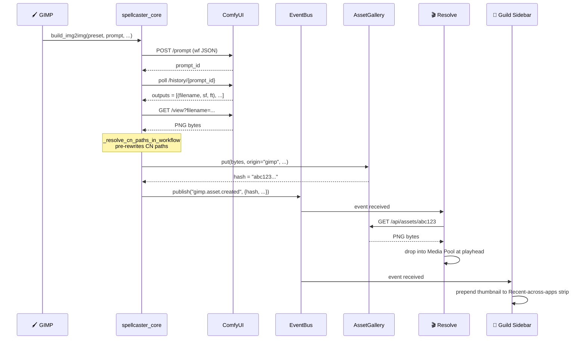
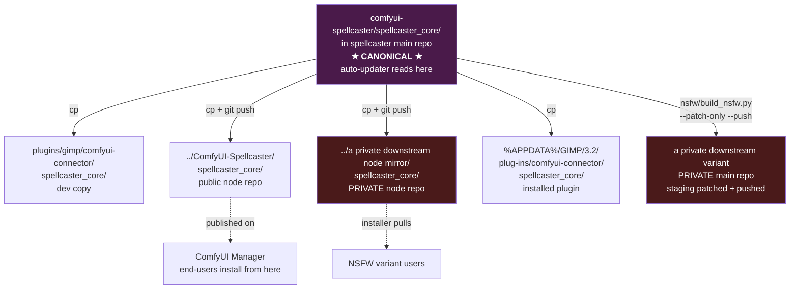
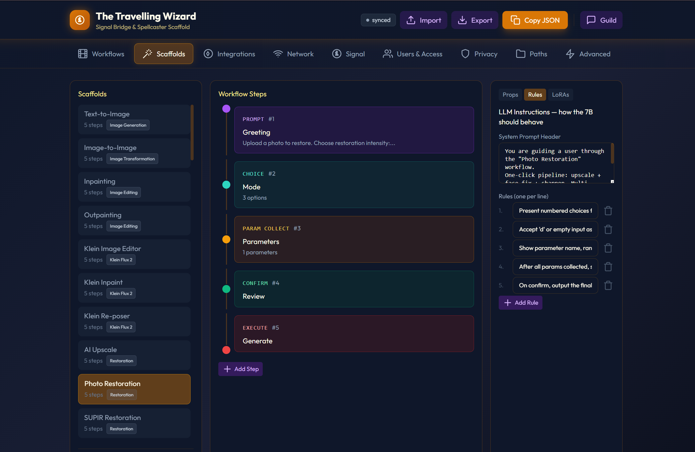
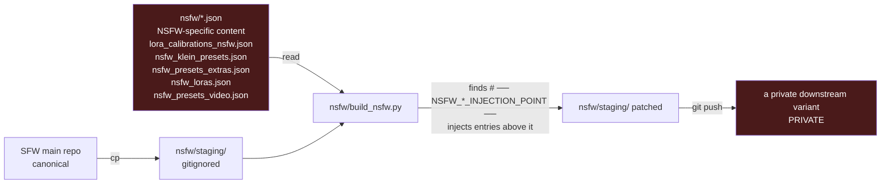

# Spellcaster — Deep Dive

Everything the [README](README.md) intentionally left out. Architecture, subsystems, every tool enumerated, cross-app flows, all 9 model families, the scaffold state machines, the antenna, the prompt enhancement chain. If you read ingredient lists on cereal boxes, this is for you.

> ### 🤖 Working on this codebase with an LLM?
>
> Feed your model this DEEP_DIVE.md at session start — it's the guided tour through the architecture, every `build_*` function, the 3-layer ControlNet resolution system, the GIMP-subprocess quirks, the dispatch pipeline, and the invariants future contributors must not break.

---

## Contents

- [System Architecture](#system-architecture) 🆕
- [Dispatch Pipeline](#dispatch-pipeline) 🆕
- [ControlNet Resolution — 3-Layer System](#controlnet-resolution--3-layer-system) 🆕
- [Cross-Repo Sync Topology](#cross-repo-sync-topology) 🆕
- [All 69 Tools](#all-69-tools)
- [Under the Hood](#under-the-hood)
- [Calibration Wizard](#calibration-wizard)
- [The Wizard Guild (chat interface)](#the-wizard-guild-chat-interface)
- [Video Shotboard](#video-shotboard)
- [SillyTavern integration](#sillytavern-integration)
- [Cross-App Functions](#cross-app-functions)
- [🔀 Cross-interface backbone](#-cross-interface-backbone--every-surface-is-the-same-surface)
- [🧠 Prompt enhancement](#-prompt-enhancement--per-architecture-per-method-per-model)
- [🎯 LLM primary picker](#-llm-primary-picker--comfyui-reroute-ollama--kobold-auto-start)
- [🛠 Scaffold system](#-scaffold-system--state-machine-wizards-for-7b-models)
- [⚡ Global preset cycle](#-global-preset-cycle--turbo--standard--quality)
- [⚡ SpeedCoach — live telemetry + ETA countdown](#-speedcoach--live-telemetry--eta-countdown)
- [🔄 LoRA version migration](#-lora-version-migration--no-orphaned-settings-when-you-upgrade)
- [🎨 Civitai rich metadata](#-civitai-rich-metadata--trigger-words-recommended-weights-example-prompts)
- [🔷 3D Normal Map modes](#-3d-normal-map--mandatory-submenu-vs-opt-in-toggle)
- [🧰 Installer / Updater / Repair](#-installer--updater--repair--one-click-fixes)
- [📡 Antenna](#-antenna--15-endpoints-tray-menu-self-update)
- [🎙 Voice](#-voice--walkie-talkie-stt--tts-playback)
- [🧩 Connect-an-app](#-connect-an-app--register-launchers-windows-shortcuts-auto-start)
- [🔐 Privacy, boot safety, auto-update risk](#-privacy-boot-safety-auto-update-risk)
- [🎬 Resolve Bridge](#-resolve-bridge--timeline-aware-shot-generation)
- [🖼️ Everything else worth mentioning](#%EF%B8%8F-everything-else-worth-mentioning)
- [For developers](#for-developers)
- [Extending the App — NSFW + personalisation](#extending-the-app--nsfw--personalisation) 🆕

---

## System Architecture

Spellcaster is **middleware** — it doesn't generate images itself. Every surface (GIMP, Darktable, Wizard Guild, SillyTavern, DaVinci Resolve) dispatches through the canonical `spellcaster_core` library to a ComfyUI instance. One backend, many front doors.

```mermaid
graph TB
    subgraph Apps["User-Facing Apps"]
        GIMP[🖌 GIMP 3<br/>69 tools<br/>~34K Python lines]
        DT[📸 Darktable<br/>Lua plugin]
        GUILD[🏰 Wizard Guild<br/>Chat UI + API]
        ST[💬 SillyTavern<br/>Extension]
        RESOLVE[🎬 DaVinci Resolve<br/>Timeline bridge]
        BLENDER[🎨 Blender / Krita<br/>Photoshop / OBS]
    end

    subgraph Backbone["spellcaster_core — single source of truth"]
        WF[workflows.py<br/>70+ build_* fns]
        NF[node_factory.py<br/>typed ComfyUI DSL]
        COMP[composites.py<br/>inject_controlnet<br/>load_model_stack<br/>inject_lora_chain]
        ARCH[architectures.py<br/>27 arch registry<br/>supported_methods]
        DISP[dispatch.py<br/>preflight → optimize → submit]
    end

    subgraph Pack["ComfyUI-Spellcaster node pack"]
        NODES[4 custom nodes<br/>SpellcasterLoader etc.]
        PRESENCE[/spellcaster/presence/*]
        BLOB[/spellcaster/blob/*]
        PRIV[/spellcaster/privacy/delete]
        REPAIR[/spellcaster/models/repair]
    end

    subgraph Compute["ComfyUI Server"]
        COMFY[ComfyUI<br/>PromptServer<br/>models/checkpoints/<br/>models/controlnet/<br/>models/loras/]
    end

    GIMP -->|python import| Backbone
    DT -->|POST /api/run_builder| GUILD
    ST -->|POST /api/run_builder| GUILD
    RESOLVE -->|POST /api/video/shots| GUILD
    BLENDER -->|POST /api/run_builder| GUILD
    GUILD -->|python import| Backbone

    Backbone -->|POST /prompt<br/>GET /view| COMFY
    GIMP -.->|HTTP routes| Pack
    DT -.->|HTTP routes| Pack
    GUILD -.->|HTTP routes| Pack

    Pack -.->|registered on| COMFY

    style Backbone fill:#2a1a4a,color:#fff
    style Pack fill:#1a3a4a,color:#fff
    style COMFY fill:#3a2a1a,color:#fff
```

**The rule:** no parallel implementations. If the GIMP plugin and Wizard Guild both need a workflow, the builder lives in `spellcaster_core/workflows.py` and both import it. Lua / JS plugins that can't import Python call `POST /api/run_builder` on the Guild, which dispatches the exact same canonical builder.

**Peer discovery works without the Guild.** The ComfyUI pack's `/spellcaster/presence/*` routes let every plugin see every other plugin through the compute server — so if the Guild is offline, GIMP and Darktable still find each other via their shared ComfyUI. Blob bus (`/spellcaster/blob/*`) is a second Guild-less transport for moving bytes between peers on the LAN.

### Cross-Interface Event Flow

When a generation completes anywhere, an `<origin>.asset.created` event fans out to every subscriber:



Same canonical hash, single storage path (`tavern/creations/gallery/`), every UI sees the asset in under 50 ms. The compat shim `/api/cached_asset/<name>` still resolves legacy flat-cache URLs but new writers only emit `/api/assets/<hash>`.

---

## Dispatch Pipeline

Every ComfyUI submission from the GIMP plugin flows through `_run_comfyui_workflow` ([_spellcaster_main.py](plugins/gimp/comfyui-connector/_spellcaster_main.py)). The pipeline has 9 steps, all defensive:

```mermaid
flowchart TD
    START[GIMP handler]
    START --> BUILD[build_* workflow<br/>spellcaster_core/workflows.py]
    BUILD --> Q[_wait_for_comfy_queue_empty<br/>don't stack prompts]
    Q --> LOCK[_flush_pending_uploads<br/>with _workflow_lock]
    LOCK --> CN[_resolve_cn_paths_in_workflow<br/>rewrite ControlNetLoader targets<br/>to what's actually installed]
    CN --> DISP[dispatch_workflow<br/>spellcaster_core/dispatch.py]

    DISP --> PREF[preflight_workflow<br/>validate nodes + files]
    PREF --> OPT[optimize_workflow<br/>VRAM cap + auto-tune]
    OPT --> FREE[POST /free<br/>evict cached models if heavy]
    FREE --> SUBMIT[POST /prompt]
    SUBMIT --> POLL[poll /history/&#123;prompt_id&#125;]
    POLL --> OUTS[collect outputs<br/>images + gifs + videos]

    OUTS --> CNERR{CN load error?<br/>incomplete metadata<br/>controlnet file invalid}
    CNERR -->|yes| BLACK[_maybe_handle_cn_error<br/>extract loader filename<br/>add to _CN_SESSION_BLACKLIST<br/>raise with actionable msg]
    CNERR -->|no| PRE

    PRE[_precache_results<br/>download ALL outputs<br/>to _download_cache<br/>BEFORE privacy cleanup]
    PRE --> REPAT[_repatriate_outputs<br/>copy to cfg.output_dir<br/>cleanup server temps]

    REPAT --> CLEAN{output_cleanup<br/>in move/delete?}
    CLEAN -->|yes| PRIVROUTE[POST /spellcaster/privacy/delete<br/>real os.remove<br/>inputs + outputs]
    CLEAN -->|no| TEL

    PRIVROUTE --> TEL[_record_dispatch_telemetry<br/>logs/dispatch_log.jsonl<br/>SpeedCoach ingest]
    TEL --> RETURN[return outputs]

    RETURN --> IMPORT[caller loops<br/>_apply_mask_mode<br/>with empty-bytes guard]
    IMPORT --> END[layer inserted<br/>or new image opened]

    style CN fill:#4a3a1a,color:#fff
    style CNERR fill:#4a1a1a,color:#fff
    style PRIVROUTE fill:#1a4a3a,color:#fff
```



**Why step 3 (CN resolver) matters:** real ComfyUI installs put CN files under HF folder paths (`SDXL/controlnet-union-sdxl-1.0/diffusion_pytorch_model.safetensors`) or versioned subdirs (`1.5/control_v11p_sd15_normalbae_fp16.safetensors`), but the hardcoded `CONTROLNET_GUIDE_MODES` table has the flat-form name. Without the resolver, dispatch fails on every workflow using a CN that's "installed but not at the canonical path."

**Why `_precache_results` runs BEFORE cleanup:** the cleanup route does real `os.remove`. If we cleaned first we'd be downloading from an empty server.

---

## ControlNet Resolution — 3-Layer System

CN resolution is defensive at three layers so a CN on any supported filesystem path Just Works:

```mermaid
flowchart LR
    subgraph L1["Layer 1 — Hardcoded"]
        GM[CONTROLNET_GUIDE_MODES<br/>_spellcaster_main.py:4188<br/>flat-form path per mode × arch<br/>drives UI combo]
    end

    subgraph L2["Layer 2 — Cascade (normal-map only)"]
        RES[_resolve_normal_map_cn<br/>walks _NORMAL_MAP_FALLBACK_CHAIN<br/>Union → Depth → Canny → lineart<br/>includes flat + HF folder paths]
        OVR[stash controlnet&#91;cn_model_override&#93;]
        INJ[composites.inject_controlnet<br/>reads cn_model_override FIRST<br/>fallback to guide&#91;cn_models&#93;&#91;arch&#93;]
    end

    subgraph L3["Layer 3 — Universal (pre-dispatch)"]
        RCN[_resolve_cn_paths_in_workflow<br/>walks every ControlNetLoader node<br/>rewrites control_net_name<br/>exact → basename → stem match]
    end

    subgraph Err["Error Recovery"]
        ERR[_maybe_handle_cn_error<br/>scans dispatch errors for<br/>incomplete metadata<br/>controlnet file invalid]
        BL[_CN_SESSION_BLACKLIST<br/>in-memory set]
        REP[_offer_cn_repair<br/>Gtk dialog on next /3D entry<br/>POST /spellcaster/models/repair]
    end

    GM --> L2
    GM --> L3
    L2 --> L3
    L3 --> DISPATCH[→ ComfyUI /prompt]
    DISPATCH --> ERR
    ERR --> BL
    ERR --> REP
    BL -.->|skipped in| L2
    BL -.->|skipped in| L3
    REP -->|success clears| BL

    style L1 fill:#2a2a1a,color:#fff
    style L2 fill:#1a2a3a,color:#fff
    style L3 fill:#1a3a2a,color:#fff
    style Err fill:#3a1a1a,color:#fff
```



**Adding a new CN:** extend (1) `CONTROLNET_GUIDE_MODES` in the plugin, (2) `_NORMAL_MAP_FALLBACK_CHAIN` if normal-map-capable, (3) `CN_URL_MAP` in both `comfyui-spellcaster/model_repair.py` AND `installer/install.py::step_check_cn_coverage` (they mirror on purpose — single edit per file per release).

**Auto-repair on corrupt files:** users hitting `safetensors_rust.SafetensorError: incomplete metadata, file not fully covered` get a "Repair on server" dialog next time they open a /3D tool. The pack's repair route deletes + streams from the curated Hugging Face URL, atomic-renames in, and the session blacklist clears so the fresh file is picked.

---

## Cross-Repo Sync Topology

`spellcaster_core/*.py` is mirrored across **5 locations**. Getting this wrong means the auto-updater overwrites your changes on next GIMP launch.



**After editing a `spellcaster_core` file:**

```bash
# 1. Edit canonical:
vim comfyui-spellcaster/spellcaster_core/CHANGED.py

# 2. Mirror to 4 other surfaces:
for D in \
  plugins/gimp/comfyui-connector/spellcaster_core \
  ../ComfyUI-Spellcaster/spellcaster_core \
  ../a private downstream node mirror/spellcaster_core \
  "$APPDATA/GIMP/3.2/plug-ins/comfyui-connector/spellcaster_core"; do
    cp comfyui-spellcaster/spellcaster_core/CHANGED.py "$D/"
done

# 3. Verify (all 5 md5sums identical):
md5sum comfyui-spellcaster/spellcaster_core/CHANGED.py \
  plugins/gimp/comfyui-connector/spellcaster_core/CHANGED.py \
  ../ComfyUI-Spellcaster/spellcaster_core/CHANGED.py \
  ../a private downstream node mirror/spellcaster_core/CHANGED.py \
  "$APPDATA/GIMP/3.2/plug-ins/comfyui-connector/spellcaster_core/CHANGED.py"

# 4. Commit + push in 3 git repos, then patch NSFW:
(cd . && git add ... && git commit && git push)
(cd ../ComfyUI-Spellcaster && git add ... && git commit && git push)
(cd ../a private downstream node mirror && git add ... && git commit && git push)
python nsfw/build_nsfw.py --patch-only --push
```

**Pack-root modules** (`presence.py`, `blob_bus.py`, `privacy_cleanup.py`, `model_repair.py`) also mirror to `../ComfyUI-Spellcaster{,-NSFW}/` but the GIMP dev copy doesn't carry them — plugins hit these routes over HTTP.

---

## All 69 Tools

Yes, we counted. Yes, we noticed. No, we will not be adding a 70th (officially).

<details open>
<summary><h3>Generate (7)</h3></summary>

| Tool | What It Does |
|---|---|
| **Text to Image** | Type what you want. 25 scene presets across 6 model families. |
| **Image to Image** | Transform any photo — change styles, add detail, reimagine. |
| **Inpaint Selection** | Paint over any area to regenerate it. 44 expert presets. |
| **Outpaint / Extend** | Extend your image beyond its borders in any direction. |
| **Batch Variations** | Generate 2-8 versions with one click. |
| **Edit by Instruction** | Type "make the sky orange" in plain English. Powered by Kontext. |
| **Generate Anything** | Create a transparent object (sword, hat, dragon) on its own layer. |

</details>

<details>
<summary><h3>Flux 2 Klein (9) — the fancy one</h3></summary>

Klein is what happens when you tell a diffusion model "no, I said *good*." It's 4-20 steps where every other architecture needs 30. It doesn't use a sampler — it uses a *guider*. It doesn't have a CFG scale — it has a *TextRefBalance*. It is, objectively, better than you. Here are its tools:

| Tool | What It Does |
|---|---|
| **AI Editor** | Best-quality img2img with Flux 2 Klein (4-20 steps). |
| **Editor + Reference** | Edit guided by a reference image for structure/style. |
| **Outpaint** | Highest-quality canvas extension. |
| **Inpaint** | Context-aware selection fill. 29 task presets. |
| **Layer Blender** | AI-powered layer harmonization. |
| **Re-poser** | Change poses and camera angles. 26 poses + 11 cameras. |
| **Headswap** | Hybrid: ReActor swap + Klein refinement. |
| **Detail Enhancer** | Targeted detail: face, eyes, hands, skin, hair, custom. |
| **Generate Object** | Transparent object with scene-matched lighting. |

</details>

<details>
<summary><h3>Enhance (9) — because your photo deserves better than what your camera gave it</h3></summary>

| Tool | What It Does |
|---|---|
| **Upscale** | 9 models: WaveSpeed SeedVR2 AI (2K/4K), UltraSharp, RealESRGAN, Remacri, NMKD, Anime. |
| **Photo Restoration** | One-click: upscale + face fix + sharpen. |
| **Detail Hallucination** | Add texture that wasn't there — upscale + low-denoise img2img. |
| **SUPIR AI Restoration** | State-of-the-art repair for damaged/compressed photos. |
| **SeedV2R Upscale** | Controllable hallucination: none/light/high. |
| **Colorize B&W** | 3 engines: DDColor instant (artistic/natural) or ControlNet+diffusion. |
| **Object Removal** | LaMa inpainting — paint over anything, it disappears. |
| **3D Normal Map** | NormalCrafter surface normals for relighting and 3D. |
| **AI Eraser** | Select + `Ctrl+Alt+X` = gone. AI fills the gap. |

</details>

<details>
<summary><h3>Face (7) — the identity crisis suite</h3></summary>

Seven different ways to put your face where it doesn't belong. We built them for "creative portrait work." You will use them to put your boss's face on a medieval knight. We know. It's fine. We've made our peace with it.

| Tool | What It Does |
|---|---|
| **Face Swap (ReActor)** | Paste a face from one photo onto another. |
| **Face Swap (Saved Model)** | Swap using a saved face model library. |
| **Face Swap (mtb)** | Alternative engine with multi-face indexing. |
| **Face Identity Transfer** | Generate images that look like a specific person. FaceID. |
| **Face Identity (Flux)** | Flux-native identity via PuLID. |
| **Face Restore** | 7 models: GPEN-2048, CodeFormer, GFPGAN, RestoreFormer++. |
| **Flux 2 Headswap** | ReActor + Klein refinement for seamless blending. |

</details>

<details>
<summary><h3>Style (4) &bull; Select (3) &bull; Video (7) — the "wait, it can do THAT?" section</h3></summary>

**Style:**

| Tool | What It Does |
|---|---|
| **Style Transfer** | Copy any reference image's visual style via IPAdapter. |
| **Color Grading** | Cinematic LUT application with strength control. |
| **IC-Light Relighting** | Change lighting direction. 10 presets. |
| **AI Color Match** | Transfer color palette from a reference. 3 methods. |

**Select:**

| Tool | What It Does |
|---|---|
| **AI Select (SAM3)** | Type "hair" or "shirt" to select it. |
| **AI Extract Subject** | One-click subject extraction with transparent background. |
| **Remove Background** | 3 engines: rembg, BiRefNet (best hair), BiRefNet Portrait. |

**Video:**

| Tool | What It Does |
|---|---|
| **LTX 2.3 Text to Video** | Generate video from text. VRAM-aware resolution. |
| **LTX 2.3 Image to Video** | Animate any photo. Preserves aspect ratio. |
| **Wan 2.2 Image to Video** | 2-5 second clips. 26 motion presets, dual-pass. |
| **Wan 2.2 First+Last Frame** | Video transition between two images. |
| **Video Upscale** | AI video upscaling with SeedVR2. |
| **Video Face Swap** | ReActor across every video frame + upscale. |
| **SeedVR2 Video Upscale** | Dedicated SeedVR2 video upscaler. |

</details>

<details>
<summary><h3>Studios (7) &bull; Quick (7) &bull; Tools (8) — for when you've gone full method actor</h3></summary>

**Studios** — full character production pipeline. You're not "using an AI tool" anymore. You're *running a one-person visual effects studio from inside a free image editor.* Your parents still think you're "playing on the computer."

| Tool | Pipeline step |
|---|---|
| **Casting Polaroids** | Create reusable face model from any photo. |
| **Body Double** | Full-body transparent cutout with face swap. |
| **Wardrobe Department** | AI outfit replacement. 40 presets. |
| **Set Design** | Generate background + composite characters. |
| **Director's Chair** (Solo/Duo/Trio) | Animated video with face re-injection. |

**Quick** — zero-dialog, instant (`Ctrl+Alt`):

| Action | Shortcut |
|---|---|
| Enhance | `Ctrl+Alt+E` |
| Inpaint | `Ctrl+Alt+P` |
| Upscale | `Ctrl+Alt+U` |
| Face Restore | `Ctrl+Alt+F` |
| Remove BG | `Ctrl+Alt+B` |
| AI Eraser | `Ctrl+Alt+X` |
| Re-run Last | `Ctrl+Alt+R` |

**Tools** — Layer Blend, Upscaler Blend, GIF Stitcher, Watermark Embed/Read, Upload to Server, Settings, Workflow Library.

</details>

---

## Under the Hood

<details>
<summary><strong>What makes it fast</strong></summary>

- **TeaCache auto-acceleration** — every image generation is automatically 1.4x faster. Zero config, zero quality loss. The optimizer injects it into all workflows.
- **Architecture-aware everything** — CFG, denoise, prompts, and ControlNet models are auto-configured per architecture. 9 supported: SD 1.5, SDXL, Illustrious/Pony, ZIT, Flux Dev, Flux 2 Klein, Flux Kontext, Chroma, and WAN/LTX for video.
- **AI Prompt Enhancement** — a local 4B LLM runs inside ComfyUI, rewrites your simple prompts into architecture-optimized descriptions. SDXL gets booru tags, Flux gets natural language, Klein gets concise descriptions. Multi-character prompts use BREAK separation with attention weights.
- **VRAM management** — LLM auto-unloads during image generation. LTX resolution auto-scales to fit your GPU. Video frame counts auto-cap on low VRAM.
- **Privacy cleanup** — all temporary files on ComfyUI are atomically overwritten with 1x1 pixel PNGs after use. Your images don't linger on the server.

</details>

## Calibration Wizard

<details>
<summary><strong>Optometrist for your GPU</strong></summary>

First time using Spellcaster? The Calibration Wizard tests every installed image model and tunes all settings to your taste — no technical knowledge required. It is, to our knowledge, the only software that treats your artistic preferences like a medical condition that needs diagnosing.

**Three steps**

1. **Taste test.** One image per model on the SAME prompt + seed so differences are the model, not luck. Rate with 4 buttons:
   - ♥ **Love** — keep at the top of the picker
   - ○ **OK** — keep available
   - ✗ **Dislike** — hide from the default picker
   - ⚠ **FAILED** — render crashed or was broken (special: gets a research / repair dialog, see below)
2. **Settings.** For each Loved model, compare CFG / step / sampler alternatives side by side. Timing is logged to SpeedCoach so dialog banners can suggest faster alternatives later.
3. **Apply.** A calibration profile is written to `config.json`. Every Spellcaster dialog auto-loads it — no manual copy.

**v2.3 polish**

- **Click thumbnails to view full size.** Every sample is wrapped in an event box; click opens a modal up to 90 % of the parent dialog's width with the native pixbuf scaled up (never past source).
- **Elapsed time per sample.** Each card shows `sdxl_base (sdxl) · 3.4s`, and every sample is POSTed to `/api/telemetry/dispatch_ok` so SpeedCoach's arch-speed-chart + speed-leaderboard learn from calibration runs too.
- **FAILED vs Dislike distinction.** Rendered samples that came back broken (missing CLIP, OOM, bad weights) are routed to a dedicated FAILED bucket, NOT confused with "user didn't like this output". Failed cards expose a 🛠 **Research fix** button that opens a three-button diagnosis dialog:
  - 🔍 **Civitai lookup** — searches the public API by filename; first 3 results link out.
  - ⚙ **Node drift** — hits `/api/speedcoach/drift` to diff the current ComfyUI `/object_info` against the last session; a missing custom node is the top cause of model-load failures.
  - 🧠 **Ask LLM** — POSTs the error to the local Ollama (default gemma3:4b) for a 3-bullet "most likely cause / verification step / fix" diagnosis.
  - **Re-try this model** button re-runs JUST that model's sample without restarting the whole batch.
- **Model-list filter fix.** The pre-v2.3 wizard surfaced ~57 entries on a 7-image-model server — every quant variant of every UNET was listed separately alongside video / Klein / Kontext archs. v2.3 filters to the 9 image-calibration archs (`sd15 / sdxl / illustrious / pony / playground / sdxl_turbo / zit / flux1dev / chroma`) and collapses quant variants of the same base model (`flux1-dev-fp8 / bf16 / Q4_K_M / Q8_0` → ONE card with a `variants` list). Same 7 models, now legibly displayed.
- **Welcome page rewrite.** Explicit "what each step does, what FAILED means, thumbnails are click-to-enlarge" up front so users don't learn by trial-and-error.

Access: `Spellcaster > Tools > Calibration Wizard`. The richer Wizard Guild side (SFW + NSFW stores, multi-seed stability, Civitai-driven prompt recipes, LLM vision scoring) lives under `✧ Calibration` in the chat UI — see the "Under the Hood" section for the full stack.

</details>

## The Wizard Guild (chat interface)

Don't want to learn GIMP? GIMP has 847 menu items and a learning curve that doubles as a cliff face. The Wizard Guild is a standalone web UI where AI wizard characters handle everything conversationally — tech support, except the support agent is a wizard and instead of restarting your computer it generates a photorealistic dragon.

<p align="center">
  
</p>

Each wizard specialises in one tool family. The backend chip row at the top shows which local LLMs are live (Ollama / KoboldCpp / ComfyUI-hosted), and every wizard's own chip row exposes the three or four actions it can do — no menus, no modes.

**Scaffolding a local LLM is a drag-and-drop affair.** The Travelling Wizard below is the editor:

<p align="center">
  
</p>

Pick a flow from the left column (*Text-to-Image*, *Inpainting*, *Klein Image Editor*, *Photo Restoration*, *SUPIR Restoration* …), reorder its steps in the middle — **Greeting → Mode → Parameters → Review → Generate** — and tune the system prompt + rule checklist on the right. No JSON, no LangChain, no prompt engineering. Hit **Export** and the scaffold runs on any 3B–14B chat model: Ollama, KoboldCpp, LM Studio, SillyTavern, or the ComfyUI-hosted LLM node. The Meta Wizard and every plugin surface (GIMP / Darktable / Resolve / Signal bridge) consume the same format, so one tuning round travels everywhere.

A **Workflow Library** tab sits next to the scaffold editor and lists every ComfyUI workflow on your server — parsed with `scaffold.workflow_parser.discover_workflows`, auto-classified, with each workflow's tunable parameters surfaced — so a scaffold step can drive a real ComfyUI render without writing a single node. One author, every LLM plays.

Launch: `start_guild.bat` (Windows) or `python tavern/guild_launcher.py`

## Video Shotboard

The Shotboard is a persistent video production system for multi-shot sequences. At some point during development we stopped making a GIMP plugin and accidentally built a pre-production suite. We don't know when it happened. We're not apologizing. Each shot tracks its own motion trajectory, prompt, model, and status (draft → queued → running → ready). Shots link together for continuity — the last frame of shot 1 feeds into shot 2.

Build a full storyboard in the Guild UI, queue all shots, and let them render overnight. The assembly pipeline stitches them together with frame interpolation (RIFE/GIMM-VFI) for smooth transitions.

## SillyTavern integration

Drop these characters into any SillyTavern group chat. They work silently in the background — generating scene backgrounds, character portraits, and dramatic illustrations as your story unfolds. Yes, we gave each one a name, a backstory, and a portrait. Yes, we are aware this is unhinged. Imaginus is our favorite and we will not be taking questions.

<table>
<tr>
<td align="center" width="25%"><br/><strong>Imaginus</strong><br/><sub>Text-to-image generation.<br/>Creates images from descriptions.</sub></td>
<td align="center" width="25%"><br/><strong>Transmutex</strong><br/><sub>Image transformation.<br/>Changes styles, moods, details.</sub></td>
<td align="center" width="25%"><br/><strong>Masquerade</strong><br/><sub>Face swap & identity.<br/>ReActor, FaceID, PuLID, Headswap.</sub></td>
<td align="center" width="25%"><br/><strong>Restorix</strong><br/><sub>Upscale & restore.<br/>SUPIR, SeedV2R, CodeFormer, GPEN.</sub></td>
</tr>
<tr>
<td align="center" width="25%"><br/><strong>Erasure</strong><br/><sub>Inpaint & remove.<br/>LaMa, AI Eraser, background gen.</sub></td>
<td align="center" width="25%"><br/><strong>Videomancer</strong><br/><sub>Video generation.<br/>Wan 2.2 I2V, LTX 2.3 T2V.</sub></td>
<td align="center" width="25%"><br/><strong>Cinematic</strong><br/><sub>Director's Chair.<br/>Multi-step video with face re-injection.</sub></td>
<td align="center" width="25%"><br/><strong>Studiocraft</strong><br/><sub>Production manager.<br/>Full Studios pipeline orchestration.</sub></td>
</tr>
<tr>
<td align="center" width="25%"><br/><strong>Sceneshifter</strong><br/><sub>Living scenes.<br/>Auto-generates backgrounds as story moves.</sub></td>
<td align="center" width="25%"><br/><strong>Portraitist</strong><br/><sub>Expression portraits.<br/>Generates mood-matched character art.</sub></td>
<td align="center" width="25%"><br/><strong>Autonoma</strong><br/><sub>Autonomous generation.<br/>AI decides when scenes need illustration.</sub></td>
<td align="center" width="25%"><br/><strong>Restyler</strong><br/><sub>Avatar restyle.<br/>Transform all avatars to any art style.</sub></td>
</tr>
<tr>
<td align="center" width="25%"><br/><strong>Animancer</strong><br/><sub>Animation.<br/>Brings still images to life as video.</sub></td>
<td align="center" width="25%"></td>
<td align="center" width="25%"></td>
<td align="center" width="25%"></td>
</tr>
</table>

**How to use:** Launch the Wizard Guild — it auto-downloads SillyTavern, installs the plugin, and imports all 13 characters. Add any character to a group chat alongside your RP characters. Sceneshifter and Autonoma work silently without interrupting conversation.

---

## Cross-App Functions

Spellcaster is the connective tissue. Every generated asset lives in one canonical store, every surface sees every other surface, and every action in one app can finish in another. Drop an image in GIMP, drop it into the Guild chat, drop it onto the Resolve timeline — same bytes, one hash, zero copies.

<p align="center">
  <a href="https://www.gimp.org/" title="GIMP — image editor"></a>
  &nbsp;
  <a href="README.md#three-ways-to-use-it" title="The Wizard Guild — chat UI"></a>
  &nbsp;
  <a href="https://www.blackmagicdesign.com/products/davinciresolve" title="DaVinci Resolve — video editor"></a>
  &nbsp;
  <a href="https://github.com/LostRuins/koboldcpp" title="KoboldCpp — local LLM server"></a>
  &nbsp;
  <a href="https://github.com/SillyTavern/SillyTavern" title="SillyTavern — roleplay chat"></a>
  &nbsp;
  <a href="https://www.darktable.org/" title="Darktable — RAW editor"></a>
</p>

<p align="center"><sub>All six talk through one event bus + one blob store + one registry. Add a plugin, get every capability for free.</sub></p>

<table>
<tr>
<th width="15%" align="center">From</th>
<th width="15%" align="center">To</th>
<th>What it does</th>
<th width="20%" align="center">Example — Resolve Plugin</th>
</tr>

<tr>
<td align="center"><br/><strong>GIMP</strong></td>
<td align="center"><br/><strong>Wizard Guild</strong></td>
<td>Save any layer to the Guild gallery. It appears instantly under "Recent across apps" in the sidebar and drops into the active wizard's chat as a reference image on click. No upload step.</td>
<td rowspan="8" align="center" valign="top">
  
  <br/><sub><em>Resolve plugin's script menu — 30 💎 Spellcaster entries. Every cross-app send/capture on the left is a one-click script here.</em></sub>
</td>
</tr>

<tr>
<td align="center"><br/><strong>GIMP</strong></td>
<td align="center"><br/><strong>Resolve</strong></td>
<td>Right-click a layer → <em>Send to Resolve Media Pool</em>. The Resolve Bridge picks up the <code>gimp.asset.created</code> event and imports the file at its canonical path. Works even when Resolve runs on a different machine (via the Antenna).</td>
</tr>

<tr>
<td align="center"><br/><strong>Wizard Guild</strong></td>
<td align="center"><br/><strong>Resolve</strong></td>
<td>Build a Shotboard in the Guild, click <em>Send to Resolve</em>. Every queued shot renders + auto-imports into the timeline in the correct order. Gap-fill between two clips with LTX first-last-frame.</td>
</tr>

<tr>
<td align="center"><br/><strong>Resolve</strong></td>
<td align="center"><br/><strong>Wizard Guild</strong></td>
<td>Drop the playhead on the timeline, type a prompt, get an 81-frame LTX-2 clip back in the Media Pool snapped to the playhead. Markers map to render profiles (red = high-effort, blue = turbo).</td>
</tr>

<tr>
<td align="center"><br/><strong>Wizard Guild</strong></td>
<td align="center"><br/><strong>SillyTavern</strong></td>
<td>13 built-in Spellcaster wizard cards install themselves into SillyTavern on first launch. Sceneshifter generates backgrounds as your RP unfolds. Autonoma decides when a scene deserves an illustration. Portraitist paints mood-matched character art. All silent, all background.</td>
</tr>

<tr>
<td align="center"><br/><strong>KoboldCpp</strong></td>
<td align="center"><br/><strong>Wizard Guild</strong></td>
<td>Pair one Kobold in RP mode (<code>kobold_rp</code> on :5001) and another in Whisper/TTS mode (<code>kobold_tts</code> on :5002). The Guild's 🎙 walkie-talkie uses the TTS/STT one; SillyTavern keeps chatting through the RP one. No conflict.</td>
</tr>

<tr>
<td align="center"><br/><strong>Darktable</strong></td>
<td align="center"><br/><strong>Wizard Guild</strong></td>
<td>Darktable's export filter pushes the developed RAW into the Guild gallery with its full develop history preserved. Send it to the next wizard for upscaling, face restoration, or a cinematic colour pass — no manual export-import dance.</td>
</tr>

<tr>
<td align="center"><br/><strong>Resolve</strong></td>
<td align="center"><br/><strong>GIMP</strong></td>
<td>Grab a frame out of Resolve, drop it into GIMP. The Cinematographer wizard reads the timeline context (surrounding clips, markers, grade) so the returned edit matches the cut it came from.</td>
</tr>

</table>

Everything above rides the same three primitives under [`comfyui-spellcaster/spellcaster_core/`](comfyui-spellcaster/spellcaster_core/) — the **event bus** (`event_bus.py`), the **asset gallery** (`asset_gallery.py`), and the **interface registry** (`interface_registry.py`). Adding a new plugin means declaring its capabilities once; every cross-app flow listed above works for it immediately without per-plugin glue code.

---

## 🔀 Cross-interface backbone — every surface is the same surface

Six user-visible interfaces (GIMP, Darktable, Resolve Bridge, SillyTavern, the Wizard Guild web UI, the remote Antenna) all speak the same backbone. When a shot renders in one, every other surface sees it.

Four components in [comfyui-spellcaster/spellcaster_core/](comfyui-spellcaster/spellcaster_core/):

- **`asset_gallery.py` — canonical blob store.** Every generated image or video is stored by content-hash under `tavern/creations/gallery/blobs/<xx>/<hash>.png` with a metadata row (prompt, seed, model, arch, kind, tags, origin, timestamps) written atomically to `index.json`. No matter which surface generates, the bytes land here once and exactly once. Deduplication is free — two identical generations share one blob.
- **`event_bus.py` — publish/subscribe.** Every generation publishes `<origin>.asset.created` with the asset hash. The Resolve Bridge listens for `gimp.asset.created` and auto-imports into the Media Pool. The Guild gallery listens for `resolve.asset.created` and surfaces the new clip under "Recent across apps". Signal Bridge subscribes to any origin and pushes notifications to the user's phone. No polling.
- **`interface_registry.py` — presence + capabilities.** Each surface heartbeats every 10s with `{enabled, online, last_meta, capabilities, origin}`. The sidebar "Connected apps" chip row reads this registry — local chips render green, remote (antenna-backed) chips render in a teal-green gradient with a 📡 prefix + purple dot halo. Disconnected services just stop appearing as chips; no sad-dot spam.
- **`mailbox.py` + `cross_interface.py` — directed delivery.** A wizard in the Guild can say "send this portrait to GIMP" and the image lands as a new GIMP layer the next time the plugin polls its inbox (HTTP long-poll, < 2s typical latency).

All of this travels through **one** canonical URL shape: `/api/assets/<hash>`. Plugins that stored flat paths against pre-refactor ComfyUI `/view?filename=…` URLs still work via the `/api/cached_asset/<name>` compat shim, but every new path produces only the canonical shape.

## 🧠 Prompt enhancement — per-architecture, per-method, per-model

Every "Enhance prompt" click (automatic on most tools, manual on others) routes through a three-layer LLM rewrite so the raw prompt the user typed becomes the exact flavour the target model was trained on.

- **Per-architecture profile** (`_ARCH_ENHANCE_PROFILES` in [prompt_enhance.py](comfyui-spellcaster/spellcaster_core/prompt_enhance.py)) — 9 architectures each with their own `max_tokens`, target `length`, `style`, and guidance notes. SDXL gets booru-style comma-separated tags (≤256 tokens). Flux 1 Dev and LTX Video get verbose natural-language paragraphs (512–768 tokens). Klein gets concise bullet-style descriptions with subject preservation. Illustrious gets a "SUBJECT PRESERVATION" block that stops it from inventing extra characters when the user asks for a single subject.
- **Per-method profile** (`_METHOD_PROFILES`) — 41+ method-level overrides. `refine`, `detailed_visual`, `colorize`, `iclight`, `face_detail`, etc. Each method extends the arch baseline with `extra_notes`, `length_override`, or `max_tokens`. A `skip` flag suppresses enhancement for methods where the raw prompt is already optimal (edit-by-instruction, ZIT). Methods inherit from parents up to 5 levels deep so groups stay DRY.
- **Per-family VRAM management** (`_PER_FAMILY_LLM_CONFIG` in [comfyui_llm.py](comfyui-spellcaster/spellcaster_core/comfyui_llm.py)) — `keep_model_loaded`, `keep_last_prompt`, `max_quant_bits`, `max_model_size_b`, `poll_timeout_s` all tuned per diffusion family. SD 1.5 runs with `keep_last_prompt=False` after the cross-prompt cache-bleed incident (iclight was returning colorize output); Flux 2 Klein keeps the LLM loaded between calls because its sampler is slow enough to mask the reload cost.
- **Per-model overrides** — `~/.spellcaster/llm_prompt_settings.json` stores optimal settings per checkpoint as the user fine-tunes them. Atomic writes via `tempfile + os.replace` so a crash mid-save can't corrupt the file.
- **Per-method AILab preset** (`_METHOD_PRESET` in [comfyui_llm.py](comfyui-spellcaster/spellcaster_core/comfyui_llm.py)) — KoboldCpp's AILab QwenVL GGUF enhancer node has a `preset_system_prompt` dropdown (*Refine*, *Detailed Visual*, *Enhance*, etc.). Each enhance method picks the right one so the node's internal system prompt matches the arch's guidance.

The chain routing is dynamic: `purpose='chat'` prefers Ollama → ComfyUI → Kobold (Ollama speaks conversation natively), `purpose='enhance'` prefers ComfyUI → Ollama → Kobold (ComfyUI's AILab is purpose-built for image prompts). A sidebar pill picker pins the primary backend; the others stay as live fallbacks.

## 🎯 LLM primary picker — ComfyUI reroute, Ollama / Kobold auto-start

Three pills under the Guild title. Clicking one pins that backend as the first hop in `guild_llm.chat()`'s chain and, if necessary, spins up the matching service via `/api/app_control/start`. The other backends stay alive.

- **🎨 ComfyUI** — pure reroute. No service starts; ComfyUI's embedded LLM is reachable whenever ComfyUI is online.
- **🦙 Ollama** — auto-starts the local Ollama daemon if it isn't running. Auto-detects the best installed model (`qwen3:4b` > `gemma3:4b` > `llama3.2:3b` > … in [guild_llm.py](comfyui-spellcaster/spellcaster_core/guild_llm.py)'s `_OLLAMA_MODEL_PREFERENCE`).
- **📜 Kobold (RP)** — auto-starts the dedicated `kobold_rp` service on port 5001.

Running three LLMs at once is fine and useful — SillyTavern keeps talking to Kobold-RP while the Guild uses ComfyUI for image prompts and Ollama for install scaffolding. The picker just decides who answers **chat()** first. The active pill lights up in a purple→gold gradient; state is stored server-side in `guild_config.user_settings.preferred_llm` so it survives browser clears, private-window sessions, and cross-device sync.

## 🛠 Scaffold system — state-machine wizards for 7B models

[scaffold/](scaffold/) contains every conversational flow the Wizard Guild exposes. These are explicit state machines — not free-form LLM chat — because a 4–7B model running locally can't reliably plan multi-step installs, calibration sweeps, or video pipelines on its own.

- **`spellcaster_wizard.py`** — the install manager. Owns `/api/spellcaster/*` endpoints: feature install/uninstall quotes (GB cost + # of unlocked methods), antenna setup, per-feature smoke tests, plugin install/uninstall (GIMP / Darktable / Resolve), custom build flows. Emits `<ACTION>{...}</ACTION>` JSON blocks that the Guild's frontend parses and dispatches.
- **`meta_wizard.py`** — interprets plain-English intent and routes to the right sub-wizard. "Make it cinematic" → cinematographer. "Fix the hands" → hand-fix LoRA suggestion. "Turn this into a video" → video wizard.
- **`video_wizard.py`** + **`shotboard.py`** — persistent multi-shot video production. Each shot tracks its own motion trajectory, prompt, model, status (draft → queued → running → ready). Shots chain for continuity (last frame of shot 1 seeds shot 2); batch queue renders overnight and RIFE/GIMM-VFI stitches them.
- **`scaffold_calibration.py`** — optometrist-style A/B sweeps. Shows two outputs with different samplers/CFG/denoise, asks "A or B?", repeats; the winning settings propagate to every other checkpoint of the same arch.
- **`lora_calibration.py`** — real-test LoRA verification. For each LoRA: load it onto one checkpoint per installed arch, actually render a sample, record where it works vs where it errors. Trigger words come from the safetensors metadata directly, not the LLM. No more "Wan video LoRA showing up on SDXL wizards".
- **`lora_grouping.py`** — purpose-aware LoRA shootout. Classifies LoRAs into 20+ purpose groups (`skin_detail`, `style_photoreal`, etc.), runs a multi-sample render with subject-specific prompts (portrait / fullbody / macro / animal), lets the user approve many LoRAs with user-supplied keywords so the Guild auto-proposes the right one when the keyword appears in a chat prompt. Auto-fallback tries up to 3 different checkpoints of the same arch on generation failure — a single broken NoobAI-anime SDXL doesn't kill the row anymore.
- **`cue_seeder.py`**, **`issue_cue.py`**, **`frame_extract.py`**, **`network_survey.py`** — cue-sheet pipeline for storyboarded work, install-plan survey, and the lead-question "where does each service live on your network?" flow the Spellcaster runs on first launch.

Every scaffold is a Python state class that writes to `tavern/.guild_state/` (atomic tempfile + `os.replace` + `fsync` on every write) so interrupted flows resume cleanly.

## ⚡ Global preset cycle — Turbo / Standard / Quality

A small pill above the chat input cycles through three generation presets on each click:

- **⚡ Turbo** — fastest. Architecture-specific turbo LoRAs auto-injected (Hyper-FLUX.1-dev-8steps at 0.125 strength, LightX2V on video). Step counts cut by 2–3×. CFG stays honest. Expect ~30% quality dip in exchange for 3–5× speedup.
- **⚖️ Standard** — the calibrated defaults. What the Calibration Wizard landed on. Balanced.
- **💎 Quality** — max-effort path. Klein enhancer chain, higher step counts, no turbo LoRAs, full CFG.

The label + colour shifts with the state. Value persists to both `localStorage.guild_preset` AND `guild_config.user_settings.guild_preset` (via `/api/user_settings`), then gets published on `window.generationPreset` + a `guildpresetchange` CustomEvent so downstream action builders can opt in with a single listener.

## ⚡ SpeedCoach — live telemetry + ETA countdown

<details>
<summary><strong>"How long will this take?" — with numbers that keep refining</strong></summary>

Ships in v2.3. A read-side aggregator that mines the telemetry Spellcaster already collects (dispatch log, preflight canaries, faceswap crash history, ratings, videoshot frame timings, ComfyUI `/object_info` snapshots) and turns it into actionable signals across every UI.

**What you see**

- **Live ETA countdown in the GIMP status bar.** Every handler dispatch shows `ETA 1m 20s` alongside the existing step-progress + VRAM + elapsed. The countdown starts from a historical-median baseline (if n≥3 samples of the same fingerprint exist), then refines every 300 ms using ComfyUI's live sampler step progress. By step 5 of 25 the live projection has full weight; before that it blends with the baseline so first-step model-load spikes don't wreck the number. When the sampler finishes but the job isn't done (VAE decode + post-processing tail), the estimate accounts for the per-handler tail fraction (~55-92 % depending on handler).
- **Warnings chip in the status bar.** A `⚠ 2` chip appears when the last dispatch returned warnings (uncalibrated LoRA, VRAM near OOM, model fallback, prompt truncated). Click-equivalent: `Spellcaster > Diagnostics > Last Run Warnings...` opens the full list.
- **Post-dispatch retrospective.** When actual runtime diverges ≥2× from prediction, a one-line banner surfaces for 6 s: `Done 47s (predicted 22s). Click Diagnostics for breakdown.` Breakdown dialog decomposes queue wait / extra LoRA / upscale / cold-model overhead.
- **SpeedCoach banner on handler dialogs.** When there's a fingerprint match with n≥3 samples AND a faster alternative exists (another arch, fewer steps, smaller upscale) with ≥30 % speedup, an amber banner offers the suggestion: `⚡ Avg 47s on your box (n=12). Drop upscale 4x→2x: ~18s (predicted, n=8 similar).` Three buttons: **Try faster** / **Keep** / **× don't show for this dialog this session**. Persisted: acceptance + dismissals logged to Insights so the user can see whether SpeedCoach is right for them.
- **Mini-HUD.** `Spellcaster > View > Show Mini-HUD` opens a floating dialog that mirrors the status-bar fields: current job, step progress, queue depth, VRAM %, live ETA. Stays open while you keep working in GIMP (non-modal + nested `GLib.MainLoop`).
- **Insights dashboard.** Wizard Guild sidebar → **⚡ Insights** opens a standalone page with 8 cards: speed leaderboard per handler, cost vs. quality scatter (elapsed vs thumbs rate), LoRA impact (Δtime + Δthumbs per LoRA), queue-by-hour-of-week heatmap, arch speed chart, faceswap reliability sparkline, mailbox SLA, last-run warnings. A drift hero banner appears if ComfyUI's node catalogue changed since the last session.

**Under the hood**

- Canonical module: `spellcaster_core/speedcoach.py` (mirrored to all 5 canonical copies). 14 read-side aggregators + 4 writers over:
  - `dispatch_log.jsonl` — every handler's completion record (ts / build_fn / arch / model / loras / steps / cfg / upscale / elapsed / predicted_elapsed / warnings / failed)
  - `preflight_cache.json` — per-arch canary `elapsed_ms`
  - `faceswap_state.json` — crash history ring
  - `ratings.jsonl` — thumbs up/down per asset + fingerprint
  - `videoshot_log.jsonl` — per-frame render timings
  - `object_info_last.json` — two-snapshot ComfyUI node diff
- Sample-size gated: suggestions require n≥3. Speedup-threshold gated: ≥30 %. Never auto-applies, never phones home.
- Typed events: `DispatchPredicted`, `DispatchCompleted`, `SpeedCoachSuggestion`, `DriftDetected`, `RatingSubmitted`.
- 14 GET endpoints under `/api/speedcoach/*` — `arch_speeds`, `warnings_last`, `drift`, `faceswap_reliability`, `mailbox_stats`, `lora_impact`, `queue_heatmap`, `speed_leaderboard`, `cost_vs_quality`, `videoshot`, `wizard_stats`, `predicted`, `suggest`, `estimate`, `insights` (composite bundle).

Preferences: Wizard Guild Settings → SpeedCoach (propagated via presence broker). `speedcoach.enabled`, `speedcoach.min_n`, `speedcoach.min_speedup_pct`. Per-dialog dismissals are session-scoped.

</details>

## 🔄 LoRA version migration — no orphaned settings when you upgrade

<details>
<summary><strong>When you swap MyLora_v1 for MyLora_v2, every trigger word / weight / calibration recipe moves with it</strong></summary>

Ships in v2.3. The problem: you download a newer version of a LoRA you've been using, delete the old file, drop the new one in. Your GIMP picker shows both — one broken, one with no saved strength / trigger words / calibration. Every piece of state keyed by the old filename (registry entry, user-confirmed triggers, failure history, calibration recipes, wizard toggles, session state, user presets) now points at nothing.

**What happens now**

1. **On LoRA registry build**, Spellcaster scans for orphaned registry entries (a registry record whose file is no longer on the ComfyUI server).
2. **For each orphan**, it scores every currently-present LoRA as a candidate replacement, with explicit reasons:
   - Same filename stem after stripping version / epoch / rank / quant / hash / `v2` / `_final` / `_epoch_050` / `_fp8` / `_Q4_K_M` suffixes → 0.7
   - Same Civitai `model_id` across versions → +0.5
   - Same folder → +0.1
   - Arch overlap → +0.1, arch mismatch → −0.5
3. **High-confidence unambiguous matches (≥0.9 + single candidate)** auto-migrate. Low-confidence or multi-candidate orphans surface in a UI banner in the LoRA manager with a dropdown + Apply / Dismiss / Delete buttons per orphan.
4. **Apply** rewrites every JSON file under `.guild_state/` plus both calibration stores (SFW + NSFW). Registry entries are merged — user-confirmed fields (triggers, default strength, failure history, preferred_for_purpose, purpose_group) survive the move.
5. **Before any rewrite**, `lora_registry.json` is backed up to a timestamped sidecar `.pre-migration-YYYYMMDD-HHMMSS.bak`.

Endpoints:
- `GET /api/spellcaster/lora/migrations` → pending list
- `POST /api/spellcaster/lora/migrations/resolve` → `{old_name, new_name, action}` where action is `apply` / `dismiss` / `delete`

UI: Wizard Guild's LoRA manager surfaces a blue banner when pending migrations exist; each row shows the old short filename, a dropdown of candidates with confidence % + reasons ("same filename stem 'sinozick'", "arch overlap sdxl, illustrious", "same folder"), Apply / Dismiss / Delete buttons.

The rewriter walks JSON recursively — handles dict keys, string values, and `["name", model_str, clip_str]` tuple-format entries. Atomic writes (temp file + `os.replace`). If a LoRA rename also changed the Civitai model ID, the apply path refuses — user has to resolve manually.

</details>

## 🎨 Civitai rich metadata — trigger words, recommended weights, example prompts

<details>
<summary><strong>When the user activates "Metadata download for all LoRAs", every LoRA card grows real info</strong></summary>

Ships in v2.3. `_query_civitai_by_filename` now picks the exact filename-matched model version and harvests:

| Harvested | Source | Surfaces |
|---|---|---|
| Trigger words | `trainedWords` | Trigger badges in the LoRA manager, auto-appended to message input on enable |
| Base model | `baseModel` | Arch-compat filter (blocks WAN LoRAs on SDXL pickers etc) |
| Recommended sampler | Mode across up to 6 example images | `civitai_recommended_sampler` pill on the card |
| Recommended CFG | Average of example `cfgScale` values | Cited alongside sampler |
| Recommended weight | Average of `<lora:…:N>` markers in example prompts (sane range 0.1-1.5 only) | Strength chip seeded from this when user hasn't tuned one |
| Example prompts | First 3 non-empty `meta.prompt` entries | 💡 expander button reveals prompts, click any to copy |
| Preview URL | First image URL | Thumbnail on each LoRA card |
| NSFW flag | Model OR any example image flagged | `NSFW` chip |

**User-confirmed fields always win over Civitai-downloaded values.** `trigger_words` as a comma-string (user-typed) is authoritative over `civitai_trigger_words` (list). Same for `default_strength` and sampler picks.

**Calibration integration.** `scaffold/lora_grouping._adapt_registry_override` translates the civitai_* registry fields into the shape `lora_knowledge.get_knowledge` expects so the calibration recipe benefits from Civitai-downloaded metadata even when we don't have the LoRA's Civitai hash locally. `_fetch_civitai_reference_image` caches preview URLs → base64 per process (4 MiB cap, 8 s timeout) so the calibration UI can render "trainer's example vs your render" side-by-side in each sample tile.

**Pre-calibration top-up.** `/api/spellcaster/lora/calibrate/auto/start` now runs a synchronous Civitai fetch for any target LoRA still missing metadata before the calibration job starts, so the recipe gets proper trigger words + weight hints on first run instead of landing on heuristic defaults.

**Frontend UX** (`tavern/static/app.js`):
- Click trigger badge → copy to clipboard
- 💡 prompts expander — click any prompt to copy it
- On enabling a LoRA, any Civitai trainedWord NOT already in the message input is auto-appended
- Preview thumbnail per row
- Sampler + CFG chip when recommendations are available
- Filter row: search (name + purpose + triggers + desc + civitai_name), purpose combo, enabled-only, hide-NSFW — all in-memory, no server round-trip

</details>

## 🔷 3D Normal Map — mandatory submenu vs opt-in toggle

<details>
<summary><strong>Two modes: the /3D submenu locks it on; everywhere else it's a convenience default</strong></summary>

Ships in v2.3. 3D normal map integration in Spellcaster has two distinct UX modes that took a couple of iterations to get right:

**Mandatory mode — `Spellcaster ◆ > 3D` submenu**

Four dedicated entries:
- 🔷 **3D Image to Image...**
- 🔷 **3D Inpaint Selection...**
- 🔷 **3D Outpaint / Extend Canvas...**
- 🔷 **3D IC-Light Relighting...**

Each is a standalone procedure (`spellcaster-img2img-3d`, etc) that wraps the canonical handler with a `_FORCE_3D_MODE = True` guard. When the dialog opens:
- The normal-map section banner reads **3D Mode — ControlNet is locked to Normal Map. Launched from the 3D submenu. For a CN-free run, use the matching entry in the Generate / Enhance / Style submenu.**
- The frame title is **🔷 3D NORMAL MAP — MANDATORY for this tool**.
- The Enable checkbox is force-active and greyed out (user can't turn it off here).
- The CN=Off short-circuit in `_collect_normal_map_from_dialog` is bypassed — 3D guidance always runs, even if the user's stored CN state says Off.
- Missing Normal Map CN file for the target arch still shows the install-it popup (for /3D entries, user clearly wants 3D guidance — warning is the correct UX).

**Opt-in mode — regular /Generate, /Enhance, /Style, /Colors submenus**

Same dialogs, but 3D normal map is an OPTIONAL checkbox. v2.3 fix: when the user explicitly picks `ControlNet = Off`, the 3D map flow short-circuits silently — no 30-second auto-gen, no "missing CN model" popup. The 3D feature requires a CN slot to be useful, and a Off pick is an explicit "no CN" choice we respect.

**NormalCrafter auto-generation**

If a dialog has 3D enabled AND no layer is selected AND "Auto-generate if missing" is checked, the plug-in runs NormalCrafter on the canvas before the main dispatch (~10-30 s first time, reused from the layer afterwards). The auto-generated layer lands in the Spellcaster results group named "Normal Map (auto)" and is reused by subsequent 3D runs without regenerating.

**Bug class fixed along the way**

- **Flatten / black-image bug.** `_export_normal_map_layer` used to manipulate visibility on the user's live image. A mid-export raise left the canvas with every-layer-hidden; the next dispatch then exported that all-hidden state as a black PNG. Fixed by duplicating the image first, toggling visibility on the duplicate, and wrapping the export call in try/finally so the original canvas is never touched. Same pattern found and fixed in the IC-Light normal-map path and the SAM3 mask-to-channel flow.
- **CN file preflight.** `/object_info/ControlNetLoader` cache lets `_maybe_override_cn_with_normal_map` detect when the arch-specific Normal Map CN file is missing (e.g. `controlnet-union-sdxl-1.0.safetensors` on a server that only has the Flux Union) and gracefully degrade with a clear message — instead of the cryptic "MISSING union net tile" that was surfacing mid-dispatch before.

</details>

## 🧰 Installer / Updater / Repair — one-click fixes

<details>
<summary><strong>Three tools that together keep everything current + recoverable</strong></summary>

**Installer** (`installer/install.py` v2.3, compiled as `spellcaster-installer.exe`)

Two-stage bootstrap: the .exe fetches the latest `install.py`, `installer_gui.py`, and `manifest.json` from `raw.githubusercontent.com/laboratoiresonore/spellcaster/main` on every launch and execs the fetched code. Falls back to the baked-in copy on network failure. **Most installer fixes don't need an .exe rebuild anymore** — editing `install.py` and pushing to main is enough.

New v2.3 flags:
- `--check-updates` — probes Civitai for newer versions of every manifest entry and proposes the latest download URL. Slower but keeps you current.
- `--no-server-probe` — skips the remote-ComfyUI `/object_info` enumeration (for when the server is unreachable).

**Remote-server probe.** When `--server-url` is set, `enumerate_server_models(comfyui_url)` hits `/object_info/<Loader>` for CheckpointLoaderSimple / LoraLoader / ControlNetLoader / VAELoader / CLIPLoader / UNETLoader / UpscaleModelLoader and returns `{category: set(filenames)}`. Any manifest entry whose basename is already on the server gets a ✓ "Already on ComfyUI server" line and is skipped — no re-download. Fixes the "installer proposes 40 GB of files I already have on my remote ComfyUI" problem the common Spellcaster layout (GIMP box + separate ComfyUI box) hit on first run.

**Update-check.** `detect_available_updates(manifest, civitai_key)` resolves the latest version-id for every manifest entry pointing at a Civitai model page. Entries with a newer version get the latest URL swapped in on the fly + a ⇈ "Update available" line prints the note.

**Manual Updater / Repairer** (`installer/manual_update.py` v2.3, compiled as `spellcaster-manual-update.exe`)

One binary serves both roles — "update" is the happy path, "repair" is when a previous install is bricked. Finds + rescues mis-located GIMP plugin installations via glob patterns (handles users who copied the plugin to the wrong dir or had a partial install). Downloads fresh files from GitHub tree API on launch; static fallback list for offline cases.

**GIMP plugin in-process updater** (`_auto_update` at boot + Settings → Repair / Update Now)

On every GIMP launch, compares the local `.spellcaster_version` SHA against `raw.githubusercontent.com/.../HEAD`. If different:
1. Fetches the full tree listing
2. Downloads every file under `plugins/gimp/comfyui-connector/` + `comfyui-spellcaster/spellcaster_core/` (canonical always wins over the bundled plugin copy)
3. Stages `.py` files as `.update` (can't replace a loaded Python module on Windows)
4. Removes local files no longer in the repo
5. Re-applies theme / splash / icons to GIMP's install location (bug fixed in v2.3: the Repair button used to skip this step, leaving GIMP reading the OLD theme after a fresh asset download)
6. Purges `pluginrc` so GIMP re-scans procedures
7. Writes the new SHA

**Procedure-set drift guard** (`do_query_procedures`, v2.3 addition). Every launch, sha1-hashes the sorted registered-procedure list and compares against the previous digest in `config.json`. On mismatch → force-delete `pluginrc`. Protects against stale procedure-name cache when the code renames / removes a menu entry but the SHA-diff updater skipped the purge.

**Restart button** (Settings → Repair / Update Now row, v2.3 addition). Spawns the new GIMP via a shell wrapper that sleeps 3 s before exec'ing (lets the old instance release pluginrc / config.json file locks), closes the Settings dialog programmatically, and schedules `Gimp.quit(False)` via `GLib.idle_add` so it fires after the dialog-close event. Equivalent to close + reopen, but one click.

**NSFW variant**

Auto-update URLs + headers are redirected to `a private downstream variant` (private repo) at NSFW-build time via `nsfw/build_nsfw.py`. The NSFW installer, manual_update, and Wizard Guild launcher all ship with an auth token patched in so they can pull from the private repo. Public Spellcaster users don't see NSFW repo references anywhere in their installed files.

</details>

## 📡 Antenna — 15+ endpoints, tray menu, self-update

The [antenna/](antenna/) module is a single-process stdlib HTTPS server that wraps one remote box with the following capabilities:

- **`/service/start` + `/service/stop` + `/service/register`** — orchestrate ComfyUI, KoboldCpp, Ollama on this box. `/service/register` persists launcher paths so future starts don't need one-shot overrides. Generic over: ComfyUI, Kobold (RP / TTS-STT), Ollama, plus path registration for GIMP, Darktable, Resolve, SillyTavern, Signal.
- **`/llm/install` + `/llm/status`** — Guild-driven install of a local LLM on a remote ComfyUI host the user can't SSH into.
- **`/comfyui/node-catalog`** — scans installed custom-node packs + returns a capability map.
- **`/resolve/luts`** — enumerates DaVinci Resolve LUTs on this box for the cross-app LUT picker.
- **`/self-update`** — `git pull` + rebuild + restart. POST with `{"force": true}` to restart even when there's no code change (useful after config edits).
- **`/pair/claim` + `/pair/state` + `/pair/start`** — 6-digit pair-code handshake. The antenna tray shows a code, the user types it into the Guild sidebar, the Guild exchanges the code for a 43-char bearer token. Constant-time comparison, single-use, 5-minute TTL.
- **`/telemetry`** — VRAM, CPU, disk, rate-limiter state. Fed into chip tooltips.
- **Heartbeats** — posts to Guild `/api/interfaces/heartbeat` every 10s so the sidebar chip stays green / stale / idle.

The **system-tray icon** (pystray + PIL, Windows only) exposes the same operations as a native right-click menu: per-service Start/Stop, View recent log, Pair with Guild (live countdown on the code), Check for antenna update, Setup Signal bridge, Reinstall Desktop + Start Menu icons, Enable/Disable run-at-Windows-startup, Open antenna folder, Quit antenna. Console-mode fallback when pystray isn't installed.

The tray installer lives at [`antenna/install_shortcuts.py`](antenna/install_shortcuts.py) — stdlib-only, shells out to PowerShell's `WScript.Shell` COM object to create `.lnk` files. The generated antenna.bat runs it once on first launch gated by a sentinel at `%USERPROFILE%\.spellcaster\antenna_shortcuts_done`.

## 🎙 Voice — walkie-talkie STT + TTS playback

A mic-button between the chat textarea and the summon-wand. Press-and-hold starts MediaRecorder capture (webm/opus); release uploads the base64 blob to `/api/stt`, which forwards to a registered **Kobold · TTS** backend running KoboldCpp in Whisper mode (`/api/extra/transcribe`). The transcript lands in the chat textarea so the user can edit before sending. Pointer-events cover both mouse and touch; the button pulses red while recording.

Symmetric `/api/tts` forwards text → audio via `/api/extra/generate_audio` so the Guild can read wizard replies aloud. Backend discovery via `_resolve_stt_backend_url()`: checks `guild_config.app_control.kobold_tts` (local) first, then falls back to any paired antenna advertising `kobold_tts`. Kobold in TTS/STT mode runs on port 5002 by convention; RP mode stays on 5001. Both modes coexist on the same box as separate services.

Registering a Kobold TTS backend: right-click any antenna chip → *Connect an app* → **Kobold**, type the launcher path + add `--whisper <model.gguf>` args. Guild tray → *Connect an app* for the local flow.

## 🧩 Connect-an-app — register launchers, Windows shortcuts, auto-start

Right-click any antenna chip (or open the Guild tray → *Connect an app…*) to pick one of eight app types — ComfyUI, Ollama, KoboldCpp, GIMP, Darktable, Resolve, SillyTavern, Signal Bridge — and type the launcher path on that machine. The Guild proxies the registration to the antenna's `/service/register` endpoint; the antenna persists it into `~/.spellcaster/antenna_config.json` (atomic tempfile + replace) under both the nested `services` map and the flat `<name>_launcher` keys so `service_launcher`'s override chain finds it either way.

Each chip also carries two tiny toggles on the left:
- **⚡ Start** — launches the app now on its configured target (local subprocess or remote via the antenna).
- **🔁 Auto-start** — persists "launch on Guild boot / auto-close on Guild exit" to `guild_config.app_control`. Toggled apps auto-start via the boot auto-launch loop in [guild_launcher.py](tavern/guild_launcher.py); `/api/guild/exit` iterates the same matrix on shutdown so nothing orphans.

The **Restart Server** button in Settings does a graceful restart: stops every `auto_start` app on its target, spawns a detached relauncher that sleeps 1.2s then re-execs the current argv, then `os._exit(0)`s the old process. The client polls `/api/comfy_status` until the new process responds, then reloads the page — so a full cycle takes about 3s.

## 🔐 Privacy, boot safety, auto-update risk

- **Privacy cleanup** ([privacy.py](comfyui-spellcaster/spellcaster_core/privacy.py)) — every temporary file on the ComfyUI server is atomically overwritten with a 1×1 pixel PNG then deleted after use. Your images don't linger. Configurable TTL.
- **Crash-safe boot shim** — the GIMP plugin is split into a 228-line immutable loader ([comfyui-connector.py](plugins/gimp/comfyui-connector/comfyui-connector.py)) + the 22K-line main plugin. The shim has 3-tier recovery: local backup → GitHub download → visible "CRASHED" menu entry. The auto-updater has the shim in its protected set — it will never overwrite or delete the loader.
- **Auto-update risk** — three separate auto-updaters run on launch (Wizard Guild, GIMP plugin, installer bootstrap). They download from GitHub and prune local files that aren't in the remote. CLAUDE.md rule 13 documents what each one clobbers and the safe-restart order (commit + push → restart is always safe).
- **Preflight validation** ([preflight.py](comfyui-spellcaster/spellcaster_core/preflight.py)) — every workflow is checked and patched before submission. Missing nodes get substituted, unsupported architectures get fallbacks. A user with a stale ComfyUI custom-node set still gets a working generation instead of a red error.
- **Atomic persistence, everywhere** — `guild_config.json`, `network_survey.json`, `generated_assets.json`, `wizard_identities.json`, `lora_registry.json`, `llm_prompt_settings.json`, `antenna_config.json`. All write via `tempfile` → `fsync` → `os.replace` so a power-cut mid-save leaves you with either the old version or the new, never half.

## 🎬 Resolve Bridge — timeline-aware shot generation

The Resolve plugin in [plugins/resolve/](plugins/resolve/) adds a Spellcaster menu to DaVinci Resolve 20+:

- **Generate from playhead** — drop the cursor on the timeline, type a prompt, get an 81-frame LTX-2 clip back in the Media Pool snapped to the playhead.
- **Smart gap fill** — place two clips with a gap between them; Spellcaster reads the last frame of clip A + the first frame of clip B and renders an LTX-2 "first-last frame" transition that fills the gap.
- **Markers to shots** — Resolve marker colours map to Spellcaster render profiles (red = high-effort, blue = turbo, etc.); batch-render every marker at once.
- **Send to Resolve** — any image anywhere (GIMP, Guild gallery, Darktable) can be pushed into the Resolve Media Pool with one click via the event bus.

The actual Resolve automation runs in a Python script in Resolve's scripting engine; the Guild-side trigger reaches it via the antenna's `/resolve/*` endpoints when Resolve lives on a different box.

## 🖼️ Everything else worth mentioning

- **9-architecture `ArchConfig` registry** ([architectures.py](comfyui-spellcaster/spellcaster_core/architectures.py)) — every arch declares its loader (checkpoint / unet_clip_vae / etc.), sampler, CFG, denoise, resolution, supports-negative flag, prompt style, LoRA prefixes, ControlNet model, turbo config, CLIP+VAE filenames, quality positive/negative tails, autoset LoRA lists per method. One object drives every builder.
- **`NodeFactory` DSL** ([node_factory.py](comfyui-spellcaster/spellcaster_core/node_factory.py)) — every ComfyUI node type is a typed Python method call. Zero raw dicts. Refactors ripple through every workflow without string-editing JSON.
- **Composites** ([composites.py](comfyui-spellcaster/spellcaster_core/composites.py)) — multi-node helpers that compose into a canonical shape: `load_model_stack`, `inject_lora_chain`, `encode_prompts`, `build_klein_enhancer_chain`, etc. Every builder that wants these behaviours gets them by calling the composite; there is no parallel implementation anywhere.
- **Model detect** ([model_detect.py](comfyui-spellcaster/spellcaster_core/model_detect.py)) — maps filename → architecture + family. Handles SD1.5 vs SDXL vs Illustrious vs Pony vs Flux Dev vs Klein vs Kontext vs Chroma vs LTX vs Wan. Extensive test matrix for adversarial filenames (`wan_mixl` shouldn't match "xl" before "wan").
- **Network survey** ([network_survey.py](scaffold/network_survey.py)) — first-time install asks "where does ComfyUI live? Local / LAN / skip / not installed?" for every tracked service. Persists to `.guild_state/network_survey.json` and drives the chip renderer's local vs remote origin hint.
- **Character-hover portrait** — 220px circular preview near the cursor whenever you mouse over a chat avatar. Pointer-events:none so it never steals a click. Delegated listener on `#chat-stream` so dynamically-added avatars pick up the behaviour with zero per-message wiring.
- **Recent-across-apps strip** — sidebar row showing the last N generated assets from **every** origin (GIMP / Resolve / Guild / …). Click a thumbnail → the image drops into the active wizard's chat as a reference. Scrollbar aligns with the character-list scrollbar exactly (both 4px purple thumb on transparent track).

---

## For developers

If you're reading this section voluntarily, you're either evaluating this for a pull request or you're the kind of person who reads disassembly for fun. Either way: welcome. You will find no clean abstractions here. Only 22,000 lines of Python that somehow work, a node factory that generates ComfyUI workflows like a possessed printer, and a boot shim so paranoid it has three backup plans for its backup plan. Godspeed.

- **9 model architectures**: SD 1.5, SDXL, Illustrious/Pony, ZIT, Flux Dev, Flux 2 Klein (4B/9B), Flux Kontext, Chroma, LTX, Wan — each with full `ArchConfig` (loader, sampler, CFG, denoise, resolution, prompt style, LoRA prefixes, ControlNet support, turbo config)
- **NodeFactory DSL** — every ComfyUI node type is a typed method call. No raw dicts.
- **Crash-safe boot shim** — 228-line immutable loader + 3-tier recovery (backup → GitHub → visible error). GIMP never bricks.
- **Scaffold system** — LLM state machines (`scaffold/`) that guide users conversationally. Meta Wizard → sub-wizards → build functions. Designed for 7B models.
- **Calibration engine** — headless A/B comparison generator + compatibility matrix. UI-agnostic (works in GIMP dialogs and Guild chat).
- **Preflight validation** — every workflow is checked and patched before submission. Missing nodes get substituted, unsupported architectures get fallbacks.
- **Privacy module** — atomic temp file cleanup on ComfyUI server (1x1 pixel overwrite + delete).
- **PDB procedures** — every tool callable from Script-Fu or Python-Fu
- **Workflow Library** — import any ComfyUI workflow JSON and run it from GIMP
- **`spellcaster_core/`** — single source of truth, shared across 4 repos. Auto-updater downloads from canonical source.
- **Cross-interface backbone** — event bus, mailbox, asset gallery, and dynamic presence. Every surface (GIMP / Resolve / Darktable / SillyTavern / Guild) can publish and consume events: a shot rendered in the Guild auto-imports into Resolve's Media Pool; an image saved from GIMP auto-appears in the Guild gallery. The **Antenna** (remote HTTPS agent) extends the same presence/auth model across machines.
- **7 plugin surfaces** in `plugins/`: `gimp` (mature, 61 files), `resolve`, `darktable`, `sillytavern` (real integrations), `blender`, `krita`, `photoshop` (minimal / experimental).

---

## Extending the App — NSFW + personalisation

The SFW codebase ships with named injection points so you can layer custom content on top without editing core logic. The NSFW build system (`nsfw/build_nsfw.py`, gitignored from the public repo) uses these markers to patch + publish to a separate private repo; you can use the same pattern for any personalisation overlay.

### Injection-point markers in `_spellcaster_main.py`

| Marker | Line | Patches |
|--------|------|---------|
| `NSFW_OUTPAINT_INJECTION_POINT`       | ~4465 | `OUTPAINT_PURPOSE_PRESETS` dict |
| `NSFW_HALLUCINATE_INJECTION_POINT`    | ~4935 | `HALLUCINATE_PRESETS` dict |
| `NSFW_ICLIGHT_INJECTION_POINT`        | ~4967 | `ICLIGHT_PRESETS` dict |
| `NSFW_KONTEXT_INJECTION_POINT`        | ~5021 | `KONTEXT_TASKS` dict |
| `NSFW_PHOTOBOOTH_STYLES_INJECTION_POINT` | ~6688 | photobooth style dict |
| `NSFW_LTX_INJECTION_POINT`            | ~9393 | `LTX_VIDEO_PRESETS` scene templates |
| `NSFW_BODY_FACTORY_INJECTION_POINT`   | ~29896 | body-factory `BODY_PRESETS` |
| `NSFW_CLOTHING_STORE_INJECTION_POINT` | ~30199 | clothing-store `OUTFIT_PRESETS` |
| `NSFW_STUDIO_SET_SCENES_INJECTION_POINT` | ~30437 | studio-set scene list |
| `NSFW_STUDIO_SET_PLACEMENTS_INJECTION_POINT` | ~30466 | studio-set actor placements |

### Injection-point markers in `tavern/server.py`

| Marker | Line | Patches |
|--------|------|---------|
| `NSFW_PERSONALITY_INJECT_ANCHOR`     | ~200   | character personality overlay |
| `NSFW_APPEARANCE_INJECT_ANCHOR`      | ~7798  | avatar appearance LoRA injection |
| `NSFW_BG_STYLES_INJECT_ANCHOR`       | ~15575 | background-style list |

Additional markers exist for WAN scenes (`NSFW_WAN_INJECTION_POINT`, `NSFW_WAN_SCENES_INJECTION_POINT`), LTX scenes (`NSFW_LTX_SCENES_INJECTION_POINT`), and director workflows (`NSFW_DIRECTOR_INJECTION_POINT`). Grep `NSFW_.*_INJECTION\|NSFW_.*_ANCHOR` to find every one.

### How the NSFW patcher works



`build_nsfw.py` finds each `# ── NSFW_<CATEGORY>_INJECTION_POINT ──` comment in the staged SFW code, reads the matching JSON file in `nsfw/`, and injects entries above the marker. The pattern is idempotent — re-running produces the same output.

### Making your own personalisation overlay

1. **Add a marker** where you want patchable content. Pick a namespace that isn't `NSFW_`:
   ```python
   # ── MYMOD_SCENES_INJECTION_POINT ── (do not remove)
   ```
2. **Write a patcher** modelled on `build_nsfw.py::patch_nsfw_*`:
   ```python
   marker = "# ── MYMOD_SCENES_INJECTION_POINT ──"
   src = Path("plugins/gimp/comfyui-connector/_spellcaster_main.py").read_text()
   extras = json.loads(Path("mymod/scenes.json").read_text())
   injection = "\n".join(f'    "{k}": {json.dumps(v)},' for k, v in extras.items())
   src = src.replace(marker, f"{marker}\n{injection}")
   ```
3. **Keep your data out of git** via your own `.gitignore` overlay dir (e.g. `mymod/`).
4. **For calibration recipes** (LoRA preferred weights / samplers / trigger words), write JSON in the `lora_calibrations_sfw.json` schema and ship via your patcher OR drop it into `comfyui-spellcaster/spellcaster_core/lora_calibrations_sfw.json` directly.
5. **For new architectures**, add an `ArchConfig` entry to `architectures.py`, populate `supported_methods`, and add a `build_*` function that calls `_assert_method_for_preset(preset, "<method>")` at line 1 — the canon rule enforced everywhere else.

No injection-point marker is gospel — add new ones freely. The rule is: any data struct that a patcher might want to extend deserves a marker with a namespace prefix.

### Safety invariants (don't break these)

- **NSFW content never reaches the public repo.** The `nsfw/` dir is gitignored; `git add -f` on anything inside is forbidden. NSFW code only reaches the private repo via `python nsfw/build_nsfw.py --patch --push`.
- **Personal data never leaks.** Before every commit, scan staged diffs for `192\.168`, home-directory paths, emails, GitHub tokens. See CLAUDE.md §11.
- **Arch support is honest.** If you add an arch but don't build its workflow chain, mark `registered=False` + empty `supported_methods=()` so `_assert_method_for_preset` raises a clear "detected but not yet scaffolded" error instead of crashing mid-sampler.
- **Every new CN file** goes in both `CN_URL_MAP`s (pack + installer) so the auto-repair path works on fresh installs.

---

Back to the [main README](README.md).
