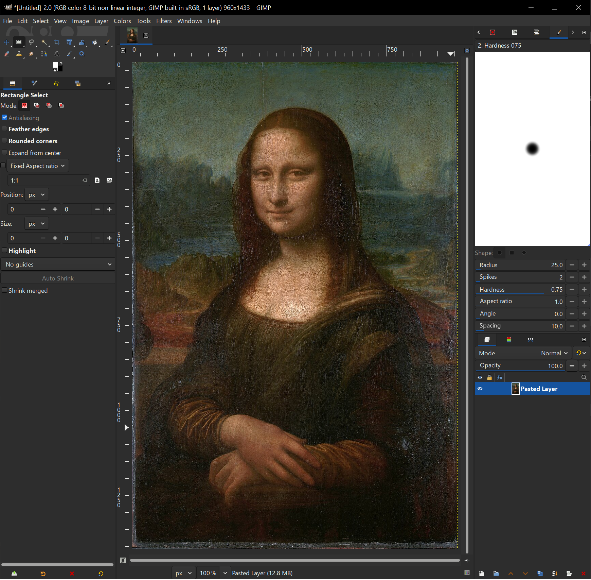
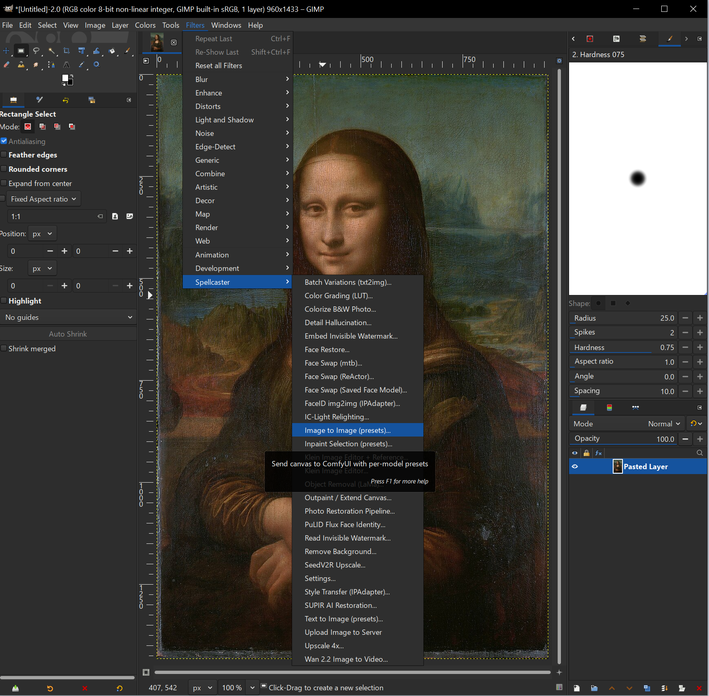
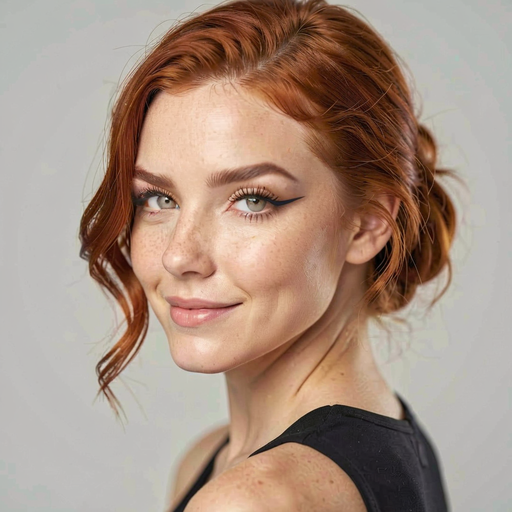
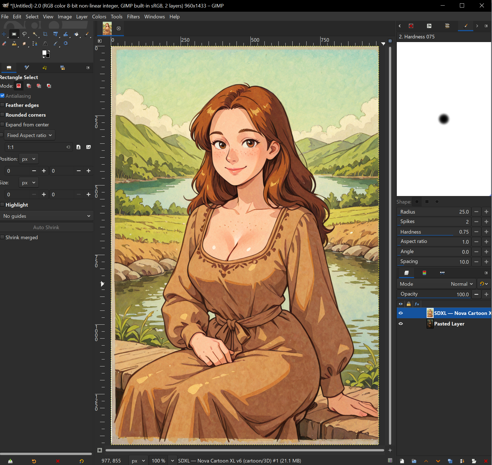

<p align="center">
  
</p>

<h1 align="center">Spellcaster</h1>

<p align="center">
  <strong>AI superpowers for your photos and art — no experience needed.</strong><br/>
  Just run the installer, open GIMP or Darktable, and start creating.
</p>

<p align="center">
  <a href="https://github.com/laboratoiresonore/spellcaster/releases"></a>
  <a href="LICENSE"></a>
  
</p>

<p align="center">
  <a href="#-what-is-spellcaster">What Is It</a> &bull;
  <a href="#-how-to-install">How to Install</a> &bull;
  <a href="#-what-can-i-do-with-it">What Can I Do</a> &bull;
  <a href="#-sample-output">Samples</a> &bull;
  <a href="#-faq">FAQ</a>
</p>

<p align="center">
Follow us for more creative experiments:
<a href="https://www.instagram.com/lelaboratoiresonore/">Instagram</a>
<a href="https://www.youtube.com/@LeLaboratoireSonore">Youtube</a>
<a href="https://www.facebook.com/laboratoire.sonore.2025">Facebook</a>
<a href="https://www.twitch.tv/laboratoiresonore">Twitch</a></p><br/>
     <br/><br/>


## What Is Spellcaster?

**Spellcaster adds AI tools to GIMP and Darktable** — the two most popular free image editors. Once installed, you'll find a new "Spellcaster" menu with 30+ tools that let you:

- **Create images from text descriptions** — type what you imagine, get a picture
- **Fix and enhance photos** — sharpen blurry images, restore old photos, fix faces
- **Remove anything from a photo** — paint over an object and it disappears
- **Swap faces** between photos
- **Change the lighting** on any portrait
- **Remove backgrounds** with one click
- **Generate short videos** from still images
- **Extend a photo** beyond its borders
- **Re-pose characters** — change how someone is standing or sitting
- **Blend layers** with AI-powered harmonization
- ...and much more

**You don't need to understand AI, machine learning, or any technical concepts.** Every tool comes with pre-configured settings that professionals have spent hundreds of hours perfecting. Your first result will look like your hundredth.

---

## How Does It Work?

Spellcaster connects your image editor (GIMP or Darktable) to an AI engine called [ComfyUI](https://github.com/comfyanonymous/ComfyUI) that runs on your computer's graphics card. You never need to touch ComfyUI directly — Spellcaster handles everything behind the scenes.

Here's what actually happens when you click a button:

1. You select an area or pick a preset in GIMP/Darktable
2. Spellcaster exports the image and sends it to ComfyUI
3. Your GPU processes the image using AI models
4. The result appears as a new layer in your editor

**The installer handles all the complexity.** It detects your GPU, downloads the right AI models, installs everything, and configures your apps. You just run it and click "Install."

---

## How to Install

### What You Need First

You need two free apps installed before running the Spellcaster installer:

| App | What It Is | Download |
|---|---|---|
| **ComfyUI** | The AI engine (runs in the background) | [github.com/comfyanonymous/ComfyUI](https://github.com/comfyanonymous/ComfyUI) |
| **GIMP 3** and/or **Darktable** | Your image editor | [gimp.org](https://www.gimp.org/downloads/) / [darktable.org](https://www.darktable.org/install/) |

> Don't worry if you've never heard of ComfyUI. Download it, unzip it, and run it once. That's all you need to do — Spellcaster handles the rest.

### Install Spellcaster

<p align="center">
  <a href="https://github.com/laboratoiresonore/spellcaster/releases/latest/download/spellcaster-installer.exe">
    
  </a>
  &nbsp;
  <a href="https://github.com/laboratoiresonore/spellcaster/releases/latest/download/spellcaster-installer-macos.zip">
    
  </a>
  &nbsp;
  <a href="https://github.com/laboratoiresonore/spellcaster/releases/latest/download/spellcaster-installer-linux">
    
  </a>
</p>

1. **Download** the installer for your system above
2. **Run it.** The installer walks you through 8 simple steps:
   - It checks that ComfyUI and GIMP/Darktable are installed
   - It asks you what you want to do (fix photos? create art? swap faces?) in plain English
   - It figures out what your GPU can handle and pre-selects the best options
   - It downloads everything automatically
3. **Open GIMP or Darktable.** Go to `Filters > Spellcaster` — all your new AI tools are there
4. **Pick any tool and click Generate.** That's it. Every preset is already optimized for great results.

### What the Installer Does For You

If you tried to set this up manually, you would need to:
- Research which AI models work with your GPU
- Figure out which model format to download (GGUF? fp8? fp16?)
- Download 5-30 GB of model files from multiple sources
- Install and configure 15+ ComfyUI extensions
- Learn what samplers, schedulers, CFG scales, and denoise values are
- Spend hours testing different combinations to get good results

**The installer does all of this in one click.** It detects your GPU's capabilities, picks the right model variants, downloads everything, installs the extensions, and configures every preset with settings that took professionals hundreds of hours to optimize.

> **Plugin not showing up?** Download the [**Manual Update & Repair tool**](https://github.com/laboratoiresonore/spellcaster/releases/latest/download/spellcaster-manual-update.exe) — it finds and fixes broken installations automatically.

---

## What Can I Do With It?

### Generation — Create and Edit Images

| Tool | What It Does |
|---|---|
| **Image-to-Image** | Transform any photo using AI — change styles, add detail, reimagine |
| **Text-to-Image** | Type a description and get an image (25 scene presets) |
| **Inpainting** | Paint over any area to regenerate it (44 expert presets) |
| **Outpaint** | Extend your image beyond its borders in any direction |
| **Batch Variations** | Generate 2-8 different versions with one click |
| **Klein Image Editor** | Next-gen Flux 2 Klein model — best quality available |
| **Klein Re-poser** | Change character poses and positions (26 poses, 8 camera angles) |
| **Klein Inpaint** | AI-fill any selection with context-aware smooth edges (17 task presets) |
| **Klein Outpaint** | Extend canvas using Klein — highest quality outpainting |
| **Klein Layer Blender** | Blend layers with AI-powered lighting/shadow harmonization |

### Fix and Enhance Photos

| Tool | What It Does |
|---|---|
| **AI Upscale** | Make any image larger and sharper (6 upscale models) |
| **Face Restore** | Fix blurry or damaged faces automatically |
| **Photo Restoration** | One-click pipeline: upscale + face fix + sharpen |
| **Detail Hallucination** | Add fine texture detail that wasn't there before |
| **SUPIR Restoration** | State-of-the-art AI photo repair |
| **Object Removal** | Paint over anything to erase it — no prompt needed |
| **Colorize B&W** | Add natural color to black-and-white photographs |
| **Upscaler Ratio Blender** | Blend two upscale models (e.g. 40% sharp + 60% smooth) |

### Style, Face & Video

| Tool | What It Does |
|---|---|
| **Style Transfer** | Copy the visual style of any reference image |
| **Color Grading** | Apply cinematic film looks (LUT presets) |
| **IC-Light Relighting** | Change lighting direction on any photo (14 presets) |
| **Face Swap** | Paste a face from one photo onto another |
| **FaceID / PuLID** | Generate new images that look like a specific person |
| **Wan 2.2 Image to Video** | Turn any photo into a 2-5 second video clip (26 motion presets) |
| **Wan 2.2 First+Last Frame** | Generate a video transition between two images |
| **Remove Background** | One-click transparent PNG |
| **Layer Blend by Ratio** | Blend any two layers by a controllable percentage |
| **Invisible Watermark** | Embed/read hidden metadata in images |

### Precision Tools

| Tool | What It Does |
|---|---|
| **ControlNet** | Guide AI using edges, depth maps, poses, or sketches |
| **AutoSet** | One-click auto-configure any dialog for the current image |
| **WD Tagger** | AI reads your image and suggests prompt tags |

---

## Sample Output

<p align="center"><em>Every image below was generated using Spellcaster's built-in presets — zero manual tuning.</em></p>

### Demo (Inpaint)

<table>
  <tr>
    <td align="center" width="25%"><br/><sub><strong>1. Select Area</strong><br/>Paint a mask over what you want to change</sub></td>
    <td align="center" width="25%"><br/><sub><strong>2. Pick Preset</strong><br/>Choose what to do (e.g. "Fix Hands")</sub></td>
    <td align="center" width="25%"><br/><sub><strong>3. Click Generate</strong><br/>The AI does its work</sub></td>
    <td align="center" width="25%"><br/><sub><strong>4. Done</strong><br/>Result appears as a new layer</sub></td>
  </tr>
</table>

### Generation

<p align="center">
  <br/>
  <sub><strong>Fantasy Landscape</strong> — IlustReal v5 &bull; 25 scene presets across 6 model families</sub>
</p>

<details>
<summary><strong>More generation examples</strong></summary>
<table>
  <tr>
    <td align="center" width="25%"><br/><sub><strong>Photorealistic Portrait</strong><br/>Juggernaut XL v9</sub></td>
    <td align="center" width="25%"><br/><sub><strong>Anime Illustration</strong><br/>NoobAI-XL v1.1</sub></td>
    <td align="center" width="25%"><br/><sub><strong>Disney / Pixar 3D</strong><br/>Modern Disney XL v3</sub></td>
    <td align="center" width="25%"><br/><sub><strong>Klein Flux 2 9B</strong><br/>Next-gen quality</sub></td>
  </tr>
</table>
</details>

### Restoration & Enhancement

<p align="center">
  <br/>
  <sub><strong>Remove Background</strong> — One-click AI background removal</sub>
</p>

<details>
<summary><strong>More restoration examples</strong></summary>
<table>
  <tr>
    <td align="center" width="25%"><br/><sub><strong>AI Upscale 4x</strong><br/>Before/after</sub></td>
    <td align="center" width="25%"><br/><sub><strong>Face Restore</strong></sub></td>
    <td align="center" width="25%"><br/><sub><strong>Colorize B&W</strong></sub></td>
    <td align="center" width="25%"><br/><sub><strong>Object Removal</strong><br/>Paint & erase</sub></td>
  </tr>
</table>
</details>

### Video — Wan 2.2

<table>
  <tr>
    <td align="center" width="25%"><br/><sub><strong>Living Portrait</strong></sub></td>
    <td align="center" width="25%"><br/><sub><strong>Camera Slow Zoom</strong></sub></td>
    <td align="center" width="25%"><br/><sub><strong>Flowing Water</strong></sub></td>
    <td align="center" width="25%"><br/><sub><strong>360 Turntable</strong></sub></td>
  </tr>
</table>

---

## Who Is This For?

| You are... | Spellcaster gives you... |
|---|---|
| **A complete beginner** | Professional results with zero learning curve |
| **A photographer** | AI retouching, upscaling, color grading — without leaving Darktable |
| **A Photoshop refugee** | All the AI tools you're used to, free and open-source |
| **An illustrator** | 25 art presets from photorealism to anime to Disney 3D |
| **Someone with old photos** | One-click restoration: upscale + face fix + colorize |
| **A video creator** | Turn any still image into a short animated clip |
| **Privacy-conscious** | Everything runs locally — no cloud, no subscriptions |

---

## FAQ

**Do I need to know anything about AI?**
No. Every tool comes with presets that handle all the technical settings. Just pick what sounds right and click Generate.

**How much disk space do I need?**
A basic setup is about 5 GB. A full installation with all models can be 30-50 GB. The installer tells you exactly how much before downloading.

**What GPU do I need?**
Any NVIDIA GPU with 4+ GB VRAM works for basic features. 8 GB unlocks most features. 12+ GB unlocks everything. The installer detects your GPU and only shows compatible features.

**Can I use this without a GPU?**
Yes — you can connect to a remote ComfyUI server running on another computer on your network. The installer has a remote server mode.

**Is this free?**
Yes. Spellcaster, GIMP, Darktable, and ComfyUI are all free and open-source. The AI models are also free. There are no subscriptions or hidden costs.

**How does this compare to Photoshop's AI tools?**
Similar capabilities (generative fill, object removal, upscaling, style transfer) but runs locally, is free, and gives you more control with 100+ expert presets.

**What if the plugin doesn't show up after installation?**
Download the [Manual Update & Repair tool](https://github.com/laboratoiresonore/spellcaster/releases/latest/download/spellcaster-manual-update.exe) — it automatically finds and fixes broken installations.

---

<details>
<summary><h2>For Developers & Power Users</h2></summary>

### Developer Install (Git + Python)

```bash
git clone https://github.com/laboratoiresonore/spellcaster
cd spellcaster
python install.py          # Interactive GUI wizard
python install.py --cli    # Force terminal mode
```

<details>
<summary><strong>CLI flags for scripted & headless installs</strong></summary>

```bash
python install.py --yes                    # Accept all defaults
python install.py --civitai-key YOUR_TOKEN # Authenticated downloads
python install.py --server-url http://192.168.1.50:8188  # Remote server
python install.py --features img2img,inpaint,upscale     # Cherry-pick
python install.py --comfyui ~/ComfyUI --gimp ~/.config/GIMP/3.0/plug-ins
python install.py --skip-models            # Plugins + nodes only
python install.py --dry-run                # Preview without changes
```

</details>

### The Expert-Tuned Difference

Every model preset is the product of extensive testing. Here's what Spellcaster handles that would take weeks to learn:

| What Spellcaster handles | What you'd have to learn |
|---|---|
| Optimal sampler + scheduler per model | Trial and error across 20+ combos |
| Correct CFG range per architecture | SD1.5=7.0, SDXL=5-6, ZIT=1-3, Flux=3.5 |
| Architecture-specific prompt structure | Quality tags vs descriptions vs natural language |
| Negative prompt engineering | 50+ patterns tuned per model family |
| Resolution constraints | SD1.5=512, SDXL=1024, Flux=mod-16 |
| LoRA selection + strength per task | Which LoRA, at what strength, for which model |
| Inpaint denoise by body part | Hands=0.78, eyes=0.65, skin=0.45 |

### Architecture

```
spellcaster/
+-- install.py                  # CLI installer
+-- installer_gui.py            # GUI installer (8-step wizard)
+-- manual_update.py            # Repair & update tool
+-- manifest.json               # Master config: features, nodes, models
+-- spellmaker.py               # Preset customization tool
+-- plugins/
|   +-- gimp/comfyui-connector/ # GIMP 3 plugin (~14,000 lines)
|   +-- darktable/              # Darktable Lua plugin (~7,400 lines)
+-- assets/                     # Showcase images, icons, splash art
```

### How It Works Internally

1. **Select** — Paint a selection or pick a tool in GIMP/Darktable
2. **Export** — Image exported as a temporary PNG
3. **Upload** — Sent to ComfyUI server via HTTP
4. **AI Process** — ComfyUI runs the workflow with tuned parameters on your GPU
5. **Download** — Result fetched back
6. **Import** — Appears as a new layer in your editor

### Self-Updating Plugins

Both plugins check GitHub on each launch and silently update themselves. New features appear automatically — no manual downloads.

### Spellmaker (Experimental)

Power users can create custom presets, link LoRAs, and import ComfyUI workflows:

```bash
python spellmaker.py
```

### Building the Installer

```bash
python build_installer.py                  # Auto-detect OS
python build_installer.py --update-tool    # Also build repair tool
```

</details>

<details>
<summary><h2>Supported Models (full list)</h2></summary>

The installer auto-detects your GPU and downloads the right model variants.

### VRAM Tiers

| Tier | VRAM | What gets installed |
|---|---|---|
| **Low** | < 8 GB | Q4/Q5 GGUF quantized — lightweight but capable |
| **Medium** | 8-12 GB | fp8 or Q8 — great quality/performance balance |
| **High** | 12-20 GB | fp8 or standard — full feature access |
| **Ultra** | 20+ GB | Full bf16 — maximum quality |

### Checkpoints (25+ models)

<details>
<summary>SD 1.5, SDXL, Illustrious, ZIT, Flux 1 Dev, Flux 2 Klein</summary>

**SD 1.5** (6 GB): Juggernaut Reborn, Realistic Vision v5.1, SD 1.5 Base

**SDXL Realistic** (8 GB): Juggernaut XL v9/Ragnarok, JibMix Realistic, ZavyChroma, CyberRealistic Pony, AlbedoBase, SDXL Base

**SDXL Anime** (8 GB): NoobAI-XL, Nova Anime XL, Wai Illustrious, IlustReal, Sloppy Messy Mix

**SDXL Cartoon** (8 GB): Modern Disney XL, Nova Cartoon XL

**Z-Image-Turbo** (8 GB): GonzaloMo Zpop v3 — 6-step turbo

**Flux 1 Dev** (12+ GB): Flux 1 Dev fp8, Flux Kontext Dev fp8

**Flux 2 Klein** (6-20 GB): Klein 9B, Klein 4B fp8, Klein Base 4B fp8

</details>

### Upscale Models (6)

4x-UltraSharp, RealESRGAN x4plus, 4x Remacri, 4x NMKD Superscale, RealESRGAN Anime, 8x NMKD Faces

### ControlNet Models (8)

SD1.5 (Lineart, Depth, OpenPose, Tile), SDXL (Canny, OpenPose, Tile), ZIT Union

### Video Models (Wan 2.2)

Q4 GGUF (8 GB) and fp8 (16 GB) variants, UMT5-XXL encoder, Wan VAE

### 90+ LoRAs

Body & detail fix, artistic styles, accelerators — across SDXL, Flux, Klein, ZIT, and Illustrious architectures.

</details>

<details>
<summary><h2>Custom Nodes (auto-installed)</h2></summary>

| Node | Purpose |
|---|---|
| ComfyUI-GGUF | Load quantized models for low VRAM |
| ComfyUI-VideoHelperSuite | Video composition |
| ComfyUI-Frame-Interpolation | RIFE smooth video |
| comfyui-reactor-node | Face swap + face restore |
| comfyui-mtb | MTB face swap |
| ComfyUI_IPAdapter_plus | FaceID + style transfer |
| PuLID_ComfyUI | Identity preservation |
| ComfyUI-KJNodes | Image size utilities |
| ComfyUI-RTXVideoSuperResolution | NVIDIA RTX video upscaling |
| ComfyUI-REMBG | Background removal |
| ComfyUI-LaMa | Object removal |
| ComfyUI_essentials | LUT color grading |
| comfyui_controlnet_aux | ControlNet preprocessors |
| ComfyUI-IC-Light | Relighting |
| ComfyUI-SUPIR | SUPIR restoration |

</details>

<details>
<summary><h2>Troubleshooting</h2></summary>

| Problem | Solution |
|---|---|
| Plugin not visible in GIMP | Run the [Manual Update & Repair tool](https://github.com/laboratoiresonore/spellcaster/releases/latest/download/spellcaster-manual-update.exe) |
| "Node not found" error | Re-run the installer to install missing extensions |
| "Cannot connect to server" | Make sure ComfyUI is running |
| Out of VRAM | Switch to a smaller model (the installer can help you pick) |
| All runs produce same result | Set seed to -1 for random results |
| Download fails (403) | Add your CivitAI or HuggingFace token in the installer |

</details>

---

## License

[GPL-2.0](LICENSE) — Free software. Use it, modify it, share it.

---

<p align="center">
  
  <br/><br/>
  <strong>From zero to AI mastery in one install.
      <br/><br/>Experimentally yours, <a href="https://www.laboratoiresonore.com/">le laboratoire sonore</a>, Arkyn Glyph</strong><br/>
<p align="center">
Follow us for more creative experiments:
<a href="https://www.instagram.com/lelaboratoiresonore/">Instagram</a>
<a href="https://www.youtube.com/@LeLaboratoireSonore">Youtube</a>
<a href="https://www.facebook.com/laboratoire.sonore.2025">Facebook</a>
<a href="https://www.twitch.tv/laboratoiresonore">Twitch</a></p><br/>
     <br/><br/>
</p>
