<p align="center">
  
</p>

<h1 align="center">Spellcaster</h1>

<p align="center">
  <strong>AI superpowers for your photos and art — no experience needed.</strong><br/>
  Use it from GIMP, from Darktable, or just tell an AI chatbot what you want.
</p>

<p align="center">
  <a href="https://github.com/laboratoiresonore/spellcaster/releases"></a>
  <a href="LICENSE"></a>
  
</p>

<p align="center">
  <a href="#what-is-spellcaster">What Is It</a> &bull;
  <a href="#how-to-install">How to Install</a> &bull;
  <a href="#complete-feature-reference">Features</a> &bull;
  <a href="#sample-output">Samples</a> &bull;
  <a href="#just-talk-to-it--the-scaffold-system">Just Talk To It</a> &bull;
  <a href="#bring-your-own-workflows">Your Workflows</a> &bull;
  <a href="#faq">FAQ</a> &bull;
  <a href="#for-developers--power-users">Dev Guide</a>
</p>

---

## What Is Spellcaster?

**Spellcaster adds 47 AI tools to GIMP and Darktable** — the two most popular free image editors. Create images from text, fix and enhance photos, swap faces, generate short videos, remove backgrounds, change lighting, extend canvases, re-pose characters, blend layers with AI harmonization — and that's just the built-in stuff.

**You don't need to understand AI, machine learning, or any technical concepts.** Every tool comes with pre-configured settings that professionals have spent hundreds of hours perfecting. Your first result will look like your hundredth.

**Don't want to learn GIMP or Darktable?** You don't have to. Spellcaster's scaffold system lets you control everything by **just talking to an AI chatbot**. Say "make this photo more cinematic" or "swap the face in this image" and the AI figures out which tool to use, asks you the right questions, runs the workflow, and delivers the result. Works with any LLM — through Signal, SillyTavern, OpenWebUI, or any chat interface. See [Just Talk To It](#just-talk-to-it--the-scaffold-system).

**Already use ComfyUI?** Spellcaster can import your existing workflows and run them straight from GIMP — no need to rebuild anything. See [Bring Your Own Workflows](#bring-your-own-workflows).

---

## How Does It Work?

Spellcaster connects your image editor (GIMP or Darktable) to an AI engine called [ComfyUI](https://github.com/comfyanonymous/ComfyUI) that runs on your computer's graphics card. You never need to touch ComfyUI directly — Spellcaster handles everything behind the scenes.

1. You select an area or pick a preset in GIMP/Darktable
2. Spellcaster exports the image and sends it to ComfyUI
3. Your GPU processes the image using AI models
4. The result appears as a new layer in your editor

**The installer handles all the complexity** — GPU detection, model downloads, extension installs, and preset configuration. You just run it and click "Install."

---

## How to Install

### What You Need First

| App | What It Is | Why | Download |
|---|---|---|---|
| **ComfyUI** | The AI engine that does the heavy lifting | Required — this is what actually runs the AI models on your GPU | [github.com/comfyanonymous/ComfyUI](https://github.com/comfyanonymous/ComfyUI) |
| **GIMP 3** and/or **Darktable** | Free image editors (like Photoshop / Lightroom) | You need at least one — this is where Spellcaster's menu lives | [gimp.org](https://www.gimp.org/downloads/) / [darktable.org](https://www.darktable.org/install/) |
| **A GPU with 4+ GB VRAM** | NVIDIA recommended, AMD works too | The AI models run on your graphics card — more VRAM = more features | You probably already have one |

> **Never heard of ComfyUI?** That's fine. Download it, unzip it, run it once. You'll never need to open it again — Spellcaster talks to it behind the scenes. Think of it like an engine under the hood: it does the work, but you never see it.
>
> **Don't have a GPU?** No problem. You can connect to a ComfyUI server running on another computer on your network (a friend's gaming PC, a cloud instance, etc.). The installer has a remote server mode.
>
> **Don't want to use GIMP or Darktable at all?** You can skip them entirely and control Spellcaster through an [AI chatbot](#just-talk-to-it--the-scaffold-system) instead.

### Install Spellcaster

<p align="center">
  <a href="https://github.com/laboratoiresonore/spellcaster/releases/latest/download/spellcaster-installer.exe">
    
  </a>
  &nbsp;
  <a href="https://github.com/laboratoiresonore/spellcaster/releases/latest/download/spellcaster-installer-macos.zip">
    
  </a>
  &nbsp;
  <a href="https://github.com/laboratoiresonore/spellcaster/releases/latest/download/spellcaster-installer-linux">
    
  </a>
</p>

1. **Download** the installer for your system above
2. **Run it.** The installer walks you through everything (see below)
3. **Open GIMP or Darktable.** Go to `Filters > Spellcaster` — all your new AI tools are there
4. **Pick any tool and click Generate.** That's it. Every preset is already optimized for great results.

> **Plugin not showing up?** Download the [**Manual Update & Repair tool**](https://github.com/laboratoiresonore/spellcaster/releases/latest/download/spellcaster-manual-update.exe) — it finds and fixes broken installations automatically.

### What the Installer Does For You

The installer is an 8-step guided wizard. It's designed so you never have to make a decision you don't understand.

<details>
<summary><strong>See the full walkthrough</strong></summary>

| Step | What Happens | What You Do |
|---|---|---|
| **1. Welcome** | Checks your system for prerequisites (GIMP, Darktable, ComfyUI) | Click download links for anything missing |
| **2. What Do You Want?** | Asks you in plain English: *"I want to enhance photos"*, *"I want to generate videos"*, etc. | Check the boxes that sound like you |
| **3. Quick Setup** | Offers three paths: *Install Everything*, *Recommended*, or *Let Me Pick* | Pick whichever you're comfortable with |
| **4. Model Advisor** | Explains which AI models are redundant so you don't waste disk space | Read the tips or just click Next |
| **5. System Layout** | Auto-detects where ComfyUI, GIMP, and Darktable are installed | Confirm or browse to correct paths |
| **6. Feature Profiles** | Shows features organized by category, matching the in-app menu layout | Review what's selected |
| **7. Components** | Lists every model and extension with size estimates and preview thumbnails | Uncheck anything you don't want |
| **8. Install** | Downloads models, installs extensions, patches plugins, configures everything | Watch the progress bar |

**The installer detects your GPU** and only shows features your hardware can run. If you have 4 GB of VRAM, you won't see options that need 16 GB. No guesswork.

**Remote server mode**: Don't have a GPU? The installer can connect to a ComfyUI server running on another computer on your network. Just enter the IP address — everything else works the same.

</details>

---

## Complete Feature Reference

### Generation — Create and Edit Images

<details>
<summary><strong>Image-to-Image, Text-to-Image, Inpainting, Outpainting</strong> — core generation tools</summary>

| Tool | What It Does | Details |
|---|---|---|
| **Image-to-Image** | Transform any photo using AI — change styles, add detail, reimagine | Per-model presets, LoRA injection, dual ControlNet support |
| **Text-to-Image** | Type a description and get an image | 25 scene presets across 6 model families, quality boost tokens auto-injected |
| **Inpainting** | Paint over any area to regenerate it | 44 expert presets with body-part-tuned denoise (hands=0.78, eyes=0.65, skin=0.45) |
| **Outpaint** | Extend your image beyond its borders in any direction | Configurable padding per side |
| **Batch Variations** | Generate 2-8 different versions with one click | Seed increments for reproducible variation |

</details>

<details>
<summary><strong>Flux 2 Klein — Next-Gen Editing</strong> — 7 tools powered by the distilled Flux 2 model</summary>

| Tool | What It Does | Details |
|---|---|---|
| **Klein Image Editor** | Best-quality img2img available | 4B and 9B model variants, 4-20 steps |
| **Klein + Reference** | Klein editing guided by a reference image | Structure and style transfer from reference |
| **Klein Inpaint** | Context-aware selection fill with smooth edges | 17 task presets |
| **Klein Outpaint** | Highest quality canvas extension | Seamless border continuation |
| **Klein Layer Blender** | AI-powered layer harmonization | Lighting and shadow matching between layers |
| **Klein Re-poser** | Change character poses and positions | 26 poses, 8 camera angles |
| **Klein Head Swap** | Face swap with Klein refinement pass | Hybrid pipeline: ReActor swap → Klein blend |

</details>

<details>
<summary><strong>ControlNet Suite</strong> — guide AI using edges, depth, poses, or sketches</summary>

| Preprocessor | What It Detects | Use For |
|---|---|---|
| **Canny Edge** | Hard edges and outlines | Preserving structure while changing style |
| **MiDaS Depth** | Depth map from 2D image | Maintaining spatial relationships |
| **OpenPose / DWPose** | Body skeleton and joints | Pose guidance and character positioning |
| **Scribble** | Rough sketch lines | Turning doodles into polished art |
| **LineArt** | Clean line drawings | Coloring and rendering line work |
| **Tile** | Grid-based detail preservation | Upscaling with structure preservation |

Dual ControlNet support in img2img and inpaint workflows. Models auto-selected per architecture (SD1.5, SDXL, ZIT, Flux Union Pro).

</details>

### Fix and Enhance Photos

<details>
<summary><strong>Upscaling, Restoration, Color</strong> — 8 tools to repair and enhance any photo</summary>

| Tool | What It Does | Details |
|---|---|---|
| **AI Upscale** | Make any image larger and sharper | 6 upscale models (UltraSharp, RealESRGAN, Remacri, NMKD, Anime, Faces) |
| **Face Restore** | Fix blurry or damaged faces | CodeFormer with adjustable fidelity weight |
| **Photo Restoration** | One-click pipeline: upscale + face fix + sharpen | Multi-stage combined workflow |
| **Detail Hallucination** | Add fine texture detail that wasn't there | Upscale + low-denoise img2img pass |
| **SUPIR Restoration** | State-of-the-art AI photo repair | Dedicated SUPIR model, tunable denoise |
| **SeedV2R Upscaler** | Specialized upscaling with hallucination control | None/light/high hallucination modes, 2x-4x scales |
| **Colorize B&W** | Add natural color to black-and-white photographs | ControlNet-guided colorization |
| **Upscaler Ratio Blender** | Blend two upscale models (e.g. 40% sharp + 60% smooth) | Parametric two-model mixing |

</details>

### Face & Identity

<details>
<summary><strong>Face Swap, FaceID, PuLID</strong> — 6 tools for face manipulation and identity preservation</summary>

| Tool | What It Does | Details |
|---|---|---|
| **Face Swap (ReActor)** | Paste a face from one photo onto another | Direct source-to-target with optional face restoration |
| **Face Swap (Model)** | Swap using a saved face model library | Build reusable face models from any photo |
| **Face Swap (mtb)** | Alternative face swap engine | antelopev2/buffalo_l analysis models, multi-face indexing |
| **FaceID (IPAdapter)** | Generate images that look like a specific person | FACEID, FACEID PLUS V2, FACEID PORTRAIT presets, dual weight control |
| **PuLID Flux** | Flux-native identity preservation | Attention-level face transfer (not post-processing), works with Klein 4B/9B |
| **Face Restore** | Enhance and repair faces | CodeFormer with adjustable strength |

</details>

### Style, Lighting & Effects

<details>
<summary><strong>Style Transfer, Relighting, Color Grading</strong> — visual transformation tools</summary>

| Tool | What It Does | Details |
|---|---|---|
| **Style Transfer** | Copy the visual style of any reference image | IPAdapter-based, adjustable strength |
| **IC-Light Relighting** | Change lighting direction on any photo | 10 presets: Left/Right/Top/Bottom light, Back light, Front Soft, Golden Hour, Blue Hour, Neon, Dramatic |
| **Color Grading (LUT)** | Apply cinematic film looks | 3D LUT application with strength control |

</details>

### Video Generation

<details>
<summary><strong>Wan 2.2 Image-to-Video + Post-Processing</strong> — turn any still into a video clip</summary>

| Tool | What It Does | Details |
|---|---|---|
| **Wan 2.2 Image-to-Video** | Turn any photo into a 2-5 second video clip | Dual-UNET 14B (GGUF Q4 or fp8), 26 motion presets |
| **Wan First+Last Frame** | Generate a video transition between two images | Interpolation with start/end frame control |
| **Director's Chair (Solo)** | Multi-step video sequence with face re-injection | Chain multiple Wan I2V steps with ReActor between |
| **Director's Chair (Duo)** | Same pipeline with 2 actors tracked | Dual face re-injection per step |
| **Director's Chair (Trio)** | Same pipeline with 3 actors tracked | Triple face re-injection per step |
| **Video Upscale** | Enhance video resolution and frame rate | RTX Super-Resolution + RIFE 2x interpolation |
| **Video Face Swap** | Face swap across video frames | ReActor on video + upscale |
| **SeedVR2 Video Upscale** | Advanced video upscaling with hallucination control | Tunable quality enhancement |
| **GIF Stitch** | Chain multiple GIFs into seamless video | Concatenation with loop control |

**Motion presets include**: breathing/living portrait, hair sway, expression shifts, eye movement, camera zoom/pan/orbit, nature elements (wind, water, fire), walking, turning, and more. Pingpong looping for seamless loops. LightX2V acceleration LoRAs reduce 30 steps to 4.

</details>

### Utility & Housekeeping

<details>
<summary><strong>Background Removal, Object Removal, Watermarks, Blending</strong> — precision tools</summary>

| Tool | What It Does | Details |
|---|---|---|
| **Remove Background** | One-click transparent PNG | rembg model |
| **Object Removal (LaMa)** | Paint over anything to erase it — no prompt needed | LaMa inpainting |
| **Layer Blend by Ratio** | Blend any two layers by a controllable percentage | Parametric layer mixing |
| **Embed Watermark** | Hide invisible metadata in images | LSB steganography |
| **Read Watermark** | Extract hidden metadata from watermarked images | LSB steganography reader |
| **Send to Server** | Upload image to ComfyUI input folder | Manual upload tool |
| **Clean Server Inputs** | Purge temp uploads from ComfyUI to reclaim disk space | Overwrites gimp_* files with 1x1 pixel PNGs |

</details>

### My Presets — Save and Recall Your Favorites

Every dialog in Spellcaster has a **Save Preset** button. Name your settings, and they appear in the **My Presets** panel — a quick-access menu that lives at the top of the Filters menu.

Presets remember everything: model, prompt, LoRAs, denoise, steps, dimensions — so you can recreate any result instantly. Works across img2img, Klein, Wan video, FaceID, PuLID, and all other tools.

### Magic Studios — Full Character Pipeline

<details>
<summary><strong>7 tools that chain together: selfie → face model → body → outfit → set → video</strong></summary>

| Tool | What It Does | Details |
|---|---|---|
| **Casting Polaroids** | Create a reusable face model from any photo | 3 face restore variants (CodeFormer Sharp, GPEN-2048, CodeFormer Faithful) |
| **Body Double** | Generate full-body references | Face swap + transparent background removal |
| **Wardrobe Department** | AI outfit replacement | Select clothing area, describe target style |
| **Set Design** | Generate backgrounds and composite actors | Klein-quality harmonization of lighting and shadows |
| **Director's Chair (Solo)** | Multi-step Wan 2.2 I2V with face re-injection | Chain video steps to build a scene |
| **Director's Chair (Duo)** | Same pipeline with 2 actors | Dual face tracking across video steps |
| **Director's Chair (Trio)** | Same pipeline with 3 actors | Triple face tracking across video steps |

```
Selfie → Casting Polaroids → Body Double → Wardrobe → Set Design → Director's Chair → MP4
          (face model)        (transparent)   (outfit)    (composite)   (Wan 2.2 I2V)
```

</details>

### Settings & Configuration

<details>
<summary><strong>Server, output, cleanup, auto-update, model favorites</strong></summary>

| Setting | What It Controls |
|---|---|
| **ComfyUI Server URL** | Where to send workflows (local or remote, persisted) |
| **Workflow Timeout** | How long to wait for a result (0 = infinite) |
| **Output Directory** | Where to copy finished images (Browse button with GTK picker) |
| **Cleanup Mode** | Copy or delete temp uploads after generation |
| **Auto-Update** | Check GitHub on launch and silently update plugin files |
| **Model Favorites** | Pin preferred checkpoints to top of every dialog |
| **Clean Server Inputs** | One-click purge of all gimp_* temp files from ComfyUI |
| **Debug Image Export** | Save intermediate workflow images for troubleshooting |

</details>

---

## Just Talk To It — The Scaffold System

You don't need to learn GIMP. You don't need to learn Darktable. You don't even need to open ComfyUI.

**Just tell Spellcaster what you want in plain English.** The scaffold system connects any AI chatbot to your full Spellcaster toolkit. Say *"upscale this photo"* or *"make this look more cinematic"* or *"swap the face in this image with mine"* — and it happens. The AI picks the right tool, asks you the right questions, runs the workflow on your GPU, and sends back the result.

### How It Works

The scaffold is a three-layer AI brain that sits between you and ComfyUI:

1. **You say what you want** — in any chat app (Signal, SillyTavern, OpenWebUI, LM Studio, KoboldCpp, or anything that can talk to an LLM)
2. **The MetaWizard figures out your intent** — "make this more cinematic" routes to Klein with a cinematic preset, not a txt2img workflow
3. **The SpellcasterWizard collects parameters** — asks you only what matters (prompt, strength, model) using simple numbered menus that even a 7B model can handle
4. **ComfyUI runs the workflow** — the scaffold builds the node graph, uploads your image, executes, and polls for results
5. **You get the result** — delivered right back into your chat, with all temp files automatically cleaned up for privacy

Every Spellcaster node and every workflow on your server is auto-discovered. No configuration needed — the scaffold builds its own menus from whatever's installed.

### Signal Bridge — AI Art on Autopilot

The **Signal Bridge** takes this further: it turns your ComfyUI server into a remote AI art service. Friends, collaborators, or clients send a message — the AI assistant handles everything and sends back the finished image.

- Works over **Signal, or any messaging platform** your LLM can reach
- **Privacy-first** — uploaded images and generated outputs are automatically deleted from the server after delivery
- **Character cards included** for SillyTavern, OpenWebUI, LM Studio, and KoboldCpp — drop one in and you're running
- The LLM doesn't need to be smart — the scaffold uses numbered menus and state machines designed for **7B parameter models**

<details>
<summary><strong>Scaffold architecture for the curious</strong></summary>

| Layer | Role |
|---|---|
| **MetaWizard** | Intent router — classifies what the user wants (enhance, generate, modify, video, inpaint, reference) and hands off to the right sub-wizard |
| **SpellcasterWizard** | Drives Spellcaster enhancement nodes with preset support (Gentle / Strong / Maximum) and step-by-step parameter collection |
| **WorkflowWizard** | Drives *any* ComfyUI workflow — parses the JSON, extracts tunable parameters, builds a numbered-menu wizard on the fly |
| **ComfyUIRunner** | Handles all server communication: image upload, workflow submission, result polling, download, and privacy cleanup |
| **Introspector** | Auto-discovers every node's parameters at runtime (live import or AST parsing) — no hardcoded definitions |
| **PromptBuilder** | Generates the LLM system prompt from discovered nodes — deterministic, regenerated fresh each run |

</details>

---

## Bring Your Own Workflows

**Already have ComfyUI workflows you've built or downloaded?** Spellcaster can run them directly from GIMP — no need to rebuild anything.

### The Travelling Wizard

Open `Filters > Spellcaster Tools > Travelling Wizard` to access the workflow bridge. It shows your server status (green/red indicator) and three main actions:

| Action | What It Does |
|---|---|
| **Open Scaffold Editor** | Launches a full settings GUI in your browser with 9 tabs — configure workflow paths, node mappings, ComfyUI connection, and manage imported workflows. |
| **Browse Workflow Library** | Connects to your ComfyUI server and lists all workflows in its `workflows/` directory. Pick one and it's imported automatically. |
| **Import Workflow File** | Load any `.json` workflow from disk. Spellcaster auto-detects the format (LiteGraph UI graph or ComfyUI API), classifies the workflow type, and extracts all tunable parameters. |

Once imported, your custom workflows appear with metadata and a one-click "Run" button. The wizard figures out which parameters matter (prompt, seed, steps, model, dimensions) and hides the ones that don't.

### The Scaffold Editor

Click "Open Scaffold Editor" in the Travelling Wizard to launch a browser-based GUI with 9 tabs:

| Tab | What You Configure |
|---|---|
| **General** | ComfyUI server URL, input/output directories, prompt history, debug mode |
| **Workflow tabs (1-8)** | One tab per workflow type (inpaint, image edit, generator, outpaint, upscaler, etc.). Point at your own workflow JSON and remap node IDs — make Spellcaster drive your workflows instead of its built-in ones. |
| **Custom Workflows** | All workflows imported via the Travelling Wizard, with metadata and parameter lists. |

You don't need to touch the Scaffold Editor for normal use — it's there for when you want deeper control.

### Spellmaker — The Preset Editor

Power users who want full control over presets can use Spellmaker, a standalone GUI tool:

```bash
python tools/spellmaker.py
```

Spellmaker lets you:
- **Create presets** for any tool — 8 types: model configs, inpaint recipes, scene templates, video settings, Wan models, Klein models, IC-Light presets, and arbitrary workflow JSON
- **Import from ComfyUI** — load a raw workflow JSON and convert it to a named preset
- **Edit and clone** existing presets
- **Export** a `spellbook.json` that can be loaded into the plugins

### For Existing ComfyUI Users

If you already use ComfyUI and have workflows, models, and custom nodes installed, Spellcaster slots right in:

- **Your existing models are used as-is.** Spellcaster discovers models on the server at runtime — it doesn't require its own copies.
- **Your existing custom nodes keep working.** The installer only adds nodes it needs and skips ones you already have.
- **Your existing workflows can be imported** via the Travelling Wizard — or remap Spellcaster's built-in tools to use your workflows via the Scaffold Editor.
- **Remote server works natively.** If ComfyUI runs on a different machine, just point the settings at it. The entire plugin works over HTTP.

---

## Supported Architectures & Models

<details>
<summary><strong>SD 1.5</strong> — 3 checkpoints, classic architecture</summary>

| Checkpoint | Style | Resolution | Steps | CFG |
|---|---|---|---|---|
| Juggernaut Reborn | Realistic | 512×512 | 20 | 7.0 |
| Realistic Vision v5.1 | Photo | 512×768 | 25 | 7.5 |
| SD 1.5 Base | General | 512×512 | 20 | 7.0 |

Turbo acceleration: Hyper-SD15 8-step LoRA. Supports all ControlNet preprocessors.

</details>

<details>
<summary><strong>SDXL</strong> — 12 checkpoints across realistic, anime, and cartoon styles</summary>

**Realistic**: Juggernaut XL v9, Juggernaut XL Ragnarok, JibMix Realistic, ZavyChroma XL, CyberRealistic Pony, AlbedoBase XL, SDXL Base 1.0

**Anime**: NoobAI-XL v1.1, Nova Anime XL v1.70, Wai Illustrious SDXL

**Cartoon/3D**: Modern Disney XL v3, Nova Cartoon XL v6

Resolution: 1024×1024 base. Steps: 25-30. CFG: 5.0-7.0. Turbo acceleration: Hyper-SDXL 8-step LoRA.

</details>

<details>
<summary><strong>Illustrious</strong> — 2 checkpoints, semi-realistic to artistic</summary>

| Checkpoint | Style | Steps | CFG |
|---|---|---|---|
| IlustReal v5 | Semi-realistic | 28 | 5.5 |
| Sloppy Messy Mix v1 | Artistic | 28 | 5.0 |

Pony-based architecture. Supports Illustrious\ and Illustrious-Pony\ LoRAs.

</details>

<details>
<summary><strong>Z-Image-Turbo (ZIT)</strong> — 5 presets, fast 4-12 step distilled SDXL</summary>

| Preset | Steps | CFG | Sampler |
|---|---|---|---|
| Photo | 6 | 2.0 | euler |
| Portrait | 8 | 2.5 | euler |
| Cinematic | 8 | 2.5 | dpmpp_2m |
| Anime/Illustration | 6 | 2.0 | euler |
| Quality | 12 | 3.0 | dpmpp_2m |

Already distilled — no turbo acceleration needed.

</details>

<details>
<summary><strong>Flux 1 Dev</strong> — 10 presets including Schnell (4-step) and Kontext (instruction editing)</summary>

**Standard**: Photo/Realistic, Portrait, Landscape, Anime, Cinematic, Artistic, Detail/Upscale Pass

**Fast**: Schnell (4-step, no guidance)

**Inpaint**: Fill/Inpaint, Light Touch

**Kontext** (8 presets): Edit/Modify, Replace Element, Style Transfer, Background Swap, Portrait Retouch, Localized Inpaint, Preserve/Light Touch — instruction-based editing via natural language.

Turbo acceleration: Hyper-FLUX 8-step LoRA (strength 0.125).

</details>

<details>
<summary><strong>Flux 2 Klein</strong> — 6 presets, ultra-fast distilled Flux (4-20 steps)</summary>

| Preset | Model | Steps | Resolution |
|---|---|---|---|
| 4B Fast | Klein 4B fp8 | 4 | 1024×1024 |
| 9B Photo Quality | Klein 9B | 20 | 1024×1024 |
| 9B Portrait | Klein 9B | 20 | 896×1152 |
| 9B Artistic/Painterly | Klein 9B | 20 | 1024×1024 |
| 9B Cinematic | Klein 9B | 20 | 1280×720 |
| 9B Inpaint/Refinement | Klein 9B | 20 | adaptive |

VAE/CLIP pairings: 9B → qwen_3_8b, 4B → qwen_3_4b. Supports PuLID face identity and reference image conditioning. Uses Flux2Scheduler with max_shift/base_shift control.

</details>

<details>
<summary><strong>Wan 2.2 — Image-to-Video</strong> — dual-UNET 14B model</summary>

| Variant | Format | VRAM | Quality |
|---|---|---|---|
| 14B GGUF Q4 | Quantized | ~8 GB | Good |
| 14B fp8 | Half-precision | ~16 GB | Best |

Dual-UNET architecture: high-noise and low-noise models with configurable switchover point. Supports content LoRAs (applied to both UNETs) and acceleration LoRAs (noise-specific: LightX2V reduces 30 steps to 4). Post-processing: RTX Super-Resolution + RIFE 2x frame interpolation. Output: MP4 + GIF with optional pingpong looping.

</details>

---

## LoRA System

<details>
<summary><strong>90+ curated LoRAs with architecture-aware filtering and turbo acceleration</strong></summary>

### Architecture-Based Filtering

LoRAs are auto-filtered by the active model architecture so you only see compatible options:

| Architecture | LoRA Folders |
|---|---|
| SD 1.5 | All LoRAs (no restriction) |
| SDXL | SDXL\, Illustrious\, Illustrious-Pony\, Pony\ |
| ZIT | Z-Image-Turbo\ |
| Illustrious | Illustrious\, Illustrious-Pony\ |
| Flux 2 Klein | Flux-2-Klein\ |
| Flux 1 Dev | Flux-1-Dev\ |
| Flux Kontext | Flux-1-Dev\ (compatible) |

### Turbo Acceleration LoRAs

| Accelerator | Architecture | Effect |
|---|---|---|
| Hyper-SD15 8-step | SD 1.5 | Reduces steps from 20-25 → 8 |
| Hyper-SDXL 8-step | SDXL | Reduces steps from 25-30 → 8 |
| Hyper-FLUX 8-step | Flux 1 Dev / Kontext | Reduces steps with 0.125 strength |
| LightX2V | Wan 2.2 | Reduces video steps from 30 → 4, noise-specific pairing |

### Style/Detail Presets

50+ curated LoRA presets organized by category: artistic styles (Anime, Ghibli, Glitch), effects (Slime, Freckles, Hyperdetail), character styles, 3D/CG rendering — each with architecture-specific paths and tuned strength, denoise, and CFG overrides.

</details>

---

## Sample Output

<p align="center"><em>Every image below was generated using Spellcaster's built-in presets — zero manual tuning.</em></p>

### Demo (Inpaint)

<table>
  <tr>
    <td align="center" width="25%">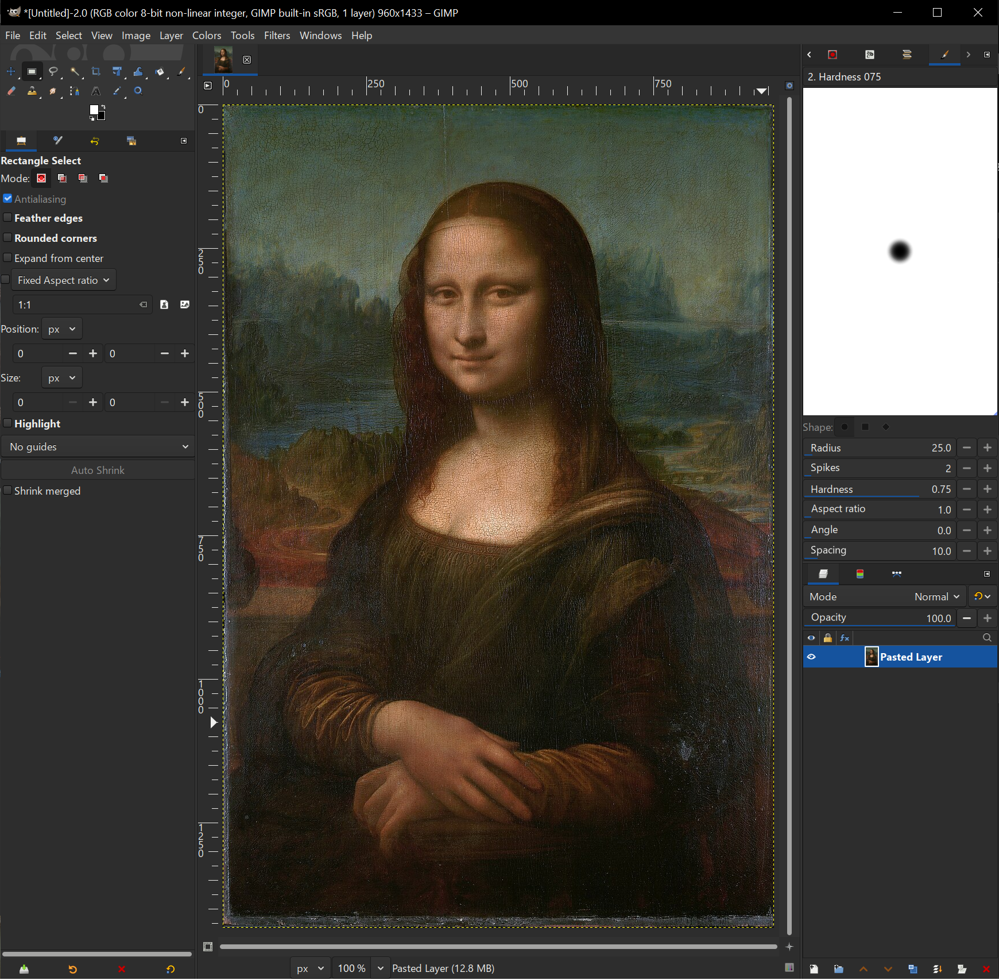<br/><sub><strong>1. Select Area</strong><br/>Paint a mask over what you want to change</sub></td>
    <td align="center" width="25%">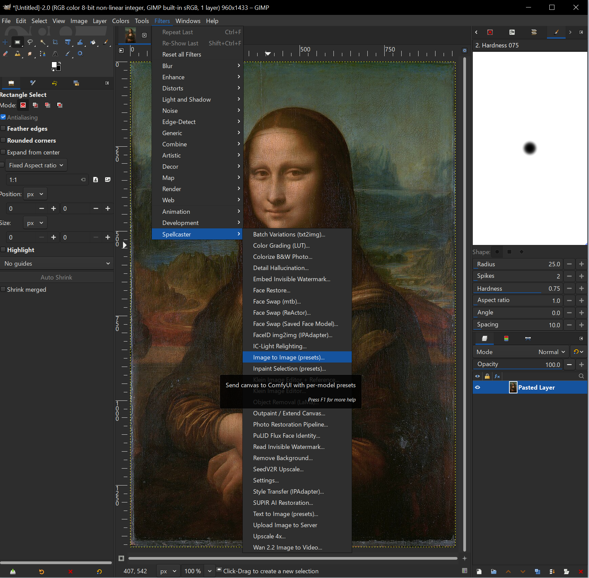<br/><sub><strong>2. Pick Preset</strong><br/>Choose what to do (e.g. "Fix Hands")</sub></td>
    <td align="center" width="25%">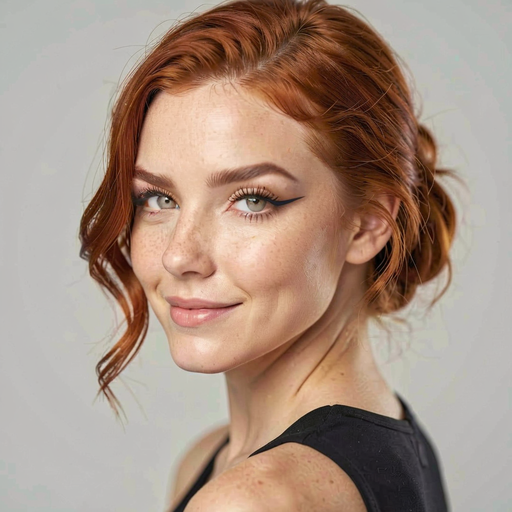<br/><sub><strong>3. Click Generate</strong><br/>The AI does its work</sub></td>
    <td align="center" width="25%">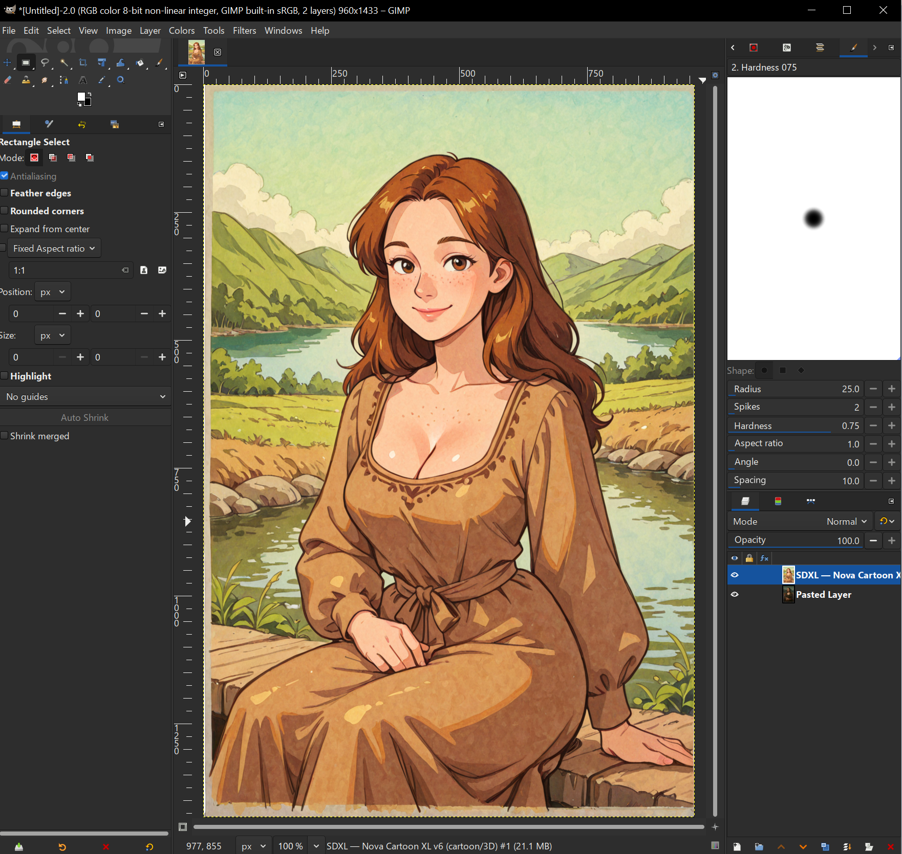<br/><sub><strong>4. Done</strong><br/>Result appears as a new layer</sub></td>
  </tr>
</table>

### Generation

<p align="center">
  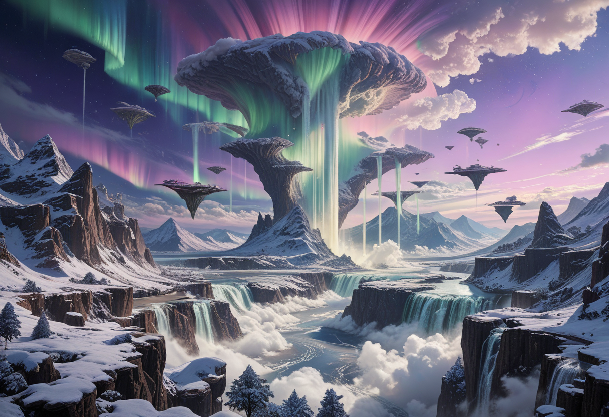<br/>
  <sub><strong>Fantasy Landscape</strong> — IlustReal v5 &bull; 25 scene presets across 6 model families</sub>
</p>

<details>
<summary><strong>More generation examples</strong></summary>
<table>
  <tr>
    <td align="center" width="25%">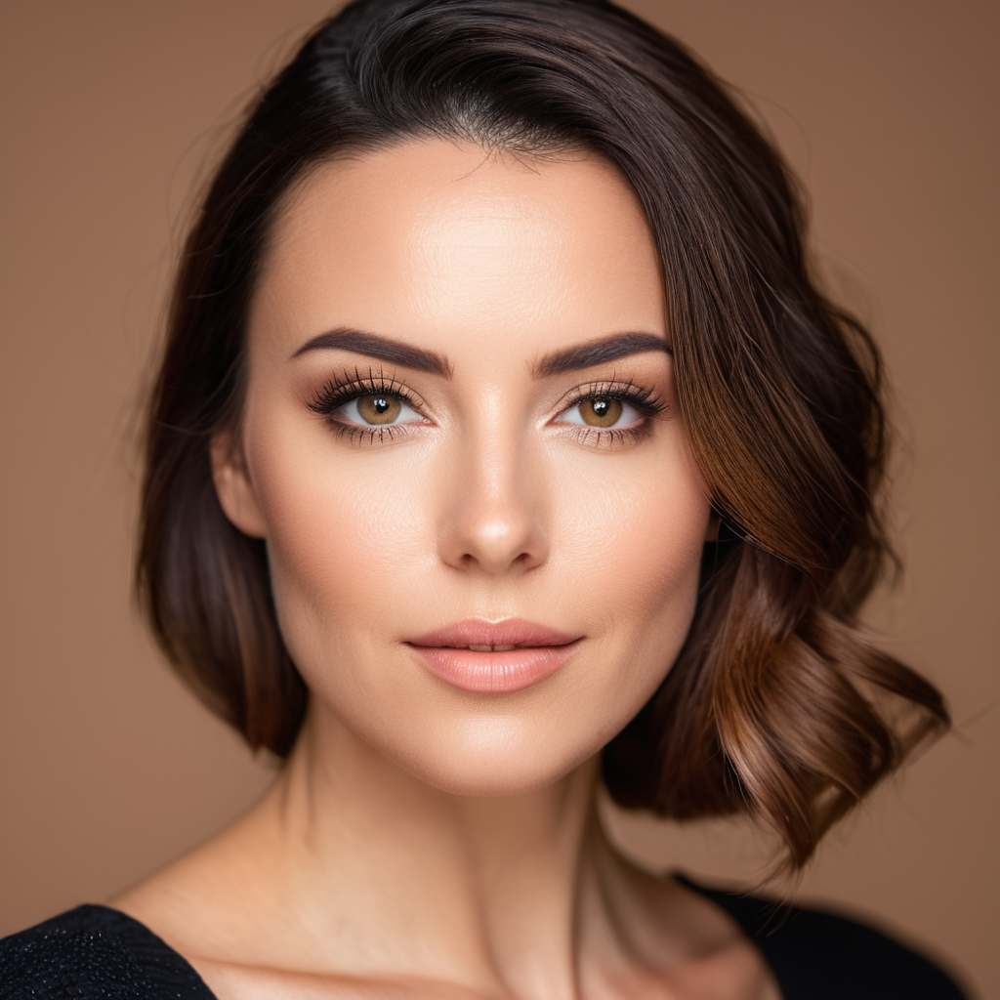<br/><sub><strong>Photorealistic Portrait</strong><br/>Juggernaut XL v9</sub></td>
    <td align="center" width="25%">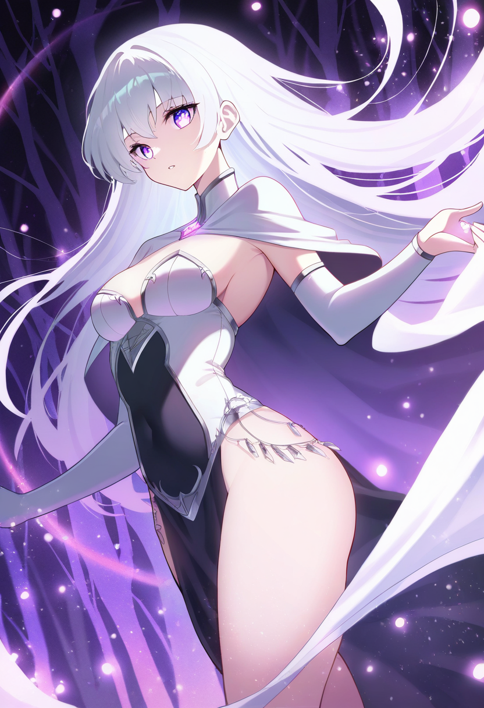<br/><sub><strong>Anime Illustration</strong><br/>NoobAI-XL v1.1</sub></td>
    <td align="center" width="25%">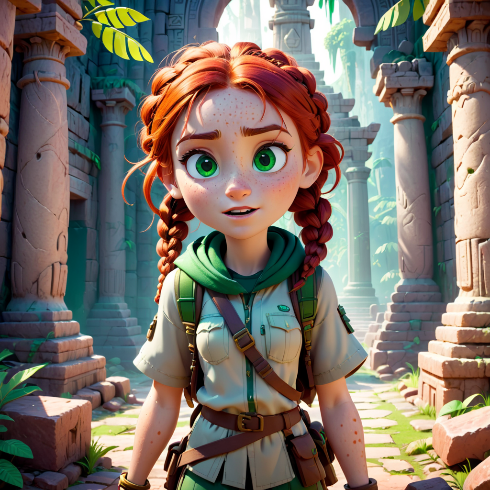<br/><sub><strong>Disney / Pixar 3D</strong><br/>Modern Disney XL v3</sub></td>
    <td align="center" width="25%"><br/><sub><strong>Klein Flux 2 9B</strong><br/>Next-gen quality</sub></td>
  </tr>
</table>
</details>

### Restoration & Enhancement

<p align="center">
  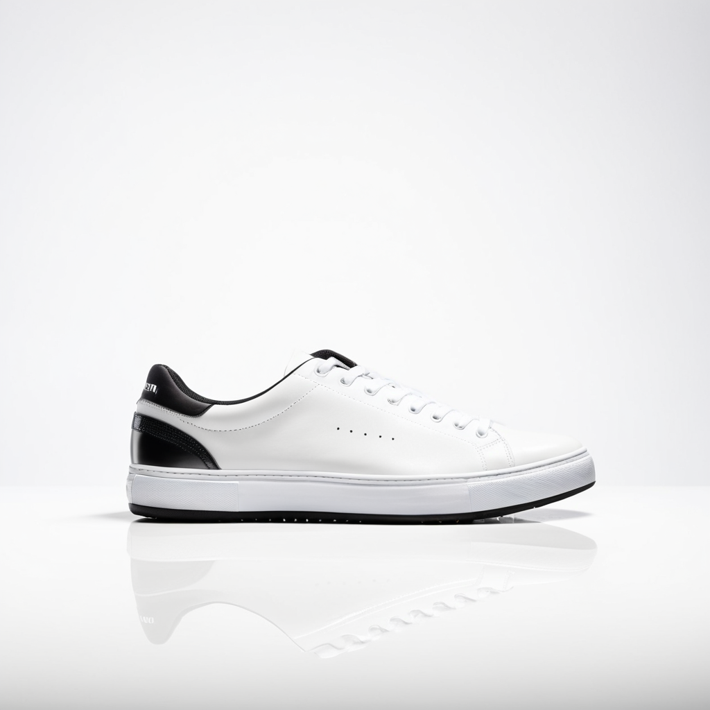<br/>
  <sub><strong>Remove Background</strong> — One-click AI background removal</sub>
</p>

<details>
<summary><strong>More restoration examples</strong></summary>
<table>
  <tr>
    <td align="center" width="25%">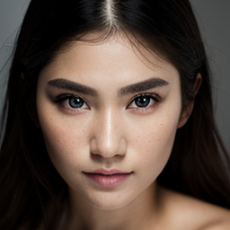<br/><sub><strong>AI Upscale 4x</strong><br/>Before/after</sub></td>
    <td align="center" width="25%">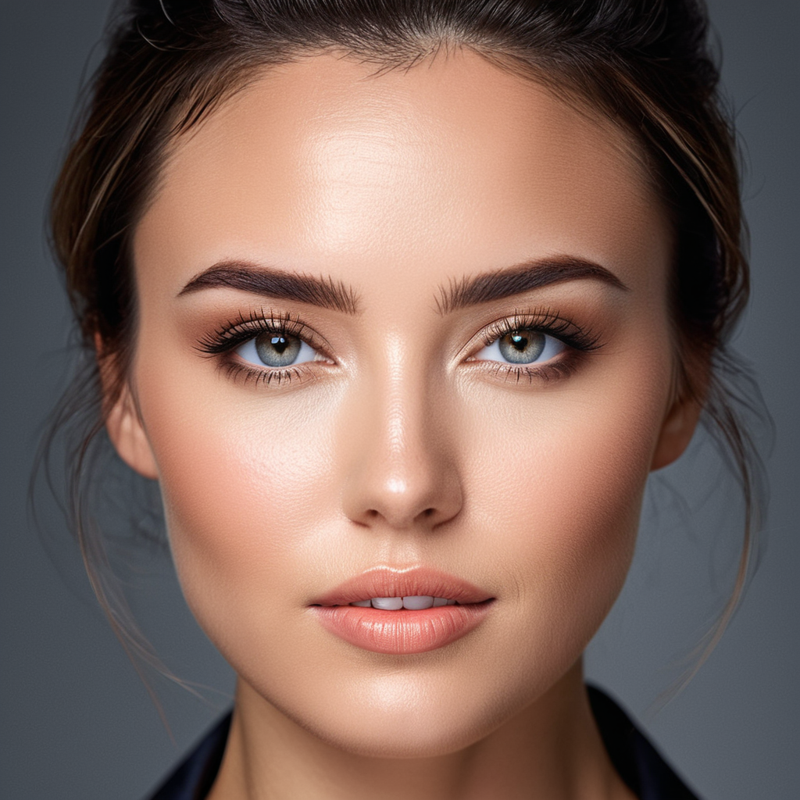<br/><sub><strong>Face Restore</strong></sub></td>
    <td align="center" width="25%"><br/><sub><strong>Colorize B&W</strong></sub></td>
    <td align="center" width="25%"><br/><sub><strong>Object Removal</strong><br/>Paint & erase</sub></td>
  </tr>
</table>
</details>

### Video — Wan 2.2

<table>
  <tr>
    <td align="center" width="25%">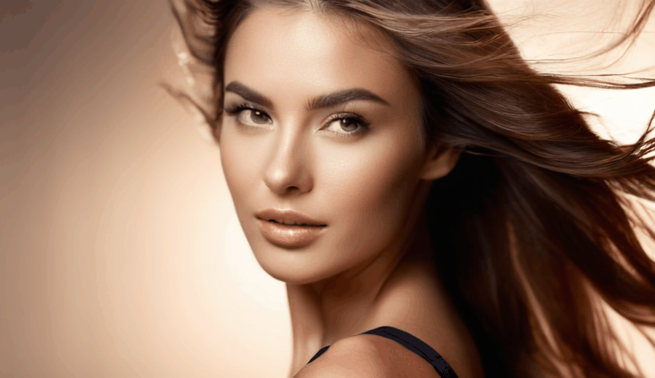<br/><sub><strong>Living Portrait</strong></sub></td>
    <td align="center" width="25%"><br/><sub><strong>Camera Slow Zoom</strong></sub></td>
    <td align="center" width="25%"><br/><sub><strong>Flowing Water</strong></sub></td>
    <td align="center" width="25%"><br/><sub><strong>360 Turntable</strong></sub></td>
  </tr>
</table>

### Magic Studios — Full Character Pipeline

<details>
<summary><strong>See the complete 5-act walkthrough: from selfie to cinematic video</strong></summary>

<br/>

Magic Studios is a guided pipeline that turns a single photo into a fully composited, animated scene. Each act builds on the last — face model, body, wardrobe, set, and finally video.

> *Featuring Gerald McFluffington III, CPA — Actor, Dreamer, Carb Enthusiast.*
> Read the [full walkthrough](docs/MAGIC_STUDIOS_WALKTHROUGH.md) for the complete story.

**Act I — Casting Polaroids** &nbsp; *Create a reusable face model from any photo*

<table>
  <tr>
    <td align="center" width="25%"><br/><sub>CodeFormer Sharp</sub></td>
    <td align="center" width="25%"><br/><sub>GPEN-2048 Balanced</sub></td>
    <td align="center" width="25%"><br/><sub>CodeFormer Faithful</sub></td>
    <td align="center" width="25%"><br/><sub><strong>Saved face model</strong></sub></td>
  </tr>
</table>

**Act II — Body Double** &nbsp; *Generate full-body references with face swap + background removal*

<table>
  <tr>
    <td align="center" width="25%"><br/><sub>Dad bod</sub></td>
    <td align="center" width="25%"><br/><sub>Stocky build</sub></td>
    <td align="center" width="25%">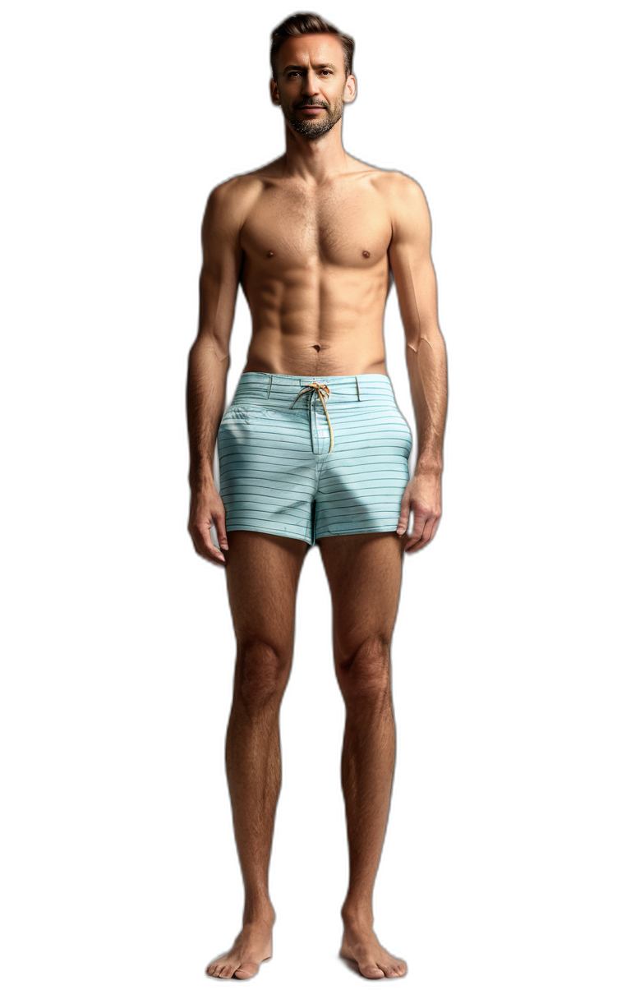<br/><sub>Lean / beanpole</sub></td>
    <td align="center" width="25%"><br/><sub><strong>Transparent PNG</strong></sub></td>
  </tr>
</table>

**Act III — Wardrobe Department** &nbsp; *AI outfit replacement on any selection*

<table>
  <tr>
    <td align="center" width="25%"><br/><sub>The shark incident</sub></td>
    <td align="center" width="25%">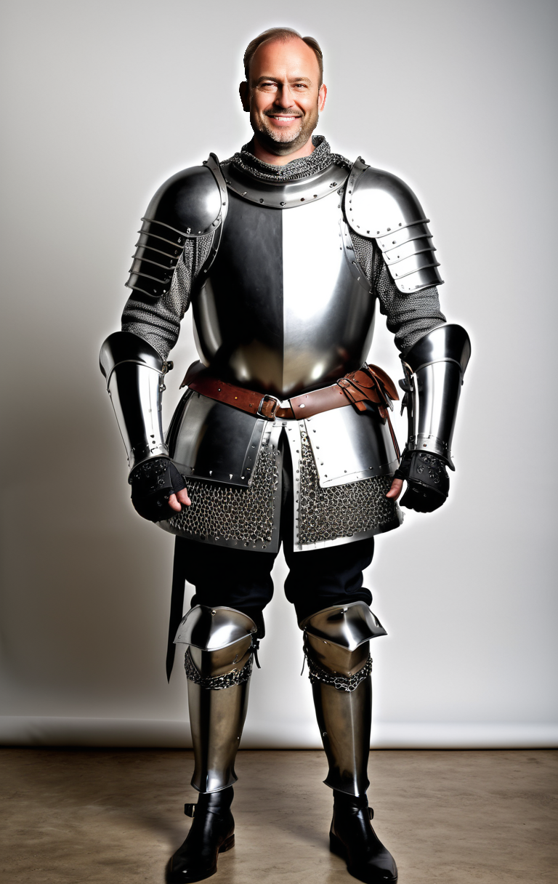<br/><sub>Gerald's face says it all</sub></td>
    <td align="center" width="25%"><br/><sub>The Hawaiian shirt</sub></td>
    <td align="center" width="25%"><br/><sub><strong>Final outfit</strong></sub></td>
  </tr>
</table>

**Act IV — Set Design** &nbsp; *Generate backgrounds and composite actors with AI harmonization*

<table>
  <tr>
    <td align="center" width="25%"><br/><sub>Too sunny</sub></td>
    <td align="center" width="25%"><br/><sub>Fog: approved</sub></td>
    <td align="center" width="25%"><br/><sub>Too much fog</sub></td>
    <td align="center" width="25%"><br/><sub><strong>Composited scene</strong></sub></td>
  </tr>
</table>

**Act V — Director's Chair** &nbsp; *Wan 2.2 I2V video generation with face re-injection*

<table>
  <tr>
    <td align="center" width="25%"><br/><sub>Approaching through fog</sub></td>
    <td align="center" width="25%">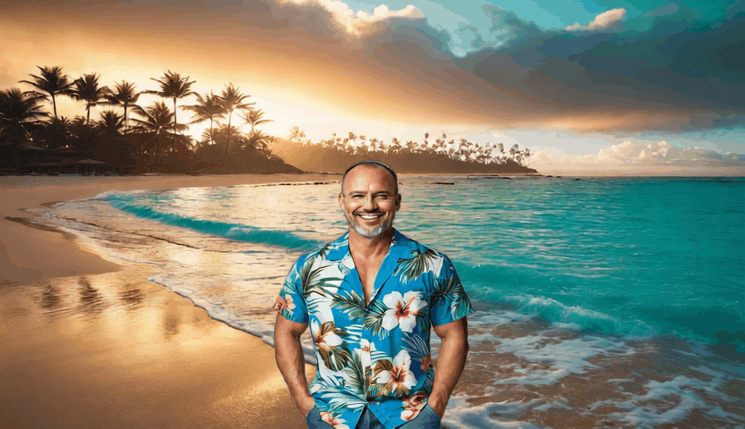<br/><sub>The dramatic stop</sub></td>
    <td align="center" width="25%">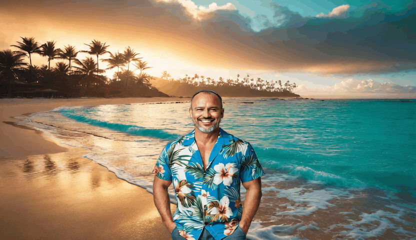<br/><sub>The close-up</sub></td>
    <td align="center" width="25%"><br/><sub><strong>Final scene</strong></sub></td>
  </tr>
</table>

</details>

---

## Who Is This For?

| You are... | Spellcaster gives you... |
|---|---|
| **A complete beginner** | Professional results with zero learning curve — presets handle everything |
| **Someone who hates learning software** | Just talk to a chatbot — the scaffold system does the rest |
| **A photographer** | AI retouching, upscaling, color grading — without leaving Darktable |
| **A Photoshop refugee** | All the AI tools you're used to, free and open-source |
| **An illustrator** | 25 art presets from photorealism to anime to Disney 3D |
| **Someone with old photos** | One-click restoration: upscale + face fix + colorize |
| **A video creator** | Turn any still image into a short animated clip |
| **An existing ComfyUI user** | Run your workflows from GIMP, skip the browser UI, keep your existing setup |
| **A tinkerer** | Import workflows, build custom presets, connect remote GPUs |
| **Privacy-conscious** | Everything runs locally — no cloud, no subscriptions |

---

## FAQ

<details>
<summary><strong>Do I need to know anything about AI?</strong></summary>

No. Every tool comes with presets that handle all the technical settings. Just pick what sounds right and click Generate. Or skip the UI entirely and [just tell a chatbot what you want](#just-talk-to-it--the-scaffold-system).

</details>

<details>
<summary><strong>Do I need to learn GIMP or Darktable?</strong></summary>

Not if you don't want to. The scaffold system lets you control Spellcaster through any AI chatbot — Signal, SillyTavern, OpenWebUI, or any LLM interface. Say what you want in plain English and the AI handles the rest. But if you do use GIMP/Darktable, you'll get layer-level control, selections, masks, and all the extra power that comes with a real editor.

</details>

<details>
<summary><strong>How much disk space do I need?</strong></summary>

A basic setup is about 5 GB. A full installation with all models can be 30-50 GB. The installer tells you exactly how much before downloading.

</details>

<details>
<summary><strong>What GPU do I need?</strong></summary>

Any NVIDIA GPU with 4+ GB VRAM works for basic features. 8 GB unlocks most features. 12+ GB unlocks everything including full-precision Wan 2.2 video. The installer detects your GPU and only shows compatible features.

</details>

<details>
<summary><strong>Can I use this without a GPU?</strong></summary>

Yes — you can connect to a remote ComfyUI server running on another computer on your network. The installer has a dedicated remote server mode, and the plugin settings let you change the server URL anytime.

</details>

<details>
<summary><strong>Is this free?</strong></summary>

Yes. Spellcaster, GIMP, Darktable, and ComfyUI are all free and open-source. The AI models are also free. There are no subscriptions or hidden costs.

</details>

<details>
<summary><strong>How does this compare to Photoshop's AI tools?</strong></summary>

Similar capabilities (generative fill, object removal, upscaling, style transfer) but runs locally, is free, and gives you more control with 100+ expert presets.

</details>

<details>
<summary><strong>I already use ComfyUI. Why would I want this?</strong></summary>

Spellcaster lets you skip the browser UI and work directly inside GIMP with your layers, selections, and masks. You can import your existing workflows via the Travelling Wizard and run them from the Filters menu. Your models, nodes, and server stay exactly where they are — Spellcaster just talks to them over HTTP.

</details>

<details>
<summary><strong>Can I use my own workflows?</strong></summary>

Yes. Open `Filters > Spellcaster Tools > Travelling Wizard`, click "Import Workflow File", and load any `.json` workflow exported from ComfyUI. Spellcaster extracts the important parameters and builds a dialog for it automatically. You can also browse workflows stored on your ComfyUI server.

</details>

<details>
<summary><strong>Can I run ComfyUI on a different machine?</strong></summary>

Yes. If you have a powerful GPU on another computer (or a cloud instance), run ComfyUI there and point Spellcaster at it: `Settings > ComfyUI Server URL > http://192.168.x.x:8188`. The installer also has a remote server mode that skips local model downloads entirely.

</details>

<details>
<summary><strong>What if the plugin doesn't show up after installation?</strong></summary>

Download the [Manual Update & Repair tool](https://github.com/laboratoiresonore/spellcaster/releases/latest/download/spellcaster-manual-update.exe) — it automatically finds and fixes broken installations, clears GIMP's plugin cache, and re-downloads any missing files.

</details>

<details>
<summary><strong>What's the difference between the GIMP and Darktable plugins?</strong></summary>

Both share the same core AI capabilities (20+ workflows each). The GIMP plugin adds selection-based workflows (paint a mask, then regenerate), layer-level operations, Magic Studios, the full Klein editing suite, and the Travelling Wizard. The Darktable plugin integrates with the lighttable workflow — select photos, process, and auto-import results back into your library.

</details>

<details>
<summary><strong>Does it update itself?</strong></summary>

Yes. Both plugins check GitHub on each launch and silently update themselves. New features appear automatically — no manual downloads needed.

</details>

---

<details>
<summary><h2>For Developers & Power Users</h2></summary>

### Developer Install (Git + Python)

```bash
git clone https://github.com/laboratoiresonore/spellcaster
cd spellcaster
python installer/install.py          # Interactive GUI wizard
python installer/install.py --cli    # Force terminal mode
```

<details>
<summary><strong>CLI flags for scripted & headless installs</strong></summary>

```bash
python installer/install.py --yes                    # Accept all defaults
python installer/install.py --civitai-key YOUR_TOKEN # Authenticated downloads
python installer/install.py --server-url http://192.168.1.50:8188  # Remote server
python installer/install.py --features img2img,inpaint,upscale     # Cherry-pick
python installer/install.py --comfyui ~/ComfyUI --gimp ~/.config/GIMP/3.0/plug-ins
python installer/install.py --skip-models            # Plugins + nodes only
python installer/install.py --dry-run                # Preview without changes
```

</details>

### The Expert-Tuned Difference

Every model preset is the product of extensive testing. Here's what Spellcaster handles that would take weeks to learn:

| What Spellcaster handles | What you'd have to learn |
|---|---|
| Optimal sampler + scheduler per model | Trial and error across 20+ combos |
| Correct CFG range per architecture | SD1.5=7.0, SDXL=5-6, ZIT=1-3, Flux=3.5, Klein=1.0 |
| Architecture-specific prompt structure | Quality tags vs descriptions vs natural language |
| Negative prompt engineering | 50+ patterns tuned per model family |
| Resolution constraints | SD1.5=512, SDXL=1024, ZIT=1024, Flux=mod-16 |
| LoRA selection + strength per task | Which LoRA, at what strength, for which model |
| Inpaint denoise by body part | Hands=0.78, eyes=0.65, skin=0.45 |
| VAE/CLIP pairings for Klein | 9B→qwen_3_8b, 4B→qwen_3_4b |
| Wan dual-UNET switchover | High-noise vs low-noise model handoff timing |

### Signal Bridge & Scaffold

See [Just Talk To It](#just-talk-to-it--the-scaffold-system) for the user-facing overview and [Signal Bridge](#signal-bridge--ai-art-on-autopilot) for the remote chatbot system.

Key source files for developers: `scaffold/comfyui_runner.py` (server comms + privacy cleanup via [ComfyUI-api-tools](https://github.com/brantje/ComfyUI-api-tools)), `scaffold/introspector.py` (runtime node discovery via live import or AST parsing), `scaffold/prompt_builder.py` (deterministic LLM system prompt generation), `scaffold/bridge_launcher.py` (Signal Bridge config + character card export).

### Architecture

```
spellcaster/
├── README.md
├── LICENSE
├── spellcaster-installer.exe       # Windows installer (download & run)
├── spellcaster-manual-update.exe   # Windows repair/update tool
├── installer/                      # Installer source & build scripts
│   ├── install.py                  #   CLI installer (97K)
│   ├── installer_gui.py            #   GUI installer — 8-step wizard (105K)
│   ├── manual_update.py            #   Repair & update tool (51K)
│   ├── manifest.json               #   Master config: features, nodes, models
│   ├── build_installer.py          #   PyInstaller build script
│   ├── build_linux.sh              #   Linux build convenience script
│   ├── build_macos.sh              #   macOS build convenience script
│   └── signal_bridge_settings.jsx  #   Signal Bridge settings GUI
├── plugins/
│   ├── gimp/comfyui-connector/     # GIMP 3 plugin (~18,000 lines)
│   │   ├── comfyui-connector.py    #   Main plugin (47 registered tools)
│   │   ├── _workflows_v2.py        #   35 workflow builders
│   │   ├── _nodes.py               #   Node definitions
│   │   ├── _architectures.py       #   Architecture configs
│   │   ├── _composites.py          #   Composite workflow helpers
│   │   ├── spellcaster-theme.css   #   Full GIMP dark theme (1,600 lines)
│   │   ├── spellcaster_steg.py     #   Steganography module
│   │   ├── spinner.gif
│   │   └── travelling-wizard/      #   Workflow import & scaffold editor
│   │       ├── wizard.py           #     Workflow bridge UI
│   │       ├── settings.py         #     Configuration
│   │       └── gimp-comfy-ai.py    #     Entry point
│   └── darktable/                  # Darktable Lua plugin (~7,900 lines)
│       ├── comfyui_connector.lua   #   20+ workflows, model management
│       ├── spellcaster-darktable.css  # Full Darktable dark theme (790 lines)
│       └── splash.py               #   Processing splash screen
├── scaffold/                       # Chatbot-driven ComfyUI interface
│   ├── __init__.py                 #   SpellcasterScaffold entry point
│   ├── meta_wizard.py              #   Intent router — top-level wizard
│   ├── wizard.py                   #   Spellcaster enhancement wizard
│   ├── workflow_wizard.py          #   Universal ComfyUI workflow wizard
│   ├── workflow_parser.py          #   Parses any .json ComfyUI workflow
│   ├── comfyui_runner.py           #   Server comms + privacy cleanup
│   ├── bridge_launcher.py          #   Signal Bridge integration
│   ├── introspector.py             #   Auto-discovers Spellcaster nodes
│   ├── prompt_builder.py           #   LLM system prompt generator
│   └── presets.py                  #   Enhancement preset definitions
├── tools/                          # Standalone utilities
│   ├── generate_showcase.py        #   Showcase asset generator
│   ├── generate_walkthrough.py     #   Magic Studios walkthrough generator
│   └── spellmaker.py               #   Preset editor GUI (89K)
├── docs/                           # Documentation
│   ├── MAGIC_STUDIOS_WALKTHROUGH.md
│   └── REFACTORING_AUDIT.md
└── assets/                         # Showcase images, walkthrough, icons
```

### How the GIMP Plugin Works Internally

<details>
<summary><strong>Execution pipeline</strong></summary>

1. **Export** — Canvas/selection exported to PNG using a custom pure-Python PNG writer (no PIL dependency)
2. **Upload** — Multipart HTTP POST to ComfyUI `/upload/image`
3. **Build** — ComfyUI workflow JSON (node graph) constructed from preset parameters via v2 builders
4. **Submit** — POST to `/prompt` endpoint
5. **Poll** — `/history/{prompt_id}` polled with configurable timeout and spinner UI
6. **Download** — Result fetched via `/view` endpoint
7. **Import** — Loaded as a new GIMP layer with optional blending
8. **Cleanup** — Temp uploads deleted or copied to output directory

All HTTP via pure urllib — zero external dependencies. Custom GTK3 UI with branded CSS theme, spinner overlays, expandable sections, and real-time LoRA filtering.

</details>

<details>
<summary><strong>How the Darktable Plugin Works Internally</strong></summary>

Uses Darktable's native `dt.database.export()` to export selected images to PNG temp files, uploads via curl (Lua has no built-in HTTP), builds workflow JSON as formatted strings, polls for completion, and auto-imports results back into the Darktable library. All UI rendered via `dt.register_lib()` as a right-center lighttable panel. Full gettext i18n support.

</details>

### Self-Updating Plugins

Both plugins check GitHub on each launch and silently update themselves. New features appear automatically — no manual downloads.

<details>
<summary><strong>Update system details</strong></summary>

The update system uses GitHub's API to compare the local version hash against the latest commit. If different, it fetches the file tree and downloads changed files incrementally.

**NSFW variant handling**: The plugin source contains a `_BUILD_VARIANT` injection point. SFW builds (default) pull from the public `laboratoiresonore/spellcaster` repo. NSFW builds have this patched to `"nsfw"` at build time, routing all updates to the private `laboratoiresonore/spellcaster_NSFW` repo — so NSFW-specific customizations are never overwritten by a standard update.

On Windows, in-use files are staged with a `.update` suffix and applied on next launch. The updater also clears GIMP's pluginrc to force menu re-scanning.

</details>

### Spellmaker (Preset Editor)

Power users can create custom presets, link LoRAs, and import ComfyUI workflows:

```bash
python tools/spellmaker.py
```

Supports 8 preset types: model configs, inpaint recipes, scene templates, video settings, Wan models, Klein models, IC-Light presets, and arbitrary workflow JSON. Create, edit, clone, import, and export to a `spellbook.json` file.

### Building the Installer

```bash
python installer/build_installer.py                  # Auto-detect OS
python installer/build_installer.py --update-tool    # Also build repair tool
```

</details>

<details>
<summary><h2>Supported Models (full list)</h2></summary>

The installer auto-detects your GPU and downloads the right model variants.

### VRAM Tiers

| Tier | VRAM | What gets installed |
|---|---|---|
| **Low** | < 8 GB | Q4/Q5 GGUF quantized — lightweight but capable |
| **Medium** | 8-12 GB | fp8 or Q8 — great quality/performance balance |
| **High** | 12-20 GB | fp8 or standard — full feature access |
| **Ultra** | 20+ GB | Full bf16 — maximum quality |

### Checkpoints (25+ models)

<details>
<summary><strong>SD 1.5, SDXL, Illustrious, ZIT, Flux 1 Dev, Flux 2 Klein</strong></summary>

**SD 1.5** (6 GB): Juggernaut Reborn, Realistic Vision v5.1, SD 1.5 Base

**SDXL Realistic** (8 GB): Juggernaut XL v9/Ragnarok, JibMix Realistic, ZavyChroma, CyberRealistic Pony, AlbedoBase, SDXL Base

**SDXL Anime** (8 GB): NoobAI-XL, Nova Anime XL, Wai Illustrious, IlustReal, Sloppy Messy Mix

**SDXL Cartoon** (8 GB): Modern Disney XL, Nova Cartoon XL

**Z-Image-Turbo** (8 GB): GonzaloMo Zpop v3 — 6-step turbo

**Flux 1 Dev** (12+ GB): Flux 1 Dev fp8, Flux Kontext Dev fp8

**Flux 2 Klein** (6-20 GB): Klein 9B, Klein 4B fp8, Klein Base 4B fp8

</details>

### Upscale Models (6)

4x-UltraSharp, RealESRGAN x4plus, 4x Remacri, 4x NMKD Superscale, RealESRGAN Anime, 8x NMKD Faces

### ControlNet Models (8)

SD1.5 (Lineart, Depth, OpenPose, Tile), SDXL (Canny, OpenPose, Tile), ZIT Union

### Video Models (Wan 2.2)

Q4 GGUF (8 GB) and fp8 (16 GB) variants, UMT5-XXL encoder, Wan VAE

### 90+ LoRAs

Body & detail fix, artistic styles, accelerators — across SDXL, Flux, Klein, ZIT, and Illustrious architectures.

</details>

<details>
<summary><h2>Custom Nodes (auto-installed)</h2></summary>

| Node Pack | Purpose |
|---|---|
| ComfyUI-GGUF | Load quantized models for low VRAM |
| ComfyUI-VideoHelperSuite | Video composition and output |
| ComfyUI-Frame-Interpolation | RIFE smooth frame interpolation |
| comfyui-reactor-node | Face swap + face restore |
| comfyui-mtb | MTB face swap alternative |
| ComfyUI_IPAdapter_plus | FaceID + style transfer |
| PuLID_ComfyUI | Flux-native identity preservation |
| ComfyUI-KJNodes | Image size utilities |
| ComfyUI-RTXVideoSuperResolution | NVIDIA RTX video upscaling |
| ComfyUI-REMBG | Background removal |
| ComfyUI-LaMa | Object removal |
| ComfyUI_essentials | LUT color grading |
| comfyui_controlnet_aux | ControlNet preprocessors (Canny, Depth, Pose, etc.) |
| ComfyUI-IC-Light | Directional relighting |
| ComfyUI-SUPIR | SUPIR AI restoration |
| ComfyUI-api-tools | REST API for image upload/download/delete (used by scaffold privacy cleanup) |

</details>

<details>
<summary><h2>Troubleshooting</h2></summary>

| Problem | Solution |
|---|---|
| Plugin not visible in GIMP | Run the [Manual Update & Repair tool](https://github.com/laboratoiresonore/spellcaster/releases/latest/download/spellcaster-manual-update.exe) |
| "Node not found" error | Re-run the installer to install missing extensions |
| "Cannot connect to server" | Make sure ComfyUI is running (`http://127.0.0.1:8188`) |
| Out of VRAM | Switch to a smaller model or GGUF variant |
| All runs produce same result | Set seed to -1 for random results |
| Download fails (403) | Add your CivitAI or HuggingFace token in the installer |
| Klein results look wrong | Check VAE/CLIP pairings: 9B→qwen_3_8b, 4B→qwen_3_4b |
| Video generation fails | Ensure both high-noise and low-noise Wan models are installed |
| Temp files filling disk | Use Settings → Clean Server Inputs to purge gimp_* uploads |
| Custom workflow import fails | Make sure the JSON is an API export or standard LiteGraph format |
| Presets not saving | Check that the plugin directory is writable (not read-only) |

</details>

---

## License

[GPL-2.0](LICENSE) — Free software. Use it, modify it, share it.

---

<p align="center">
  
  <br/><br/>
  <strong>From zero to AI mastery in one install.</strong>
  <br/><br/>
  <em>Experimentally yours, <a href="https://www.laboratoiresonore.com/">le laboratoire sonore</a>, Arkyn Glyph</em>
  <br/><br/>
  <a href="https://www.instagram.com/lelaboratoiresonore/">Instagram</a> &bull;
  <a href="https://www.youtube.com/@LeLaboratoireSonore">YouTube</a> &bull;
  <a href="https://www.facebook.com/laboratoire.sonore.2025">Facebook</a> &bull;
  <a href="https://www.twitch.tv/laboratoiresonore">Twitch</a>
</p>
