<p align="center">
  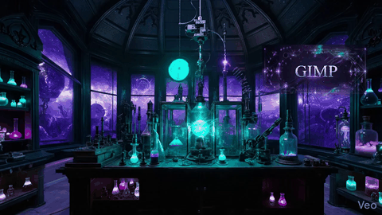
</p>

<h1 align="center">✨ Spellcaster ✨</h1>

<p align="center">
  <strong>49 AI tools. Zero experience needed. Just talk to it.</strong><br/>
  <em>GIMP &bull; Darktable &bull; SillyTavern &bull; Standalone Web UI &bull; 100% Local &bull; No Cloud</em>
</p>

<p align="center">
  <a href="https://github.com/laboratoiresonore/spellcaster/releases"></a>
  &nbsp;
  <a href="LICENSE"></a>
  &nbsp;
  
  &nbsp;
  
</p>

<p align="center">
  <a href="#-what-is-spellcaster">What Is It</a> &bull;
  <a href="#-chatbot-enhancer">Chatbot Enhancer</a> &bull;
  <a href="#-how-to-install">Install</a> &bull;
  <a href="#-the-wizard-guild">Wizard Guild</a> &bull;
  <a href="#-sillytavern-characters">SillyTavern</a> &bull;
  <a href="#-complete-feature-reference">All Features</a> &bull;
  <a href="#-faq">FAQ</a> &bull;
  <a href="https://www.reddit.com/r/spellcaster_ai/">Reddit</a>
</p>

---

## 🧙 What Is Spellcaster?

<table>
<tr>
<td width="60%">

**Spellcaster adds 49 AI tools to GIMP and Darktable** — create images from text, fix photos, swap faces, generate videos, remove backgrounds, change lighting, extend canvases, re-pose characters, and more.

**No AI experience needed.** Every tool has expert-tuned presets. Your first result looks like your hundredth.

**Three ways to use it:**
- 🎨 **GIMP / Darktable** — full plugin with 49 menu entries
- 🧙 **The Wizard Guild** — standalone chat UI with AI wizards
- 💬 **SillyTavern** — 13 character cards for live RP visuals

Everything runs **100% locally** on your GPU. No cloud, no subscriptions, no content filters.

</td>
<td width="40%">

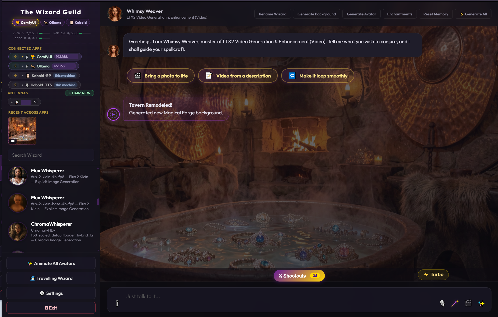
<sub><em>The Wizard Guild — talk to AI wizards, get images</em></sub>

</td>
</tr>
</table>

---

## 🎬 Chatbot Enhancer

> **Every image and animation below was generated by Spellcaster — zero manual tuning, zero Photoshop, zero cloud APIs.**

### 🌍 Living Worlds — Scenes That Breathe

<table>
<tr>
<td align="center" width="33%"><br/><sub>🌲 <strong>Animancer</strong> brought this forest to life</sub></td>
<td align="center" width="33%">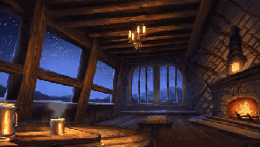<br/><sub>🔥 Firelight flickers. Candles dance.</sub></td>
<td align="center" width="33%">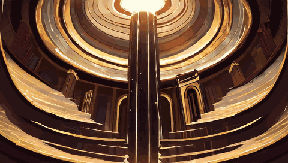<br/><sub>📚 Dust motes drift through lamplight</sub></td>
</tr>
</table>

<p align="center"><sub><strong>Sceneshifter</strong> generates the background. <strong>Animancer</strong> makes it move. Your story writes itself.</sub></p>

<details>
<summary><h3>Tell me more — portraits, restyle, autonomous art, scenes</h3></summary>

#### 🧝 Characters That Feel Real

<table>
<tr>
<td align="center" width="20%">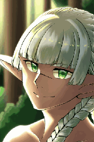<br/><sub>✨ <strong>Living portrait</strong><br/>Hair sways. Eyes blink.</sub></td>
<td align="center" width="20%">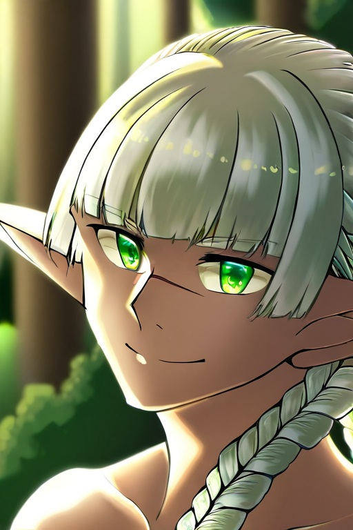<br/><sub>🧝 Elven Ranger</sub></td>
<td align="center" width="20%">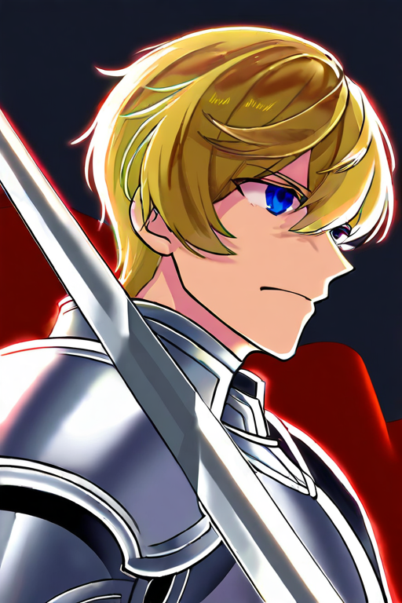<br/><sub>⚔️ Noble Paladin</sub></td>
<td align="center" width="20%">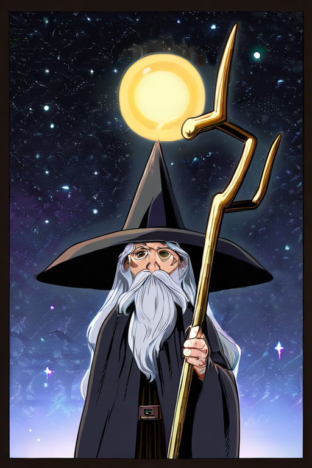<br/><sub>🔮 Wise Wizard</sub></td>
<td align="center" width="20%">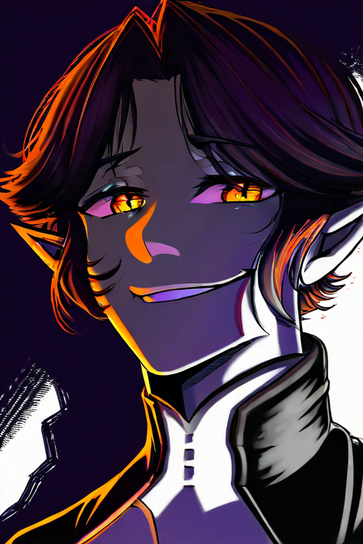<br/><sub>🗡️ Charming Rogue</sub></td>
</tr>
</table>

<p align="center"><sub><strong>Portraitist</strong> generates expression portraits that match your character's mood — happy, angry, heartbroken, confident.</sub></p>

#### 🎨 One Character. Five Art Styles. One Command.

<table>
<tr>
<td align="center" width="20%"><br/><sub>Original</sub></td>
<td align="center" width="20%">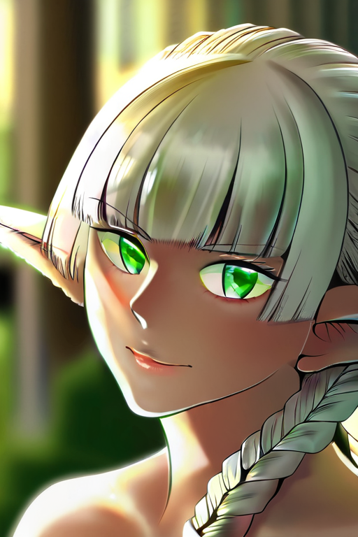<br/><sub>📷 Photorealistic</sub></td>
<td align="center" width="20%">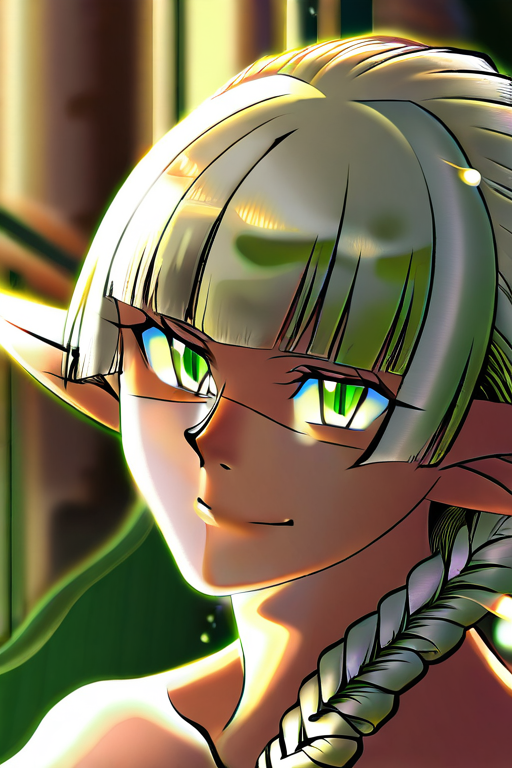<br/><sub>🖼️ Oil Painting</sub></td>
<td align="center" width="20%">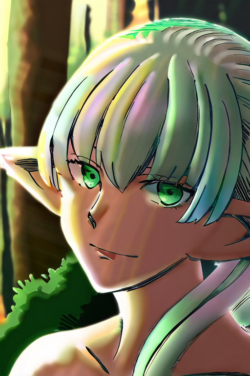<br/><sub>💧 Watercolor</sub></td>
<td align="center" width="20%">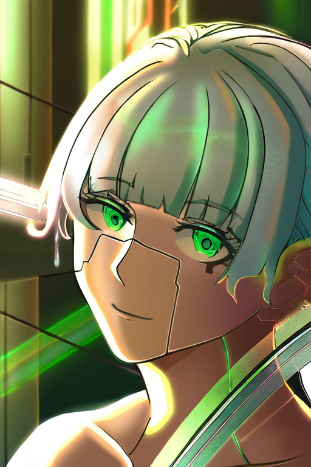<br/><sub>⚡ Cyberpunk</sub></td>
</tr>
</table>

<p align="center"><code>/restyle-all photorealistic portrait, 8k</code> — every avatar in your chat, transformed instantly</p>

#### ⚔️ The AI Decides When You Need a Picture

<table>
<tr>
<td align="center" width="33%">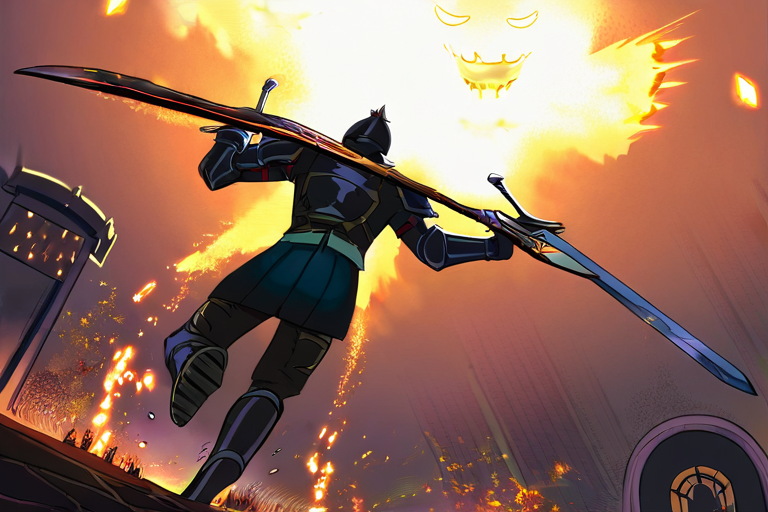<br/><sub>⚔️ Two knights clash — <strong>Autonoma</strong> illustrated this on its own</sub></td>
<td align="center" width="33%">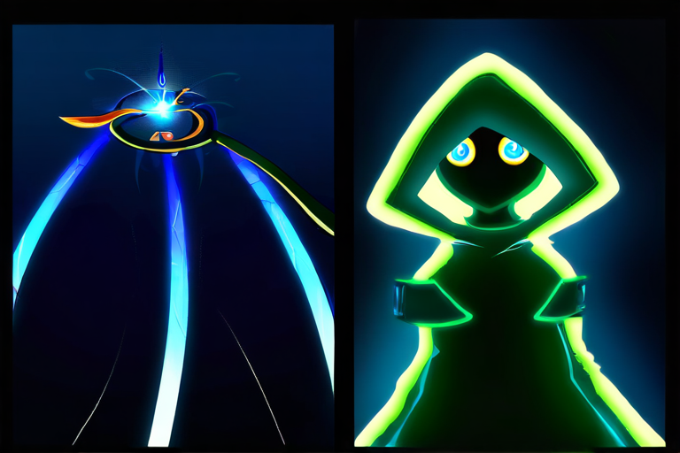<br/><sub>👁️ A dramatic reveal — the AI sensed the moment</sub></td>
<td align="center" width="33%">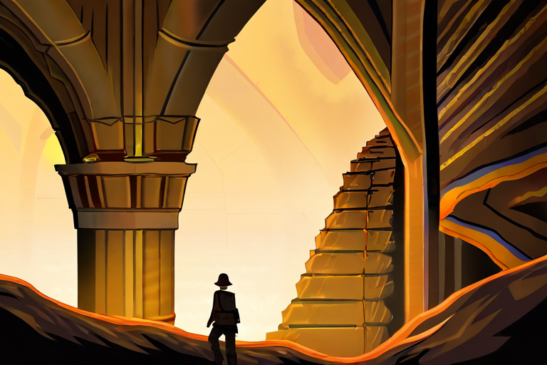<br/><sub>💎 An ancient discovery — visual generated autonomously</sub></td>
</tr>
</table>

<p align="center"><sub><strong>Autonoma</strong> uses LLM function tools to decide <em>on its own</em> when a scene deserves an illustration. You don't ask. It just knows.</sub></p>

#### 🏰 More Scenes — All Auto-Generated

<table>
<tr>
<td align="center" width="20%"><br/><sub>🍺 Medieval Tavern</sub></td>
<td align="center" width="20%">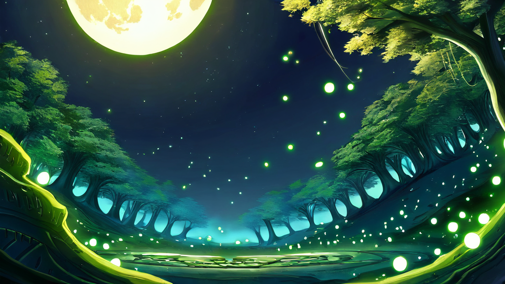<br/><sub>🌙 Moonlit Forest</sub></td>
<td align="center" width="20%">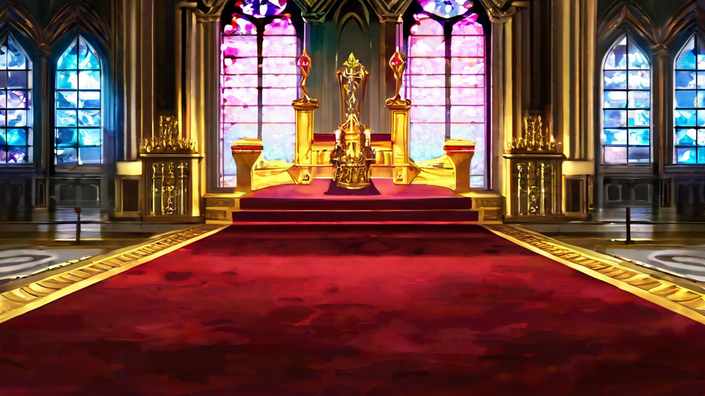<br/><sub>👑 Throne Room</sub></td>
<td align="center" width="20%"><br/><sub>🏴‍☠️ Pirate Ship</sub></td>
<td align="center" width="20%">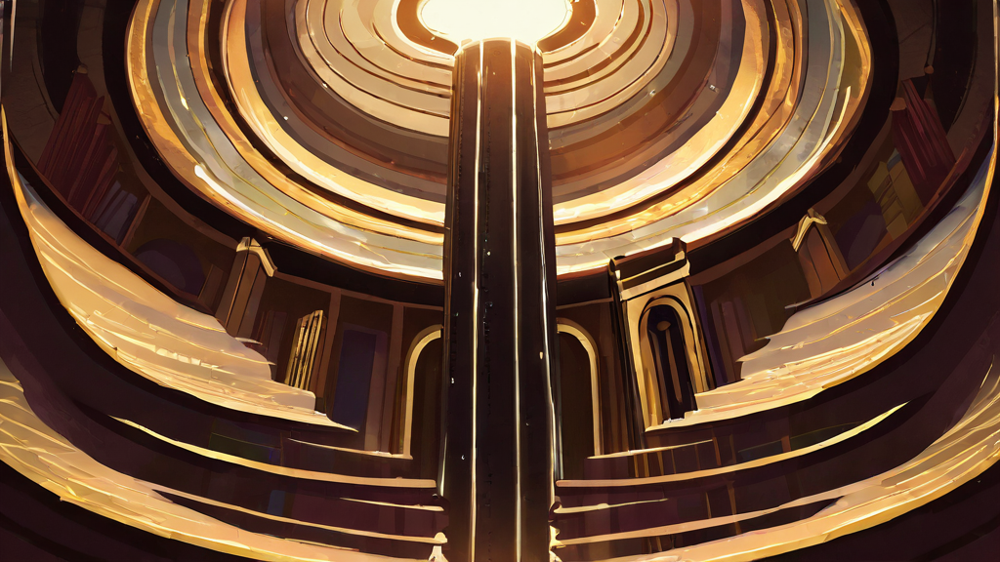<br/><sub>📖 Arcane Library</sub></td>
</tr>
</table>

<p align="center"><sub>Write <em>"They stepped through the portal into a moonlit forest clearing"</em> — the background changes automatically.</sub></p>

</details>

---

## ⚡ How Does It Work?

```
You pick a tool → Spellcaster talks to ComfyUI → Your GPU does the magic → Result appears in your editor
```

That's it. [ComfyUI](https://github.com/comfyanonymous/ComfyUI) is the AI engine under the hood. You never touch it. The installer handles GPU detection, model downloads, and configuration. You just run it and click "Install."

---

## 📦 How to Install

### What You Need First

| App | What It Is | Why | Download |
|---|---|---|---|
| **ComfyUI** | The AI engine that does the heavy lifting | Required — this is what actually runs the AI models on your GPU | [github.com/comfyanonymous/ComfyUI](https://github.com/comfyanonymous/ComfyUI) |
| **GIMP 3** and/or **Darktable** | Free image editors (like Photoshop / Lightroom) | You need at least one — this is where Spellcaster's menu lives | [gimp.org](https://www.gimp.org/downloads/) / [darktable.org](https://www.darktable.org/install/) |
| **A GPU with 4+ GB VRAM** | NVIDIA recommended, AMD works too | The AI models run on your graphics card — more VRAM = more features | You probably already have one |

> **Never heard of ComfyUI?** That's fine. The installer can download and set it up for you. You'll never need to open it — Spellcaster talks to it behind the scenes. Think of it like an engine under the hood.
>
> **Don't have a GPU?** No problem. You can connect to a ComfyUI server running on another computer on your network (a friend's gaming PC, a cloud instance, etc.). The installer has a remote server mode.
>
> **Don't want to use GIMP or Darktable at all?** You can skip them entirely and control Spellcaster through [The Wizard Guild](#just-talk-to-it-the-wizard-guild--scaffold-system) — an AI chatbot that handles everything for you.

**Want the AI chatbot experience (The Wizard Guild)?** You'll also need a local LLM engine. See the [Wizard Guild setup guide](#how-to-set-up-the-wizard-guild) — it takes about 5 minutes.

| App | What It Is | Why | Download |
|---|---|---|---|
| **KoboldCPP** | Local AI chatbot engine | Powers the Wizard Guild's conversational interface | [github.com/LostRuins/koboldcpp](https://github.com/LostRuins/koboldcpp/releases) |
| **SillyTavern** *(optional)* | Chat frontend with character cards | Enhanced chat experience — auto-downloaded by the Guild launcher | [github.com/SillyTavern/SillyTavern](https://github.com/SillyTavern/SillyTavern) |

### Install Spellcaster

<p align="center">
  <a href="https://github.com/laboratoiresonore/spellcaster/releases/latest/download/spellcaster-installer.exe">
    
  </a>
  &nbsp;
  <a href="https://github.com/laboratoiresonore/spellcaster/releases/latest/download/spellcaster-installer-macos.zip">
    
  </a>
  &nbsp;
  <a href="https://github.com/laboratoiresonore/spellcaster/releases/latest/download/spellcaster-installer">
    
  </a>
</p>

1. **Download** the installer for your system above
2. **Run it.** The installer walks you through everything (see below)
3. **Open GIMP or Darktable.** Go to `Filters > Spellcaster` — all your new AI tools are there
4. **Pick any tool and click Generate.** That's it. Every preset is already optimized for great results.

> **Linux users:** After downloading, make it executable: `chmod +x spellcaster-installer && ./spellcaster-installer`
>
> **Prefer to run from source?** Works on any OS with Python 3.10+:
> ```bash
> git clone https://github.com/laboratoiresonore/spellcaster
> cd spellcaster
> python installer/install.py
> ```
>
> **Plugin not showing up?** Download the [**Manual Update & Repair tool**](https://github.com/laboratoiresonore/spellcaster/releases/latest/download/spellcaster-manual-update.exe) ([Linux version](https://github.com/laboratoiresonore/spellcaster/releases/latest/download/spellcaster-manual-update)) — it finds and fixes broken installations automatically.

### ComfyUI on Another Machine? (Remote / Network Install)

If ComfyUI runs on a **different computer** on your local network (a server, a friend's gaming PC, a cloud box), use the **Remote Installer** instead. It sets up everything on *your* machine — GIMP plugin, Darktable plugin, Wizard Guild, desktop shortcuts — pre-configured to talk to the remote ComfyUI. No ComfyUI needed locally.

```bash
# Clone the repo (or use your existing clone)
git clone https://github.com/laboratoiresonore/spellcaster
cd spellcaster

# Point it at your ComfyUI server — everything else is automatic
python installer/install_remote.py http://192.168.1.50:8188

# Don't know the IP? Let it scan your network
python installer/install_remote.py --scan

# Also have a local LLM on the server machine?
python installer/install_remote.py http://192.168.1.50:8188 --llm-url http://192.168.1.50:5001
```

> **Want a standalone .exe?** Build it yourself with `python installer/build_installer.py --remote-only` — produces a single `spellcaster-remote-installer.exe` that bundles everything. Standalone binaries will also be available in future releases.

<details>
<summary><strong>What the remote installer does</strong></summary>

1. **Probes the remote ComfyUI** — queries `/system_stats` and `/object_info` to discover GPU, VRAM, installed nodes, checkpoints, LoRAs, VAEs, and ControlNets
2. **Detects SFW / NSFW edition** — scans the server's model list for known NSFW patterns and configures the local install accordingly
3. **Identifies available features** — cross-references server capabilities against the feature manifest to show what's ready to use
4. **Auto-detects GIMP and Darktable** — finds your local installations (Windows registry, macOS Application Support, Linux config dirs, Flatpak/Snap)
5. **Installs plugins** — copies the GIMP and Darktable plugins with the remote server URL pre-configured
6. **Deploys the Wizard Guild** — full standalone web UI installation with launcher scripts
7. **Creates desktop shortcuts** — Windows Start Menu, macOS .command, Linux .desktop entries
8. **Writes shared settings** — `spellcaster_settings.json` with all detected models, LoRA architecture classification, and server config

Everything is **completely autonomous** — no prompts, no decisions. Just give it the server URL and walk away. Use `--dry-run` to preview without making changes.

| Flag | What It Does |
|---|---|
| `--scan` | Auto-discover ComfyUI servers on your local network |
| `--port 8188` | Port to scan (default: 8188) |
| `--llm-url URL` | LLM server for Wizard Guild prompt enhancement |
| `--skip-gimp` | Don't install the GIMP plugin |
| `--skip-darktable` | Don't install the Darktable plugin |
| `--skip-guild` | Don't install the Wizard Guild |
| `--skip-shortcuts` | Don't create desktop shortcuts |
| `--nsfw-token PAT` | GitHub PAT for NSFW repo auto-updates |
| `--force-sfw` | Force SFW mode even if NSFW content detected |
| `--interactive` | Use guided prompts instead of auto-detection |
| `--dry-run` | Preview what would happen without making changes |

</details>

### Already Using ComfyUI Manager?

If you installed [ComfyUI-Spellcaster](https://github.com/laboratoiresonore/ComfyUI-Spellcaster) through ComfyUI Manager (or `git clone`), you already have the nodes — but you're missing the rest of the suite. On first load, Spellcaster drops a ready-to-run **`Install_Spellcaster_Suite.bat`** into your `custom_nodes` folder. Double-click it to get Wizard Guild, GIMP/Darktable plugins, desktop shortcuts, and the model downloader. You'll also see a toast notification in the ComfyUI web UI with a link.

### What the Installer Does For You

The installer is an 8-step guided wizard. It's designed so you never have to make a decision you don't understand.

<details>
<summary><strong>See the full walkthrough</strong></summary>

| Step | What Happens | What You Do |
|---|---|---|
| **1. Welcome** | Checks your system for prerequisites (GIMP, Darktable, ComfyUI) | Click download links for anything missing |
| **2. What Do You Want?** | Asks you in plain English: *"I want to enhance photos"*, *"I want to generate videos"*, etc. | Check the boxes that sound like you |
| **3. Quick Setup** | Offers three paths: *Install Everything*, *Recommended*, or *Let Me Pick* | Pick whichever you're comfortable with |
| **4. Model Advisor** | Explains which AI models are redundant so you don't waste disk space | Read the tips or just click Next |
| **5. System Layout** | Auto-detects where ComfyUI, GIMP, and Darktable are installed | Confirm or browse to correct paths |
| **6. Feature Profiles** | Shows features organized by category, matching the in-app menu layout | Review what's selected |
| **7. Components** | Lists every model and extension with size estimates and preview thumbnails | Uncheck anything you don't want |
| **8. Install** | Downloads models, installs extensions, patches plugins, configures everything | Watch the progress bar |

**The installer detects your GPU** and only shows features your hardware can run. If you have 4 GB of VRAM, you won't see options that need 16 GB. No guesswork.

**Remote server mode**: Don't have a GPU? Use the [Remote Installer](#comfyui-on-another-machine-remote--network-install) — it connects to a ComfyUI server on another machine and sets up everything locally. Or use the main installer with `--server-url http://192.168.1.50:8188`.

</details>

---

<details>
<summary><h2>🛠️ Technical Reference — All 49 Features, Architectures, LoRAs, Models</h2></summary>

### Generation — Create and Edit Images

<details>
<summary><strong>Image-to-Image, Text-to-Image, Inpainting, Outpainting</strong> — core generation tools</summary>

| Tool | What It Does | Details |
|---|---|---|
| **Image-to-Image** | Transform any photo using AI — change styles, add detail, reimagine | Per-model presets, LoRA injection, dual ControlNet support |
| **Text-to-Image** | Type a description and get an image | 25 scene presets across 6 model families, quality boost tokens auto-injected |
| **Inpainting** | Paint over any area to regenerate it | 44 expert presets with body-part-tuned denoise (hands=0.78, eyes=0.65, skin=0.45) |
| **Outpaint** | Extend your image beyond its borders in any direction | Configurable padding per side |
| **Batch Variations** | Generate 2-8 different versions with one click | Seed increments for reproducible variation |

</details>

<details>
<summary><strong>Flux 2 Klein — Next-Gen Editing</strong> — 7 tools powered by the distilled Flux 2 model</summary>

| Tool | What It Does | Details |
|---|---|---|
| **Klein Image Editor** | Best-quality img2img available | 4B and 9B model variants, 4-20 steps |
| **Klein + Reference** | Klein editing guided by a reference image | Structure and style transfer from reference |
| **Klein Inpaint** | Context-aware selection fill with smooth edges | 29 task presets, optional LoRA |
| **Klein Outpaint** | Highest quality canvas extension | Seamless border continuation |
| **Klein Layer Blender** | AI-powered layer harmonization | Lighting and shadow matching between layers |
| **Klein Re-poser** | Change character poses and positions | 26 poses, 8 camera angles |
| **Klein Head Swap** | Face swap with Klein refinement pass | Hybrid pipeline: ReActor swap → Klein blend |

</details>

<details>
<summary><strong>ControlNet Suite</strong> — guide AI using edges, depth, poses, or sketches</summary>

| Preprocessor | What It Detects | Use For |
|---|---|---|
| **Canny Edge** | Hard edges and outlines | Preserving structure while changing style |
| **MiDaS Depth** | Depth map from 2D image | Maintaining spatial relationships |
| **OpenPose / DWPose** | Body skeleton and joints | Pose guidance and character positioning |
| **Scribble** | Rough sketch lines | Turning doodles into polished art |
| **LineArt** | Clean line drawings | Coloring and rendering line work |
| **Tile** | Grid-based detail preservation | Upscaling with structure preservation |

Dual ControlNet support in img2img and inpaint workflows. Models auto-selected per architecture (SD1.5, SDXL, ZIT, Flux Union Pro).

</details>

### Fix and Enhance Photos

<details>
<summary><strong>Upscaling, Restoration, Color</strong> — 8 tools to repair and enhance any photo</summary>

| Tool | What It Does | Details |
|---|---|---|
| **AI Upscale** | Make any image larger and sharper | 6 upscale models (UltraSharp, RealESRGAN, Remacri, NMKD, Anime, Faces) |
| **Face Restore** | Fix blurry or damaged faces | CodeFormer with adjustable fidelity weight |
| **Photo Restoration** | One-click pipeline: upscale + face fix + sharpen | Multi-stage combined workflow |
| **Detail Hallucination** | Add fine texture detail that wasn't there | Upscale + low-denoise img2img pass |
| **SUPIR Restoration** | State-of-the-art AI photo repair | Dedicated SUPIR model, tunable denoise |
| **SeedV2R Upscaler** | Specialized upscaling with hallucination control | None/light/high hallucination modes, 2x-4x scales |
| **Colorize B&W** | Add natural color to black-and-white photographs | ControlNet-guided colorization |
| **Upscaler Ratio Blender** | Blend two upscale models (e.g. 40% sharp + 60% smooth) | Parametric two-model mixing |

</details>

### Face & Identity

<details>
<summary><strong>Face Swap, FaceID, PuLID</strong> — 6 tools for face manipulation and identity preservation</summary>

| Tool | What It Does | Details |
|---|---|---|
| **Face Swap (ReActor)** | Paste a face from one photo onto another | Direct source-to-target with optional face restoration |
| **Face Swap (Model)** | Swap using a saved face model library | Build reusable face models from any photo |
| **Face Swap (mtb)** | Alternative face swap engine | antelopev2/buffalo_l analysis models, multi-face indexing |
| **FaceID (IPAdapter)** | Generate images that look like a specific person | FACEID, FACEID PLUS V2, FACEID PORTRAIT presets, dual weight control |
| **PuLID Flux** | Flux-native identity preservation | Attention-level face transfer (not post-processing), works with Klein 4B/9B |
| **Face Restore** | Enhance and repair faces | CodeFormer with adjustable strength |

</details>

### Style, Lighting & Effects

<details>
<summary><strong>Style Transfer, Relighting, Color Grading</strong> — visual transformation tools</summary>

| Tool | What It Does | Details |
|---|---|---|
| **Style Transfer** | Copy the visual style of any reference image | IPAdapter-based, adjustable strength |
| **IC-Light Relighting** | Change lighting direction on any photo | 10 presets: Left/Right/Top/Bottom light, Back light, Front Soft, Golden Hour, Blue Hour, Neon, Dramatic |
| **Color Grading (LUT)** | Apply cinematic film looks | 3D LUT application with strength control |

</details>

### Video Generation

<details>
<summary><strong>Wan 2.2 Image-to-Video + LTX2.2 Text/Image-to-Video + Post-Processing</strong> — turn any still or text prompt into a video clip</summary>

#### Wan 2.2 (Image-to-Video)

| Tool | What It Does | Details |
|---|---|---|
| **Wan 2.2 Image-to-Video** | Turn any photo into a 2-5 second video clip | Dual-UNET 14B (GGUF Q4 or fp8), 26 motion presets |
| **Wan First+Last Frame** | Generate a video transition between two images | Interpolation with start/end frame control |
| **Director's Chair (Solo)** | Multi-step video sequence with face re-injection | Chain multiple Wan I2V steps with ReActor between |
| **Director's Chair (Duo)** | Same pipeline with 2 actors tracked | Dual face re-injection per step |
| **Director's Chair (Trio)** | Same pipeline with 3 actors tracked | Triple face re-injection per step |

**Motion presets include**: breathing/living portrait, hair sway, expression shifts, eye movement, camera zoom/pan/orbit, nature elements (wind, water, fire), walking, turning, and more. Pingpong looping for seamless loops. LightX2V acceleration LoRAs reduce 30 steps to 4.

#### LTX2.2 (Text-to-Video + Image-to-Video)

| Tool | What It Does | Details |
|---|---|---|
| **LTX2.2 Text-to-Video** | Generate video from a text prompt — no input image needed | phr00t merge model (fp8_e4m3fn), 8-step LCM schedule, 80 prompt templates (55 SFW + 25 NSFW) |
| **LTX2.2 Image-to-Video** | Animate any photo with text guidance | Same pipeline with image conditioning and adjustable strength |

**Hardware-aware quality presets**: 8 presets including Auto-Detect — queries ComfyUI `/system_stats` to classify your GPU tier and auto-selects optimal resolution, duration, and post-processing chain. Supports LoRA injection (distilled, motion-track, union-control), ChunkFeedForward VRAM optimization, and the full post-processing stack below.

#### Video Post-Processing (shared)

| Tool | What It Does | Details |
|---|---|---|
| **RIFE Frame Interpolation** | Double frame rate for smoother playback | rife47/rife49 models, 2x multiplier |
| **RTX Video Super Resolution** | NVIDIA hardware-accelerated upscale | 2x scale, LOW/MEDIUM/HIGH/ULTRA quality (RTX 40/50 series) |
| **SeedVR2 Video Upscale** | AI video upscaling with hallucination control | 3B DiT model (fp8), batch processing, color correction, tunable quality |
| **Video Face Swap** | Face swap across video frames | ReActor on video + upscale |
| **GIF Stitch** | Chain multiple GIFs into seamless video | Concatenation with loop control |

</details>

### Utility & Housekeeping

<details>
<summary><strong>Background Removal, Object Removal, Watermarks, Blending</strong> — precision tools</summary>

| Tool | What It Does | Details |
|---|---|---|
| **Remove Background** | One-click transparent PNG | rembg model |
| **Object Removal (LaMa)** | Paint over anything to erase it — no prompt needed | LaMa inpainting |
| **Layer Blend by Ratio** | Blend any two layers by a controllable percentage | Parametric layer mixing |
| **Embed Watermark** | Hide invisible metadata in images | LSB steganography |
| **Read Watermark** | Extract hidden metadata from watermarked images | LSB steganography reader |
| **Send to Server** | Upload image to ComfyUI input folder | Manual upload tool |
| **Clean Server Inputs** | Purge temp uploads from ComfyUI to reclaim disk space | Overwrites gimp_* files with 1x1 pixel PNGs |

</details>

### Magic Studios — Full Character Pipeline

<details>
<summary><strong>7 tools that chain together: selfie → face model → body → outfit → set → video</strong></summary>

| Tool | What It Does | Details |
|---|---|---|
| **Casting Polaroids** | Create a reusable face model from any photo | 3 face restore variants (CodeFormer Sharp, GPEN-2048, CodeFormer Faithful) |
| **Body Double** | Generate full-body references | Face swap + transparent background removal |
| **Wardrobe Department** | AI outfit replacement | 40 outfit presets, session memory |
| **Set Design** | Generate backgrounds and composite actors | Klein-quality harmonization of lighting and shadows |
| **Director's Chair (Solo)** | Multi-step Wan 2.2 I2V with face re-injection | Chain video steps to build a scene |
| **Director's Chair (Duo)** | Same pipeline with 2 actors | Dual face tracking across video steps |
| **Director's Chair (Trio)** | Same pipeline with 3 actors | Triple face tracking across video steps |

```
Selfie → Casting Polaroids → Body Double → Wardrobe → Set Design → Director's Chair → MP4
          (face model)        (transparent)   (outfit)    (composite)   (Wan 2.2 I2V)
```

</details>

### Settings & Configuration

<details>
<summary><strong>Server, output, cleanup, auto-update, model favorites</strong></summary>

| Setting | What It Controls |
|---|---|
| **ComfyUI Server URL** | Where to send workflows (local or remote, persisted) |
| **Workflow Timeout** | How long to wait for a result (0 = infinite) |
| **Output Directory** | Where to copy finished images (Browse button with GTK picker) |
| **Cleanup Mode** | Copy or delete temp uploads after generation |
| **Auto-Update** | Check GitHub on launch and silently update plugin files |
| **Model Favorites** | Pin preferred checkpoints to top of every dialog |
| **Clean Server Inputs** | One-click purge of all gimp_* temp files from ComfyUI |
| **Debug Image Export** | Save intermediate workflow images for troubleshooting |

</details>

---

## 🧙‍♂️ Just Talk To It: The Wizard Guild & Scaffold System

You don't need to learn GIMP. You don't need to learn Darktable. You don't even need to open ComfyUI.

**Just tell Spellcaster what you want in plain English.** Spellcaster comes with a standalone Web UI called **The Wizard Guild**. It connects any local LLM (like KoboldCPP) and your ComfyUI backend into an immersive, premium chat interface.

Say *"upscale this photo"* or *"swap the face in this image"* — and it happens. The AI picks the right tool, asks you the right questions, runs the workflow, and delivers the result directly in your browser.

<p align="center">
  <br/>
  <sub><strong>The Wizard Guild</strong> — AI-driven generative art studio. Each wizard specializes in different tools.<br/>Just describe what you want and the wizard handles everything.</sub>
</p>

### The Wizard Guild (Standalone Web GUI)

When you launch The Wizard Guild, you step into a dynamically generated, premium generative playground:

- **Living Personas:** The Guild reads every node, workflow, and tool installed in your ComfyUI. It assigns an intelligent Wizard persona to each — Imaginus for image creation, Masquerade for face tools, Videomancer for video generation, Restorix for upscaling, and more.
- **Native Avatar & Environment Generation:** Wizards synthesize their own 4K portraits using your installed models. The Guild auto-generates an epic tavern environment.
- **Parametric Extraction:** When chatting with a Wizard, the system extracts only relevant capabilities and walks you through configuration step by step.
- **Pipeline Wizard:** Complex multi-step operations (photo restoration, video generation, SUPIR, detail hallucination) have dedicated guided pipelines with curated presets — pick "Quick fix" or "Cinematic (2-stage + RTX + RIFE)" and go.
- **Absolute Privacy:** Everything runs 100% locally. No cloud, no accounts, no data leaves your machine.

### How to Set Up The Wizard Guild

The Guild needs two things running on your computer: **ComfyUI** (the AI engine) and a **local LLM** (the chatbot brain). Here's the simplest path:

<details>
<summary><strong>Step-by-step: get the Guild running in 5 minutes</strong></summary>

**1. Make sure ComfyUI is running** (the Spellcaster installer handles this)

**2. Get a local chatbot engine** — pick ONE:

| Engine | What It Is | Best For | Download |
|---|---|---|---|
| **KoboldCPP** | One-file LLM server, no install needed | Simplest option — just download and run | [github.com/LostRuins/koboldcpp/releases](https://github.com/LostRuins/koboldcpp/releases) |
| **Ollama** | CLI-based LLM manager | If you want to try many models easily | [ollama.com/download](https://ollama.com/download) |
| **LM Studio** | GUI app for running local models | If you want a visual model browser | [lmstudio.ai](https://lmstudio.ai/) |

> **Recommended for beginners: KoboldCPP.** Download `koboldcpp.exe` (Windows) or the Linux/macOS build. Download a GGUF chat model (see below). Run: `koboldcpp --model your-model.gguf --port 5001`. Done.

**3. Download a chat model** (GGUF format):

| Your GPU VRAM | Recommended Model | Size | Download |
|---|---|---|---|
| 4 GB or less | Phi-3-mini-4k Q4_K_M | ~2.3 GB | [HuggingFace](https://huggingface.co/microsoft/Phi-3-mini-4k-instruct-gguf) |
| 4-8 GB | Mistral-7B-Instruct Q4_K_M | ~4.1 GB | [HuggingFace](https://huggingface.co/TheBloke/Mistral-7B-Instruct-v0.2-GGUF) |
| 8-12 GB | Llama-3.1-8B-Instruct Q5_K_M | ~5.7 GB | [HuggingFace](https://huggingface.co/bartowski/Meta-Llama-3.1-8B-Instruct-GGUF) |
| 12+ GB | Llama-3.1-8B-Instruct Q8_0 | ~8.5 GB | [HuggingFace](https://huggingface.co/bartowski/Meta-Llama-3.1-8B-Instruct-GGUF) |

> **Tip:** The Wizard Guild's scaffold system is designed to work with small 7B models — you don't need a massive model. It uses numbered menus, not open-ended conversation.

**4. Launch the Guild:**

```bash
# Windows
start_guild.bat

# macOS / Linux
python tavern/guild_launcher.py
```

On first run, it walks you through connecting to ComfyUI and your LLM. After that, it auto-starts everything.

**5. Optional: SillyTavern integration**

The Guild can auto-download and launch [SillyTavern](https://github.com/SillyTavern/SillyTavern) alongside itself for character-card-based chat. The launcher handles the setup — just say "yes" when prompted.

</details>

### How The Scaffold Brain Works

Underneath The Wizard Guild sits a four-layer AI brain routing requests into ComfyUI:

1. **You say what you want** — to a Guild Wizard, or via any external chat app (Signal, SillyTavern, OpenWebUI)
2. **The MetaWizard maps your intent** — classifies what you want (enhance, generate, restore, video, etc.) and routes to the right sub-wizard
3. **The sub-wizard collects parameters:**
   - **SpellcasterWizard** — for enhancement nodes (Klein, detail, reference)
   - **PipelineWizard** — for multi-step operations (photo restore, SUPIR, LTX video, WAN video, SeedVR2 upscale) with step-by-step guidance and curated presets
   - **WorkflowWizard** — for any arbitrary ComfyUI workflow from your library
4. **ComfyUI executes** — the scaffold translates the conversation into a ComfyUI JSON workflow, submits it, polls for results
5. **The result is delivered** — right back into your browser, chat window, or messenger

### Signal Bridge — AI Art on Autopilot

If you prefer external messengers, the **Signal Bridge** turns your ComfyUI server into a remote AI art service via the exact same scaffold logic. Friends or collaborators send a text message to a number — the AI assistant handles the rest.

- Works over **Signal** or anything communicating with an LLM.
- **Privacy-first** — all temporary files are automatically erased after delivery.
- Uses strict state machines designed so that even lightweight **7B parameter models** can flawlessly drive the full pipeline.

<details>
<summary><strong>Scaffold architecture for developers</strong></summary>

| Layer | Role |
|---|---|
| **MetaWizard** | Intent router — classifies what the user wants and hands off to the right sub-wizard |
| **SpellcasterWizard** | Drives Spellcaster enhancement nodes with preset support (Gentle / Strong / Maximum) |
| **PipelineWizard** | Guides multi-step pipelines (Photo Restore, SUPIR, Detail Hallucinate, LTX Video, WAN Video, SeedVR2, Video Reactor) with per-step params and pipeline-level presets |
| **WorkflowWizard** | Drives *any* ComfyUI workflow — parses the JSON, extracts parameters, builds interactive states on the fly |
| **ComfyUIRunner** | Handles all server communication: image upload, workflow dispatch, polling, and privacy cleanup |
| **Introspector** | Auto-discovers every node's parameters natively at runtime (no hardcoding) |
| **PromptBuilder** | Generates the LLM system prompt from discovered nodes deterministically |

</details>

### 🎭 SillyTavern Characters — AI Art Inside Your Roleplay

**Your roleplay just got eyes.** 👀

Spellcaster ships **13 character cards** for [SillyTavern](https://github.com/SillyTavern/SillyTavern) that turn your text-only RP into a **visual experience**. Backgrounds change when the story moves. Portraits shift with emotions. Dramatic moments get illustrated *automatically*. Characters restyle from anime to photorealistic mid-conversation. Scenes come alive as short animations. All without leaving the chat window.

> 💡 **Think of it like this:** You write *"The ancient door creaked open to reveal a vast underground library."* — and suddenly your SillyTavern background IS that library. Generated in real-time. By your GPU. For free.

<table>
  <tr>
    <td align="center" width="7.7%">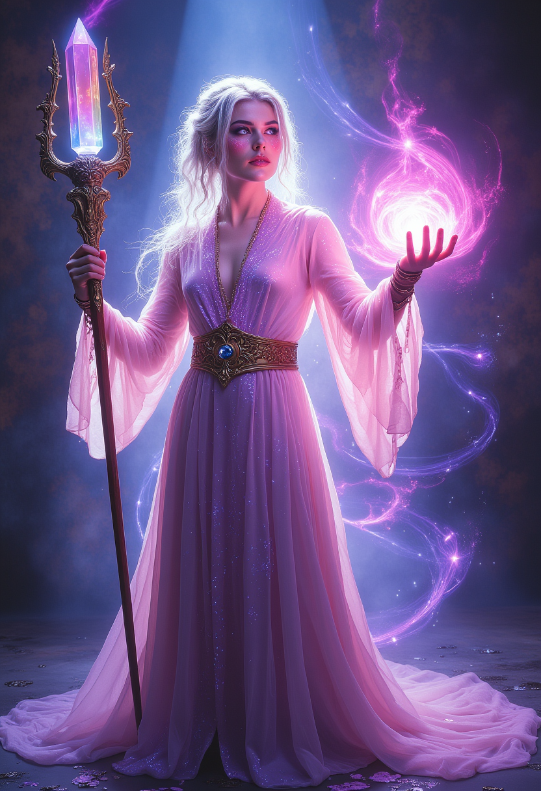<br/><strong>Imaginus</strong><br/><sub>Image creation</sub></td>
    <td align="center" width="7.7%">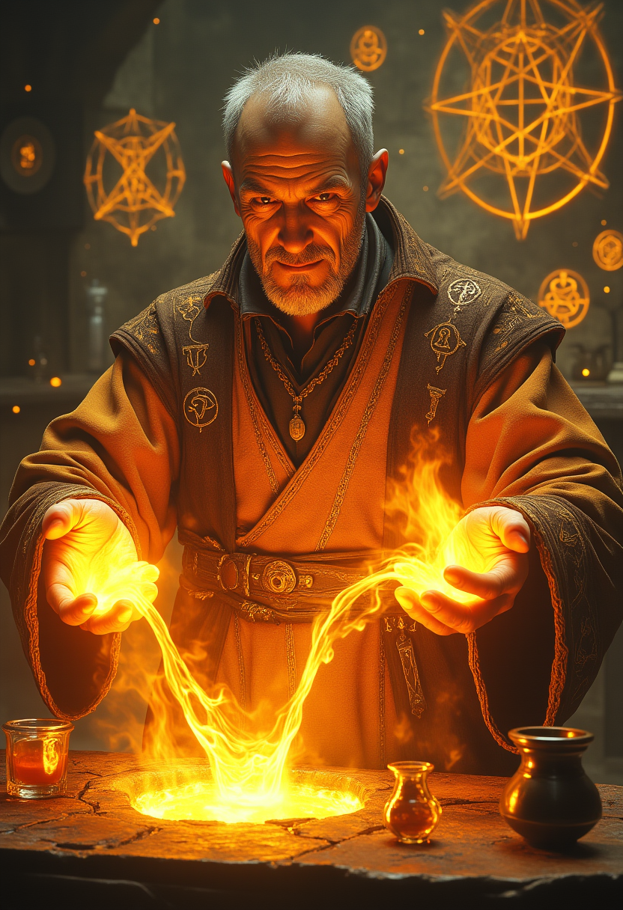<br/><strong>Transmutex</strong><br/><sub>Transformation</sub></td>
    <td align="center" width="7.7%">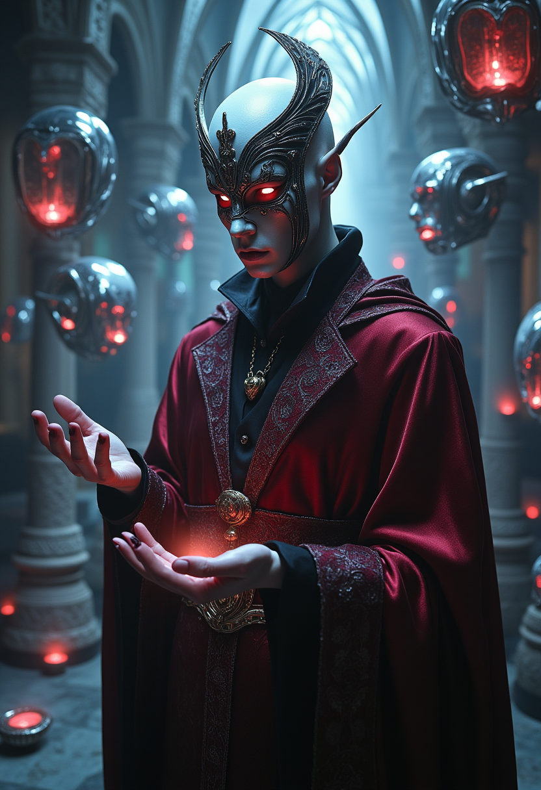<br/><strong>Masquerade</strong><br/><sub>Face & identity</sub></td>
    <td align="center" width="7.7%">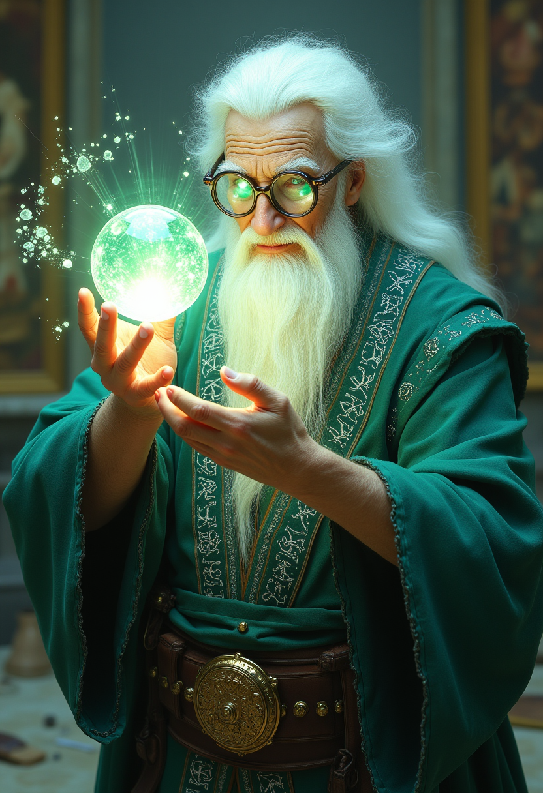<br/><strong>Restorix</strong><br/><sub>Upscale & restore</sub></td>
    <td align="center" width="7.7%">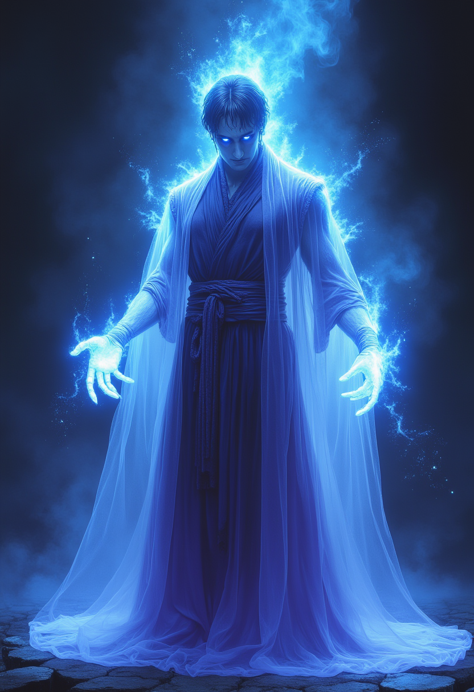<br/><strong>Erasure</strong><br/><sub>Inpaint & remove</sub></td>
    <td align="center" width="7.7%">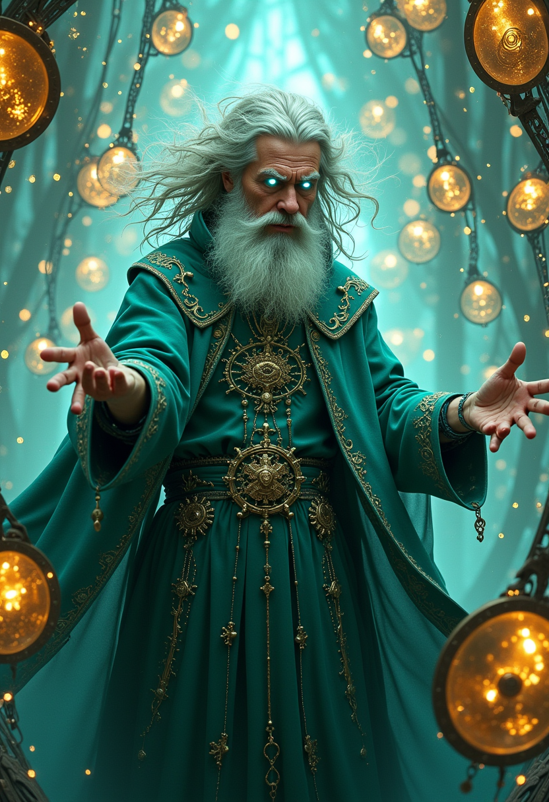<br/><strong>Videomancer</strong><br/><sub>Video generation</sub></td>
    <td align="center" width="7.7%">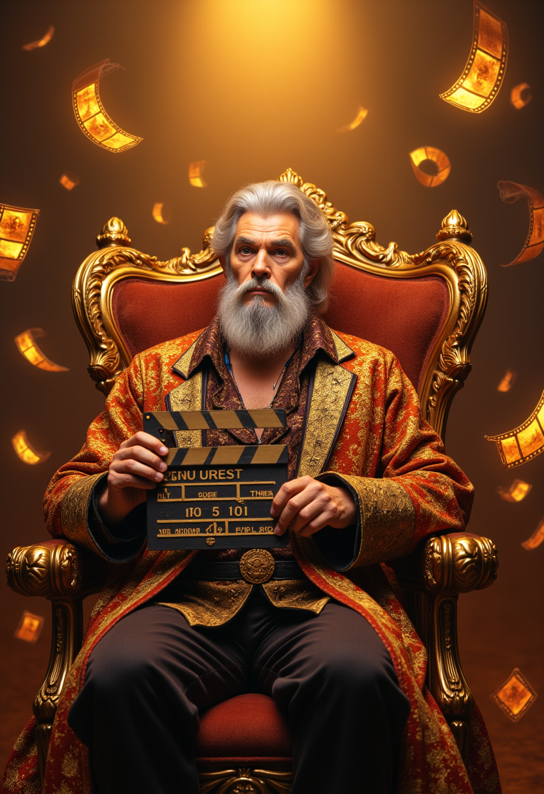<br/><strong>Cinematic</strong><br/><sub>Director's Chair</sub></td>
  </tr>
  <tr>
    <td align="center" width="7.7%">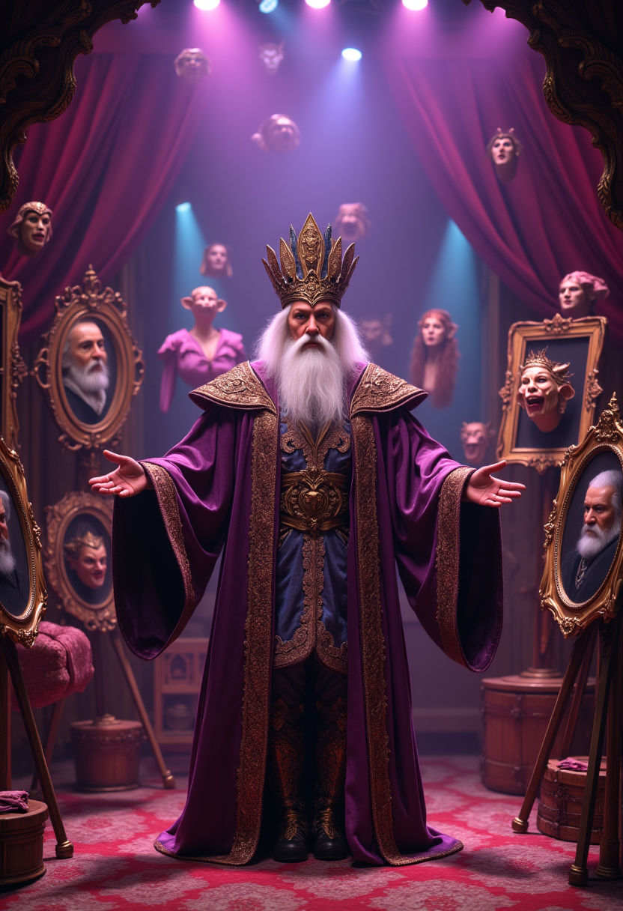<br/><strong>Studiocraft</strong><br/><sub>Magic Studios</sub></td>
    <td align="center" width="7.7%">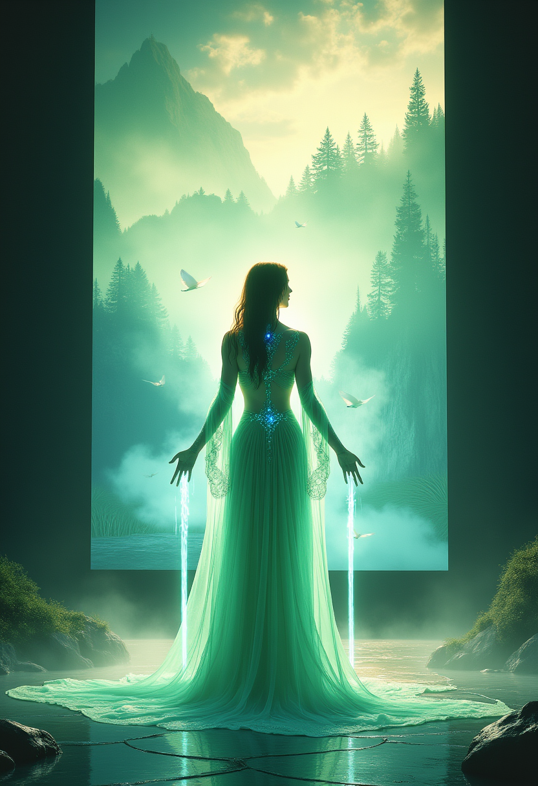<br/><strong>Sceneshifter</strong><br/><sub>Living scenes</sub></td>
    <td align="center" width="7.7%">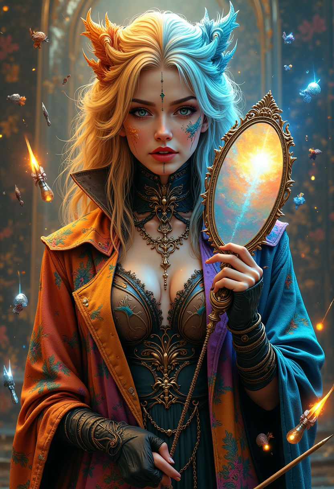<br/><strong>Restyler</strong><br/><sub>Avatar restyle</sub></td>
    <td align="center" width="7.7%">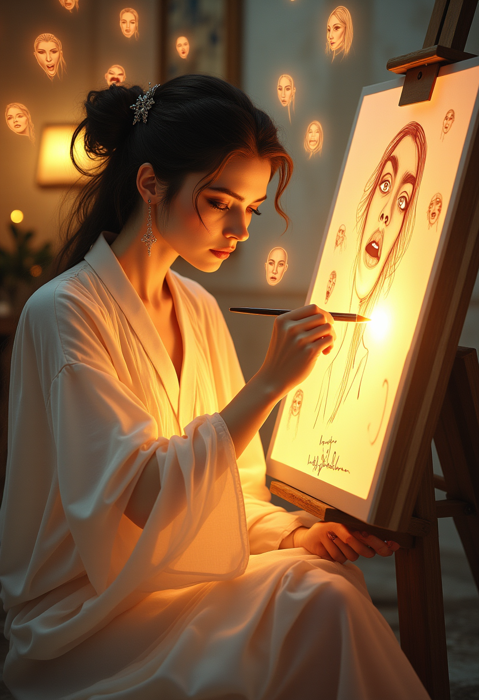<br/><strong>Portraitist</strong><br/><sub>Expression gen</sub></td>
    <td align="center" width="7.7%">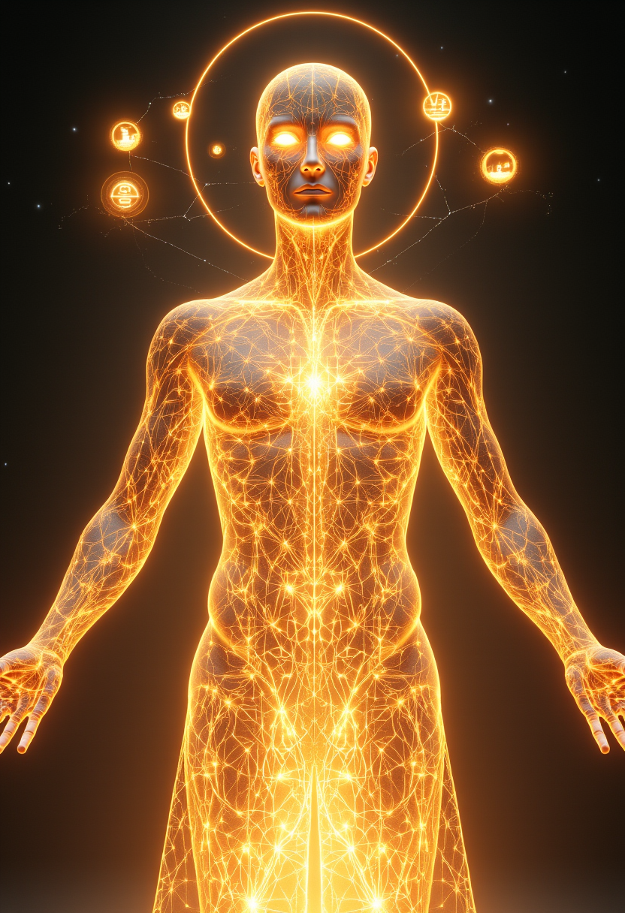<br/><strong>Autonoma</strong><br/><sub>Autonomous gen</sub></td>
    <td align="center" width="7.7%">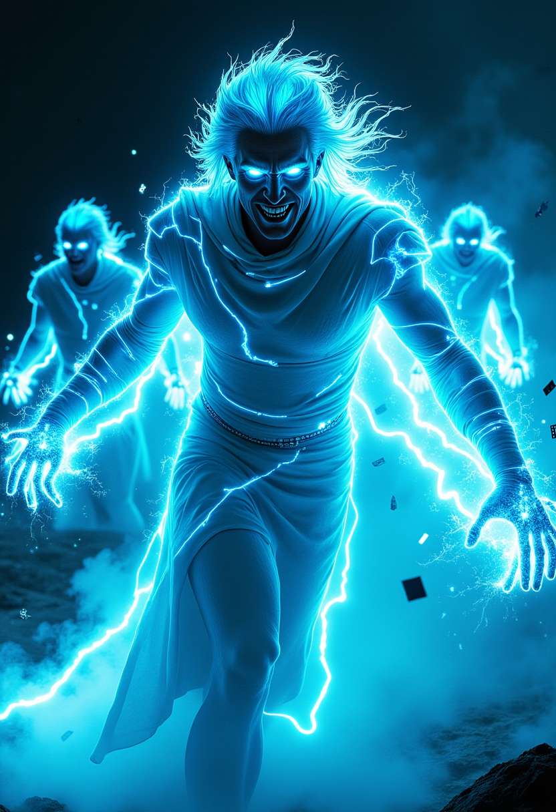<br/><strong>Animancer</strong><br/><sub>Animation</sub></td>
    <td align="center" width="7.7%"></td>
  </tr>
</table>

<details>
<summary><h3>Tell me more — how it works under the hood</h3></summary>

**What actually happens:** Add Sceneshifter to your group chat. You write *"They stepped through the portal into a moonlit forest clearing."* — and the SillyTavern background silently changes to a moonlit forest clearing, generated in real-time by your GPU. Add Portraitist, and every time a character smiles, frowns, or rages, their portrait updates to match. Add Autonoma, and the AI decides *on its own* when a scene deserves an illustration — a dramatic reveal, a first meeting, a battle — and generates it inline in the chat.

These aren't gimmicks. They're full ComfyUI pipelines — the same ones photographers and artists use — triggered by your story. Sceneshifter generates 1280×720 scene backgrounds. Portraitist creates 400×600 character portraits. Restyler can transform **every avatar in your chat** from anime to photorealistic (or vice versa) with one command: `/restyle-all photorealistic portrait, professional photography, 8k`. Masquerade can swap faces between characters. Videomancer can animate a still scene into a short video clip. Restyling is **fully reversible** — originals are auto-backed up and restored with `/restyle-undo`.

Everything runs locally on your GPU. No cloud API, no per-image costs, no content filters.

#### Magic Studios — Characters *Inside* Your Scenes

The ultimate feature: **your characters appear inside the generated scenes, dressed for the occasion.**

Use `/studio-cast-all` to create face models from every character's avatar. Use `/studio-body-all` to generate full-body transparent cutouts with face swap. Then every time a scene generates — manually via `/studio-scene` or automatically via Sceneshifter — your characters are **composited into the scene** with attire appropriate to the setting, followed by an AI harmonization pass that matches lighting and shadows.

Write *"They entered the medieval tavern"* → your characters appear in the tavern, wearing tavern-appropriate clothing. Write *"They fled into the enchanted forest"* → same characters, now in adventurer gear, composited into a moonlit forest. The attire changes automatically based on the scene description.

```
/studio-cast-all              → Face models ready
/studio-body-all casual wear  → Transparent body doubles ready
/studio-scene a pirate ship   → Scene + characters composited + harmonized
```

All characters are auto-cast on startup (face models generated from avatars in the background). If a character card includes a `body_description` in its metadata, the body double is also auto-generated.

#### Story Scaffold — The AI Watches Your Story

Spellcaster includes a **story scaffold** that watches every message for narrative changes that need a visual update. It doesn't just wait for scene descriptions — it detects:

| What Changed | Example | What Happens |
|---|---|---|
| **Location** | *"walked into the throne room"* | Full scene regeneration + re-dress characters |
| **Character enters/exits** | *"a stranger appears"*, *"storms off"* | Recomposite with updated cast |
| **Pose change** | sitting → running, fighting, kneeling, dancing | Regenerate bodies in new poses |
| **Attire change** | *"puts on armor"*, *"removes her cloak"* | Regenerate body with new outfit |
| **Important object** | *"draws a glowing sword"*, *"opens an ancient chest"* | Recomposite scene with new element |
| **Weather/atmosphere** | sunset, storm, fog, fire, earthquake | Full scene regeneration |
| **Intimate moment** | kissing, embracing, holding close | Bodies regenerated close together |
| **Conflict** | arguing, shouting, confronting | Bodies in tense stances |
| **Dramatic beat** | betrayal, confession, death | Recomposite for dramatic staging |

The scaffold triggers **immediately** on detected changes — no waiting for the message counter. It falls back to interval-based extraction only when no specific trigger is detected.

</details>

<details>
<summary><strong>Sceneshifter — Living Scenes (auto-background generation)</strong></summary>

**The scene changes. The background follows.**

Sceneshifter is the character that makes SillyTavern feel alive. Add it to any group chat and forget about it — it works in the background, watching your story unfold. When the narrative moves to a new location, Sceneshifter detects the scene change and generates a matching background image using ComfyUI. The SillyTavern background updates automatically.

**How it works:** Sceneshifter uses a two-layer detection system. The **story scaffold** watches every message for 10 categories of narrative change (location shift, character enter/exit, pose change, attire change, atmosphere shift, combat, intimacy, drama, object appearance). When a trigger is detected, it fires immediately — no waiting for the message interval. As a fallback, it also parses asterisk narration (`*They entered the dark cavern*`), parenthetical descriptions, and scene-setting keywords on a configurable interval. When characters have studio body doubles ready, they're automatically composited into the scene with appropriate attire.

**How to use it:**
1. Add Sceneshifter to your group chat (it won't talk — it just watches)
2. Enable auto-background: type `/spellcaster auto-bg on`
3. Set the interval (default: every 3 messages): adjust in the Spellcaster settings panel
4. Play your story. When the setting changes, the background changes with it.

**Best for:** Any roleplay with multiple locations — fantasy adventures, detective stories, slice-of-life scenes, dungeon crawls. Imagine your tavern scene having an actual tavern background, then transitioning to a forest when the party sets out. No manual work.

**Pro tips:**
- Write descriptive scene transitions: *"The grand doors swung open to reveal a cathedral of ice, frozen pillars reaching impossibly high"* — the more vivid, the better the background
- Set the interval to 5+ messages for slower stories, 1-2 for fast-paced action
- Use `/scene [description]` manually for an instant background override
- Sceneshifter works best as a silent observer — it won't interrupt the conversation

</details>

<details>
<summary><strong>Autonoma — The AI That Decides When You Need a Picture</strong></summary>

**It's not just generating images. It's deciding *when* images matter.**

Autonoma is the most magical character in the collection. It registers three LLM function tools — `generate_scene`, `generate_portrait`, and `set_atmosphere` — that let the AI model itself decide when to create a visual. You don't ask for images. The AI reads the emotional weight of the moment and decides "this deserves to be seen."

**How it works:** When your LLM backend supports function calling (Mistral, Llama 3.1+, GPT-4, Claude), Autonoma's tools appear in the model's tool list. During a dramatic reveal, a first meeting, a battle, or any visually striking moment, the AI can call `generate_scene` with a description. The image appears inline in the chat.

**How to use it:**
1. Add Autonoma to your group chat
2. Make sure your LLM backend supports function calling (KoboldCPP with Mistral-7B works)
3. Play your story as usual
4. When something dramatic happens, Autonoma generates an image automatically
5. You can also talk to Autonoma directly: *"Autonoma, show me what the throne room looks like"*

**Best for:** Immersive storytelling where you want visuals at emotional peaks without breaking the flow. Fantasy adventures, mysteries with dramatic reveals, romantic scenes where the atmosphere matters. The AI generates at moments like:
- A character's first appearance (*"A tall figure emerged from the shadows..."*)
- A scene of high tension (*"The dragon reared its head, flames licking between its teeth"*)
- A mood shift (*"The sun broke through the clouds for the first time in days"*)
- An important discovery (*"Hidden behind the bookshelf was a door she'd never seen before"*)

**Pro tips:**
- Autonoma works best with models that have strong tool-calling support — Mistral 7B Instruct is the sweet spot for local inference
- If it generates too often, adjust the system prompt to be more selective
- If it doesn't generate enough, try adding *"[Autonoma: consider generating a visual]"* as a subtle hint in your narration

</details>

<details>
<summary><strong>Imaginus — The Image Conjurer</strong></summary>

**Describe it. See it. That's the whole deal.**

Imaginus is your direct line to txt2img generation. It's the character you talk to when you want to *create* something from scratch — concept art for a new character, a landscape for your world, a dramatic illustration of a scene.

**How it works:** Tell Imaginus what you want to see. It constructs a ComfyUI txt2img workflow with quality-boosting prompt engineering, dispatches it, and returns the result. Imaginus automatically detects the best available model on your ComfyUI server (preferring Flux/SDXL over SD1.5) and optimizes the parameters.

**How to use it:**
- Chat directly: *"Imaginus, conjure me a crystal palace floating among clouds at sunset"*
- Group chat: Imaginus responds when mentioned or when given a visual request
- Slash command: `/scene a crystal palace floating among clouds` for instant generation

**Best for:** World-building, character concept art, scene illustrations, inspiration boards. When you need a specific visual that doesn't come from transforming an existing image.

</details>

<details>
<summary><strong>Transmutex — The Transformation Alchemist</strong></summary>

**Take what exists. Make it something else entirely.**

Transmutex specializes in img2img — taking an existing image and transforming it. Change the art style. Shift the mood. Turn a rough sketch into a polished illustration. Transmutex is what you use when you already have a visual but want to push it in a new direction.

**How it works:** Transmutex takes an existing image (character avatar, generated scene, uploaded reference), applies a style prompt through ComfyUI's img2img pipeline at a configurable denoise level, and returns the transformed version.

**How to use it:**
- *"Transmutex, take this scene and make it look like it's painted by Studio Ghibli"*
- *"Transform my character's portrait into a dark, moody noir style"*
- Slash command: `/restyle oil painting, dramatic chiaroscuro lighting, museum masterpiece`

**Best for:** Style experiments, mood shifts mid-story, transforming AI-generated art into different aesthetics. Amazing for "what if" explorations — same character, different universe. Imagine: *"What would this tavern look like in a cyberpunk setting?"*

</details>

<details>
<summary><strong>Masquerade — The Face Weaver</strong></summary>

**Identities are fluid. Faces are just another mask.**

Masquerade handles everything face-related — face swapping between characters, identity preservation, and generating portraits with specific facial features. If your story involves disguises, shapeshifting, twins, doppelgangers, or any kind of identity play, Masquerade is your go-to.

**How it works:** Under the hood, Masquerade drives ReActor (face swap), IPAdapter FaceID (identity-guided generation), PuLID Flux (attention-level face transfer), and Klein Head Swap (hybrid pipeline). In SillyTavern, it generates identity-consistent portraits based on character descriptions.

**Best for:** Stories with shapeshifters, disguises, twin characters, or any scenario where faces matter. Also great for creating consistent character portraits across multiple scenes — describe a character once, and Masquerade keeps them recognizable.

</details>

<details>
<summary><strong>Restorix — The Restoration Elder</strong></summary>

**Old, damaged, blurry? Restorix makes it pristine.**

Restorix handles upscaling, restoration, and quality enhancement. In a SillyTavern context, it sharpens and enhances generated images — taking a rough generation and refining it into something that looks professional.

**How it works:** Restorix applies low-denoise img2img passes that add fine detail without changing the composition. Think of it as an AI-powered "enhance" button that actually works. It uses the same SUPIR, CodeFormer, and detail hallucination pipelines that professional photo editors rely on.

**How to use it:**
- *"Restorix, enhance this image — make it sharper and more detailed"*
- Apply after any other character's generation to improve quality

**Best for:** Post-processing. Generate a rough scene with Imaginus or Sceneshifter, then pass it through Restorix for a polished final version. Also great for enhancing character avatars.

</details>

<details>
<summary><strong>Erasure — The Surgical Editor</strong></summary>

**Remove what shouldn't be there. Fill in what should.**

Erasure is the precision tool — background removal, object erasure, inpainting (regenerating specific areas), and clean scene generation. In SillyTavern, its most common use is generating empty environments for scenes, free of any pre-existing characters.

**How it works:** Erasure generates scenes with explicit negative prompts to exclude people and characters, producing clean backgrounds perfect for roleplay. It can also remove unwanted elements from existing images using LaMa inpainting.

**How to use it:**
- *"Erasure, create an empty medieval throne room — no people, just the architecture"*
- *"Remove the figure from this background and fill in what was behind them"*

**Best for:** Creating clean backgrounds for scenes, removing unwanted elements from generated images, preparing environments for compositing.

</details>

<details>
<summary><strong>Videomancer — The Motion Weaver</strong></summary>

**Your still images just started breathing.**

Videomancer turns static images into short video clips. A portrait becomes a living, breathing character. A landscape gets gentle wind and flowing water. A dramatic scene gets camera movement. Videomancer supports both WAN 2.2 (image-to-video) and LTX 2.3 (text-to-video) depending on what's installed on your ComfyUI server.

**How it works:** Videomancer dispatches video generation workflows to ComfyUI — WAN for high-quality portrait animation, LTX for text-prompted video. Results come back as GIFs that display inline in the chat or MP4s saved to disk.

**Best for:** Living portraits for your character cards, animated scene transitions, dramatic moments that deserve more than a still image. Imagine your villain's entrance as a short video clip right there in the chat.

</details>

<details>
<summary><strong>Cinematic — The Director</strong></summary>

**Lights. Camera. Multiple takes. Face continuity across every shot.**

Cinematic is the Director's Chair — it orchestrates multi-step video sequences where the same character appears consistently across multiple shots. It chains WAN I2V video steps with face re-injection between each step to maintain character identity.

**How it works:** Cinematic plans a sequence (3-4 steps), generates each video clip, extracts the last frame, re-injects the character's face using ReActor, then feeds the re-injected frame into the next clip. The result is a coherent mini-movie with consistent character appearance.

**Script presets include:**
- *Dramatic Reveal* (3 steps): wide shot → medium → close-up
- *Living Portrait* (2 steps): subtle breathing → gentle smile
- *Walk Cycle* (3 steps): approach → walk past → exit
- *Emotional Arc* (4 steps): neutral → concern → realization → resolve

**Best for:** Users who want cinematic storytelling — multi-shot sequences for dramatic moments, character introductions, action scenes. This is the most ambitious feature in the collection.

</details>

<details>
<summary><strong>Studiocraft — The Production Manager</strong></summary>

**From a selfie to a composited, animated scene. Five acts. One pipeline.**

Studiocraft guides you through Magic Studios — a complete 5-act character production pipeline. In SillyTavern, this is accessible via `/studio-*` commands that automate the entire process:

1. **Act 1 — Casting Polaroids** (`/studio-cast`): Avatar → ReActor face model saved to ComfyUI
2. **Act 2 — Body Double** (`/studio-body`): txt2img full body → face swap → background removal → transparent PNG
3. **Act 3 — Wardrobe Department**: Characters are auto-dressed based on the scene description
4. **Act 4 — Set Design** (`/studio-scene`): Generate scene → composite characters → AI harmonization pass
5. **Act 5 — Director's Chair** (`/animate`): Animate the composited scene as video

**In SillyTavern**, the pipeline runs automatically: characters are auto-cast on startup, and when Sceneshifter generates a new scene, any characters with body doubles are composited into it wearing scene-appropriate attire. The story scaffold detects attire changes, pose changes, and character entrances/exits to trigger regeneration.

**How to use it:**
- Start: *"Studiocraft, I want to create a character from this photo"*
- Studiocraft walks you through each act, asking for choices at each step
- Skip acts if you already have assets (e.g., already have a face model → start at Act 2)

**Best for:** Creating complete character sheets for new RP characters, building visual novel-style scenes, producing character content that's consistent across images and video. The ultimate tool for users who want to fully visualize their OCs.

</details>

<details>
<summary><strong>Restyler — The Art Director</strong></summary>

**Every avatar in your chat. Transformed. One command.**

Restyler is the batch avatar transformation specialist. While Transmutex handles individual image transformations, Restyler is designed for the workflow SillyTavern users actually want: change the art style of *everyone* at once.

**How to use it:**
- `/restyle-all photorealistic portrait, professional photography, detailed skin, 8k` — turns every avatar in your chat from anime/cartoon to photorealistic
- `/restyle-all anime style, cel shading, vibrant colors, manga illustration` — goes the other direction
- `/restyle-all dark fantasy oil painting, moody, dramatic lighting` — unified art style for the whole cast
- `/restyle watercolor, soft washes, paper texture` — transform just the active character

**Best for:** When you download a character card with an anime avatar but you're running a photorealistic RP. When you want your entire cast to look like they belong in the same universe. When you're experimenting with how your story would look in a completely different art style. One command, every avatar, instant transformation.

**Fully reversible:** Restyling automatically backs up the original avatar as a `.bak.png` file. Don't like the result? Just type `/restyle-undo` (single character) or `/restyle-undo-all` (everyone) and you're back to the originals instantly. Experiment fearlessly.

**Denoise guide:**
- 0.30 = subtle touch-up (sharpen, slight style shift)
- 0.50 = noticeable transformation (clear style change, character still recognizable)
- 0.70 = heavy transformation (major style shift, composition may change)

</details>

<details>
<summary><strong>Portraitist — The Expression Artist</strong></summary>

**Characters that wear their emotions on their face. Literally.**

Portraitist generates emotion-appropriate character portraits based on the mood of each message. When a character is happy, their portrait shows joy. When they're angry, you see fury. When they're heartbroken, the expression matches.

**How it works:** Portraitist hooks into `CHARACTER_MESSAGE_RENDERED` and runs keyword-based sentiment analysis on the AI's response. It detects emotions (happy, sad, angry, surprised, afraid, loving, thinking, confident) and generates a matching portrait via ComfyUI. The portrait is **saved as an expression sprite** to SillyTavern's character folder (`data/default-user/characters/<CharName>/<emotion>.png`), so ST's built-in expression system can use it.

**Emotion detection keywords:**
- Happy: smile, laugh, grin, joy, cheer, delight
- Angry: fury, rage, snarl, growl, scowl, glare, fist
- Sad: cry, tear, sob, mourn, grief, sorrow
- Surprised: gasp, shock, widen, startle
- Loving: blush, flutter, warmth, tender, embrace

**How to use it:**
1. Add Portraitist to your group chat
2. Enable auto-expressions in the Spellcaster settings panel
3. Play your story — when characters show strong emotions, portraits update automatically
4. Or generate manually: `/portrait a warrior grimacing in pain, clutching a wound`

**Best for:** Emotional storytelling. Characters that feel real because their face actually changes. Stories where expression matters — romance, drama, conflict, comedy. Combined with Sceneshifter, you get a visual novel experience that generates itself.

</details>

<details>
<summary><strong>Animancer — The Motion Enchanter</strong></summary>

**That perfect still image? Now it moves.**

Animancer takes any generated image and brings it to life as a short animation. A portrait starts breathing. A landscape gets wind through the trees. A campfire flickers. It's the final polish that turns a good visual into an immersive one.

**How it works:** Type `/animate` and Animancer takes the current character's avatar, creates subtle frame variations via img2img with noise injection, and assembles them into a looping pingpong GIF. The result plays inline in the chat. For more complex animations, the full WAN I2V and LTX I2V pipelines are available via the Wizard Guild.

**Best for:** Living character portraits, animated scene headers, dramatic moment captures. Particularly powerful when combined with Sceneshifter — the background not only changes, but comes alive with subtle motion.

</details>

**Setup — what you need:**

| Requirement | What It Is | How to Get It |
|---|---|---|
| **SillyTavern** | The chat frontend these characters live in | [github.com/SillyTavern/SillyTavern](https://github.com/SillyTavern/SillyTavern) |
| **ComfyUI** | The AI engine that generates images/video | Already installed if you use Spellcaster |
| **Spellcaster server plugin** | Bridges SillyTavern to ComfyUI | Installed automatically (see below) |
| **An LLM backend** | Powers the character conversations | KoboldCPP, Ollama, or any OpenAI-compatible API |

<details>
<summary><h3>Tell me more — setup, commands, and technical details</h3></summary>

**How the installer sets it up:**

The Spellcaster installer and the Wizard Guild launcher both handle SillyTavern setup automatically:

- **Wizard Guild launcher** (`start_guild.bat` or `Wizard_Guild.exe`): If SillyTavern isn't found, it offers to clone and install it. If it IS found, it checks for the Spellcaster plugin and installs it if missing. **All 13 character cards and their avatars are auto-imported** — no manual copying.
- **Manual patcher**: Run `python installer/patch_sillytavern.py --st-dir /path/to/SillyTavern` to install the plugin into any existing SillyTavern installation.
- **What gets installed**: A server plugin at `ST/plugins/spellcaster/` (ComfyUI bridge, Magic Studios pipeline, story scaffold) + a UI extension at `ST/data/default-user/extensions/spellcaster-st/` (slash commands, function tools, auto-background, settings panel) + all 13 character cards with pre-generated avatars.

**How to use them:**

1. Launch the Wizard Guild — it handles everything automatically (SillyTavern setup, plugin install, character import)
2. Or run the patcher manually: `python installer/patch_sillytavern.py --st-dir /path/to/SillyTavern`
3. Open SillyTavern — the 13 characters appear in your character list with their avatars
4. Add any of them to a **group chat** alongside your existing roleplay characters
5. Characters auto-cast on startup (face models generated from avatars in the background)
6. Sceneshifter generates backgrounds as scenes change; Portraitist creates expression portraits; Autonoma generates images at dramatic moments — all automatically
7. Use `/studio-cast-all` + `/studio-body-all` to enable full character compositing in scenes

> **Tip:** You don't need all 13. Start with **Sceneshifter** (auto-backgrounds) and **Autonoma** (autonomous image generation) — they work silently alongside any existing character without interrupting the conversation.

</details>

**Slash commands** (available when any Spellcaster character is active):

| Command | What It Does |
|---|---|
| **Scenes & Portraits** | |
| `/scene [description]` | Generate and set a scene background |
| `/portrait [description]` | Generate a character portrait inline |
| `/animate [prompt]` | Animate the current character's avatar as a looping GIF |
| **Avatar Restyling** | |
| `/restyle [style prompt]` | Transform the active character's avatar (original auto-backed up) |
| `/restyle-all [style prompt]` | Transform ALL character avatars at once (all originals backed up) |
| `/restyle-undo` | Restore the current character's original avatar |
| `/restyle-undo-all` | Restore ALL avatars to their originals |
| **Magic Studios** | |
| `/studio-cast` | Create a face model from the current character's avatar |
| `/studio-cast-all` | Batch-cast all characters (face models for everyone) |
| `/studio-body [description]` | Generate a full-body transparent PNG with face swap + bg removal |
| `/studio-body-all [attire]` | Batch-generate bodies for all cast characters |
| `/studio-scene [description]` | Generate a scene with characters composited in, auto-dressed for the setting |
| `/studio-status` | Show which characters are cast and have bodies ready |
| **System** | |
| `/spellcaster auto-bg on` | Enable automatic background generation (with story scaffold) |
| `/spellcaster auto-bg off` | Disable auto-background |
| `/spellcaster on\|off` | Enable/disable the entire extension |

---

## 🔌 Bring Your Own Workflows

**Already have ComfyUI workflows?** Import them in two clicks — Spellcaster runs them directly from GIMP.

### The Travelling Wizard

Open `Filters > Spellcaster Tools > Travelling Wizard` and you'll see:

- 🟢 **Live server status** — GPU name, VRAM, and connection indicator
- 📂 **Browse Workflow Library** — lists every workflow on your Comfy