<p align="center">
  
</p>

<h1 align="center">Spellcaster</h1>

<p align="center">
  <strong>Type "hair" in GIMP. It selects the hair. Perfectly. In one second.</strong><br/>
  <em>69 AI tools, one menu. GIMP · DaVinci Resolve · Darktable · chat UI · 100% local · zero config.</em>
</p>

<p align="center">
  <sub><em>Spellcaster auto-detects your installed checkpoints and routes each generation to the right architecture. You never pick a sampler.</em></sub>
</p>

<p align="center">
  <a href="https://github.com/laboratoiresonore/spellcaster/releases/latest/download/spellcaster-installer.exe"></a>
  &nbsp;
  <a href="https://github.com/laboratoiresonore/spellcaster/releases/latest/download/spellcaster-installer-macos.zip"></a>
  &nbsp;
  <a href="https://github.com/laboratoiresonore/spellcaster/releases/latest/download/spellcaster-installer"></a>
</p>

<p align="center">
  <a href="https://github.com/laboratoiresonore/spellcaster/releases"></a>
  <a href="LICENSE"></a>
  <a href="https://github.com/laboratoiresonore/spellcaster/stargazers"></a>
  <a href="https://github.com/laboratoiresonore/spellcaster/releases/latest"></a>
  <a href="https://patreon.com/LeLaboratoireSonore"></a>
</p>

<p align="center">
  <a href="#save-a-day-of-work-right-now">Save a day of work</a> &bull;
  <a href="#i-want-to">I want to…</a> &bull;
  <a href="#five-clicks-start-to-finish">5-click showcase</a> &bull;
  <a href="#install">Install</a> &bull;
  <a href="#three-ways-to-use-it">Three UIs</a> &bull;
  <a href="#faq">FAQ</a> &bull;
  <a href="DEEP_DIVE.md">Deep dive</a>
</p>

---

<div align="center">

<strong>📣 Status — August 2026</strong>

<table>
<tr><td><strong>🆕 News</strong></td><td>Self-healing installer + honest diagnostic validator landed. Local-LLM (LM Studio) prompt-enhancement promoted to canon, optional bearer-token auth across the HTTP surfaces, automated 6-surface mirror sync. DaVinci Resolve plugin is still in test — bug reports welcome.</td></tr>
<tr><td><strong>✅ What works</strong></td><td>GIMP plugin is a powerhouse and a far better interface than ComfyUI for anything related to images. Diagnostic validator now distinguishes real failures from false positives (cold-load timeouts, outdated node names, model classifier fall-through).</td></tr>
<tr><td><strong>🔧 Current focus</strong></td><td>Correctness hardening — installer edge cases, validator accuracy, cross-repo mirror automation. Nightly LLM briefing summarizes what changed overnight.</td></tr>
<tr><td><strong>⏭ Next</strong></td><td>Signal bridge &nbsp;·&nbsp; Moar plugins / frontends (<a href="https://github.com/laboratoiresonore/spellcaster/issues/new">make a request</a>)</td></tr>
</table>

</div>

---

## Save a day of work, right now

<p align="center"><em>Three things Spellcaster does in one click that most people spend an afternoon — or a whole day — on.</em></p>

<br/>

<!-- ─────────────────────────────────────────────────────────
     1 / 3  —  Type what to select
     Image on the LEFT, copy on the right. The two halves are
     fixed-width columns so image heights stop fighting each
     other for vertical alignment (the bug users saw: each cell
     in the old 3-up table had a different image height so the
     captions drifted wildly up and down in a giant white gutter).
     ───────────────────────────────────────────────────────── -->
<table width="100%">
<tr>
<td width="52%" align="center" valign="top">
  <a href="DEEP_DIVE.md#all-69-tools"></a>
</td>
<td width="48%" valign="top">
  <h3>⚡ Let it make the picks</h3>
  <p>Type what you want selected — <em>earring</em>, <em>hair</em>, <em>left shoe</em>. Perfect mask, one second. No lasso, no zooming, no quick-mask dance.</p>
  <p>Same trick runs everywhere else. Type what you want <em>made</em>, and Spellcaster picks the right model for the job, rewrites your prompt in that model's own language, filters out incompatible add-ons, sets up the guidance. You describe the outcome; it chooses the tools.</p>
  <p><sub>🖌️ <strong>GIMP</strong> · <code>Select &gt; AI Select by Description</code> &nbsp;·&nbsp; 🧙 <strong>Guild</strong> · smart generate &nbsp;·&nbsp; <a href="DEEP_DIVE.md#-prompt-enhancement--per-architecture-per-method-per-model">how the auto-picks work →</a></sub></p>
</td>
</tr>
</table>

<!-- ─────────────────────────────────────────────────────────
     2 / 3  —  Resurrect a blurry photo   (image on the RIGHT)
     ───────────────────────────────────────────────────────── -->
<table width="100%">
<tr>
<td width="48%" valign="top">
  <h3>🔮 Resurrect — and rewrite — any photo</h3>
  <p><strong>SUPIR restoration, one click.</strong> Damaged, compressed, low-res — faces, skin, texture all come back. Works on grandma's scanned photos and on the JPEGs you downloaded in 2006.</p>
  <p>Then: do whatever you want to the picture. Point at the power line and it's gone. Say <em>"add a coffee cup on the table"</em> and it lands, matching light and perspective. Change the time of day. Colour in a black-and-white. Extend the canvas past its edges. Swap the face. Re-pose the subject. Every edit most photo apps took a decade to learn — done by describing it in English.</p>
  <p><sub>🖌️ <strong>GIMP</strong> · restore, erase, add, re-light &nbsp;·&nbsp; 📷 <strong>Darktable</strong> · batch across a whole shoot</sub></p>
</td>
<td width="52%" align="center" valign="top">
  <a href="DEEP_DIVE.md#all-69-tools"></a>
</td>
</tr>
</table>

<!-- ─────────────────────────────────────────────────────────
     3 / 3  —  Animate a still    (image on the LEFT — GIF)
     ───────────────────────────────────────────────────────── -->
<table width="100%">
<tr>
<td width="52%" align="center" valign="top">
  <a href="DEEP_DIVE.md#all-69-tools"></a>
</td>
<td width="48%" valign="top">
  <h3>🎬 Animate a still — and drop it on the timeline</h3>
  <p><strong>Wan 2.2 Image-to-Video.</strong> Pick a motion preset — zoom, parallax, a breathing portrait, 26 of them. The still moves. 2–5 seconds, 720p, rendered overnight if you want.</p>
  <p>Or skip the still. Type a paragraph and <strong>LTX 2.3</strong> gives you three seconds of cinema — fireballs, rain, a neon fly-through, a slow dolly-in. Straight from words to video.</p>
  <p>Then the good part: <em>Send to Resolve</em>. The clip lands in your DaVinci bin, ready to cut. Or plan a whole sequence in the Guild — a Cinematographer wizard scaffolds twelve shots, renders them while you get coffee, and the full reel is waiting in Resolve's media pool when you get back.</p>
  <p><sub>🧙 <strong>Guild</strong> · Shotboard &nbsp;·&nbsp; 🖌️ <strong>GIMP</strong> · LTX + Wan &nbsp;·&nbsp; 🎬 <strong>Resolve</strong> · <a href="plugins/resolve/">bridge plugin</a></sub></p>
</td>
</tr>
</table>

<br/>

<!-- ─────────────────────────────────────────────────────────
     Models that power the above — badge strip. GitHub's
     markdown renderer wraps badges naturally; dropping the
     manual <br/> line breaks lets 11 image-model badges flow
     into a clean grid instead of the 8+3 orphan-wrap they
     used to make.
     ───────────────────────────────────────────────────────── -->
<p align="center"><sub><strong>POWERED BY</strong> — <a href="DEEP_DIVE.md#all-69-tools">full matrix →</a></sub></p>

<p align="center"><sub>
  <strong>🎨 Image</strong> &nbsp;<code>Flux 2 Klein</code> · <code>Flux 1 Dev</code> · <code>Flux Kontext</code> · <code>Chroma</code> · <code>SDXL</code> · <code>Illustrious</code> · <code>Pony</code> · <code>Playground</code> · <code>SD 1.5</code> · <code>SDXL Turbo</code> · <code>Z-Image Turbo</code><br/>
  <strong>🎬 Video</strong> &nbsp;<code>Wan 2.2 I2V</code> · <code>LTX 2.3</code> · <code>SeedVR</code><br/>
  <strong>🧠 Helpers</strong> &nbsp;<code>SAM 3</code> · <code>NormalCrafter</code> · <code>IC-Light</code> · <code>ReActor</code> · <code>Ollama</code>
</sub></p>

<p align="center"><sub><a href="DEEP_DIVE.md#all-69-tools"><strong>→ 69 tools across 19 models.</strong> See the full matrix in DEEP_DIVE.md</a></sub></p>

---

## I want to…

Pick the thing you want. One tool per row. The **Best in** column tells you the fastest interface to launch it from — 🖌️ **GIMP** for pixel-accurate work, 📷 **Darktable** for RAW-first batching, 🧙 **Wizard Guild** for conversational prompts, 🎬 **Resolve** for timeline-aware video, 🎭 **SillyTavern** for in-chat renders.

<table>
<tr>
<td width="16%" align="center"></td>
<td><strong>Remove something from a photo</strong><br/><sub>LaMa inpainting erases anything — tourists, power lines, ex-boyfriends — and fills the gap cleanly.</sub></td>
<td width="18%"><sub>🖌️ <strong>GIMP</strong> — select + <code>Ctrl+Alt+X</code> ·<br/>📷 <strong>Darktable</strong> — Send to GIMP first</sub></td>
</tr>
<tr>
<td width="16%" align="center"></td>
<td><strong>Cut out the subject</strong><br/><sub>Three engines — rembg, BiRefNet (best for hair), BiRefNet Portrait. You get transparency. No cleanup needed.</sub></td>
<td width="18%"><sub>🖌️ <strong>GIMP</strong> — <code>Ctrl+Alt+B</code> ·<br/>🧙 <strong>Guild</strong> — "remove the background"</sub></td>
</tr>
<tr>
<td width="16%" align="center"></td>
<td><strong>Colorize a B&W photo</strong><br/><sub>Three engines — DDColor artistic/natural, or ControlNet + diffusion for the "restored family portrait" look.</sub></td>
<td width="18%"><sub>🖌️ <strong>GIMP</strong> — one dialog ·<br/>📷 <strong>Darktable</strong> — batch across shoots</sub></td>
</tr>
<tr>
<td width="16%" align="center"></td>
<td><strong>Change the lighting</strong><br/><sub>IC-Light relighting. Pick "Golden Hour", "Neon", "Studio", 10 presets — the subject stays, the light changes.</sub></td>
<td width="18%"><sub>🖌️ <strong>GIMP</strong> — Style menu, one preset click ·<br/>🧙 <strong>Guild</strong> — "relight as sunset"</sub></td>
</tr>
<tr>
<td width="16%" align="center"></td>
<td><strong>Fix a face</strong><br/><sub>Seven models — GPEN-2048, CodeFormer, GFPGAN, RestoreFormer++. Sharp eyes and skin back.</sub></td>
<td width="18%"><sub>🖌️ <strong>GIMP</strong> — <code>Ctrl+Alt+F</code> ·<br/>📷 <strong>Darktable</strong> — restore a whole folder</sub></td>
</tr>
<tr>
<td width="16%" align="center"></td>
<td><strong>Put your face on a character</strong><br/><sub>ReActor, FaceID, PuLID, Flux 2 Headswap. Upload a reference, generate a new scene, the subject has your face.</sub></td>
<td width="18%"><sub>🖌️ <strong>GIMP</strong> — upload + preset ·<br/>🎭 <strong>ST</strong> — <code>/portrait</code> in roleplay</sub></td>
</tr>
<tr>
<td width="16%" align="center"></td>
<td><strong>Copy a style</strong><br/><sub>IPAdapter style transfer. Point at any reference image — painting, photograph, illustration — and your image gets rewritten in that style.</sub></td>
<td width="18%"><sub>🖌️ <strong>GIMP</strong> — reference image picker ·<br/>🧙 <strong>Guild</strong> — drop a ref, chat it</sub></td>
</tr>
<tr>
<td width="16%" align="center"></td>
<td><strong>Upscale with hallucinated detail</strong><br/><sub>Nine upscalers: WaveSpeed SeedVR2 (best, 2K/4K), UltraSharp, RealESRGAN, Remacri, NMKD, Anime. Controllable hallucination.</sub></td>
<td width="18%"><sub>🖌️ <strong>GIMP</strong> — <code>Ctrl+Alt+U</code> ·<br/>📷 <strong>Darktable</strong> — Hybrid Blend panel</sub></td>
</tr>
<tr>
<td width="16%" align="center">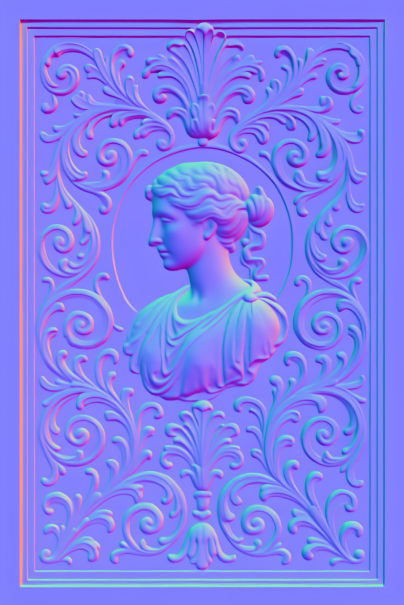</td>
<td><strong>Extract 3D surface geometry</strong><br/><sub>NormalCrafter generates a 3D normal map from any 2D image. Use it in Blender, in game engines, or feed it back into Spellcaster to relight the scene.</sub></td>
<td width="18%"><sub>🖌️ <strong>GIMP</strong> — Enhance ▸ 3D Normal Map ·<br/>📷 <strong>Darktable</strong> — 3D / Relighting panel</sub></td>
</tr>
<tr>
<td width="16%" align="center"></td>
<td><strong>Edit with Flux 2 Klein</strong><br/><sub>4-20 steps, photorealistic, best-in-class img2img and inpaint. Klein is the one people notice. 9 Klein-specific tools, all pre-tuned.</sub></td>
<td width="18%"><sub>🖌️ <strong>GIMP</strong> — Flux 2 submenu, 9 tools ·<br/>🧙 <strong>Guild</strong> — auto-routes via Portraitist wizard</sub></td>
</tr>
<tr>
<td width="16%" align="center">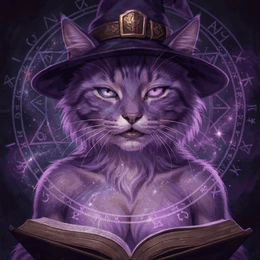</td>
<td><strong>Have fun and generate whatever the hell I want</strong><br/><sub>Text to Image across 9 model families. Type "a cat wizard reading a spellbook." Get a cat wizard reading a spellbook. 25 scene presets.</sub></td>
<td width="18%"><sub>🧙 <strong>Wizard Guild</strong> — just type it, the wizards route it ·<br/>🖌️ <strong>GIMP</strong> — Text to Image dialog</sub></td>
</tr>
<tr>
<td width="16%" align="center"></td>
<td><strong>Animate a still into a clip</strong><br/><sub>Wan 2.2 I2V (81 frames, 720p) or LTX 2.3. 26 motion presets — zoom, turntable, parallax, breathing portrait, falling petals.</sub></td>
<td width="18%"><sub>🎬 <strong>Resolve</strong> — drop playhead, render to timeline ·<br/>🖌️ <strong>GIMP</strong> — Image ▸ WAN I2V ·<br/>🎭 <strong>ST</strong> — <code>/animate</code></sub></td>
</tr>
</table>

<sub><strong>Icon key</strong> · 🖌️ GIMP plugin · 📷 Darktable plugin · 🧙 Wizard Guild chat · 🎬 DaVinci Resolve plugin · 🎭 SillyTavern extension — all four talk to the same ComfyUI backend and share a gallery, so any result shows up everywhere.</sub>

**Too many to list here.** [All 69 tools →](DEEP_DIVE.md#all-69-tools)

---

## Five clicks, start to finish

A real pipeline, all built into the GIMP menu. Generate a scene → AI-select the subject → extract its 3D geometry → enhance the detail surgically → blend back in. Five menu items. Zero configuration. Takes longer to microwave a Hot Pocket — and unlike the Hot Pocket, the result doesn't make you question your life choices.

<table>
<tr>
<td width="20%">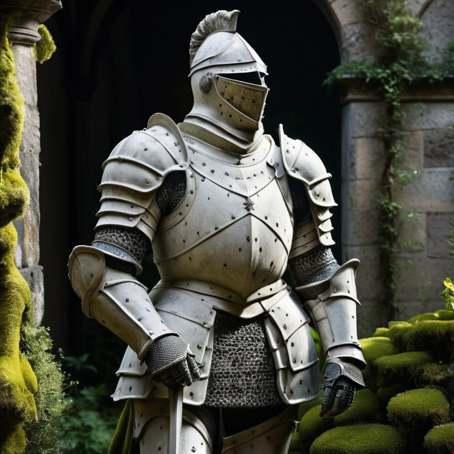<br/><sub><strong>1. Generate</strong> — SDXL creates the scene</sub></td>
<td width="20%">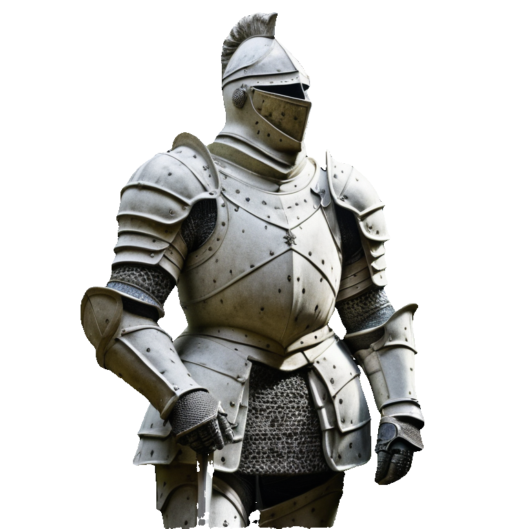<br/><sub><strong>2. AI Select</strong> — SAM3 isolates the statue</sub></td>
<td width="20%">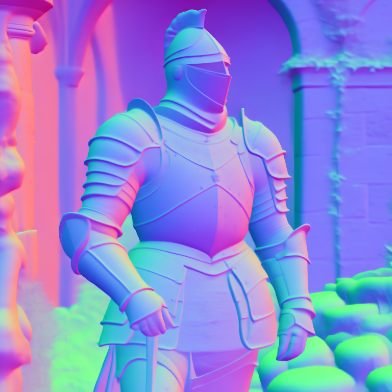<br/><sub><strong>3. 3D Normal Map</strong> — surface geometry extracted</sub></td>
<td width="20%">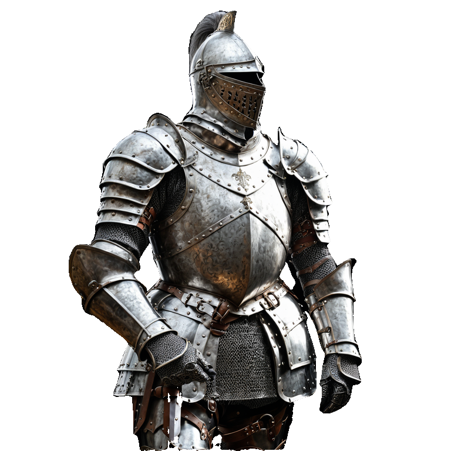<br/><sub><strong>4. Detail Enhance</strong> — surgical texture refinement on the isolated layer</sub></td>
<td width="20%">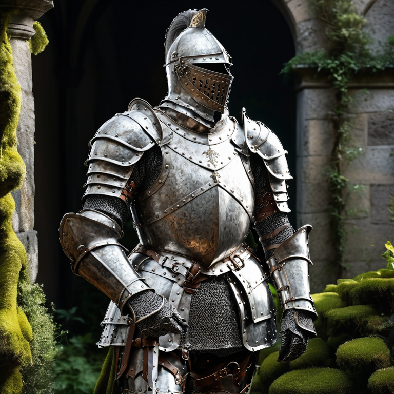<br/><sub><strong>5. Blend Layers</strong> — reintegrated into the original scene</sub></td>
</tr>
</table>

---

## Install

### One-liner — Universal Installer

If you've got Python 3.10+ around, the fastest path:

```bash
python install.py
```

`install.py` in this repo is a thin shim for the [LaboratoireSonore Universal Installer](https://github.com/laboratoiresonore/laboratoiresonore/tree/main/installer). It fetches the latest installer, picks Spellcaster's installer asset for your platform, runs it. Same `spellcaster-installer` you'd download from the buttons below — just one fewer click.

Don't have Python? Skip to "Get the installer" below for the platform-specific downloads.

### What you need

| You need | What it is | Where to get it |
|---|---|---|
| **ComfyUI** | The AI engine (runs in background, you never open it) | [github.com/comfyanonymous/ComfyUI](https://github.com/comfyanonymous/ComfyUI) |
| **GIMP 3** | Free image editor (the free Photoshop) | [gimp.org](https://www.gimp.org/downloads/) |
| **A GPU with 4+ GB VRAM** | Runs the AI models | You probably have one |

> **No GPU on this machine?** That's fine — if you have a gaming PC in another room, you can run ComfyUI there and Spellcaster on your laptop. Use the **Remote Installer** further down.

### Get the installer

This is the one you want **99% of the time**. Double-click and click Next a few times. It looks at your computer, downloads what's missing, sets up GIMP, and makes desktop shortcuts. About 370 MB — includes the wizard's own artwork (drawn locally by Spellcaster's own engine).

<p align="center">
  <a href="https://github.com/laboratoiresonore/spellcaster/releases/latest/download/spellcaster-installer.exe"></a>
  &nbsp;
  <a href="https://github.com/laboratoiresonore/spellcaster/releases/latest/download/spellcaster-installer-macos.zip"></a>
  &nbsp;
  <a href="https://github.com/laboratoiresonore/spellcaster/releases/latest/download/spellcaster-installer"></a>
</p>

**How to use it:**

1. **Download it.** Double-click. Wait. (First time, it asks Windows for permission — click Yes.)
2. **Click through the wizard.** It auto-fills almost everything; you mostly just click *Next*. If something looks unfamiliar, leave it as the default — we picked smart defaults.
3. **Open GIMP.** Go to the **Filters** menu → **Spellcaster**. Every AI tool is there. Pick one, click Generate, get a result.

That's the whole thing. If anything goes wrong, the installer tells you in plain English what went wrong and what to do.

> **Self-updating**. Every Spellcaster installer below downloads the latest version from GitHub on every launch — you don't need to re-download new releases just to get bug fixes. Want to use the version baked into the .exe instead (e.g. you're offline)? Add `--no-update` when launching.

> **Comfortable with the command line?** From source: `git clone https://github.com/laboratoiresonore/spellcaster && cd spellcaster && python installer/install.py`. Skip this line if you don't know what `git` is.

---

### Other downloads (most people don't need these)

The main installer above does almost everything. These three smaller tools are for special situations:

<p align="center">
  <a href="https://github.com/laboratoiresonore/spellcaster/releases/latest/download/spellcaster-remote-installer.exe"></a>
  &nbsp;
  <a href="https://github.com/laboratoiresonore/spellcaster/releases/latest/download/spellcaster-validate-install.exe"></a>
  &nbsp;
  <a href="https://github.com/laboratoiresonore/spellcaster/releases/latest/download/spellcaster-manual-update.exe"></a>
</p>

#### 🌐 Remote Installer — *for when ComfyUI lives on a different computer*

Some people have a powerful PC with a beefy graphics card sitting in a closet, and use a quiet laptop on the couch. The Remote Installer is for that. It puts the GIMP plugin and chat UI on **your laptop**, but tells them "the actual AI brain is over there on the gaming PC". It also tries to find your gaming PC automatically.

**Use it when**: your ComfyUI is on a different computer on the same Wi-Fi/network as the one you're installing on. **Skip it if** ComfyUI is on the same machine you're installing onto — use the regular installer instead.

#### 🩺 Health Checker — *"is everything actually working?"*

After installing, this tool runs a quick test on every feature you installed. It picks each one ("background remove", "face swap", "upscale"…), tries it for real on tiny test images, and tells you which ones work and which ones don't (and why). Takes about 1–5 minutes.

**Use it when**: you ran the installer and want to make sure everything actually works before opening GIMP. Or weeks later, when you've added new models to ComfyUI and want to confirm Spellcaster sees them. Or any time something feels broken.

#### 🔧 Repair Tool — *"the plugin disappeared from GIMP!"*

Sometimes things break. GIMP doesn't show the Spellcaster menu anymore. Or a file got deleted. Or you tried to update and it half-worked. This tool re-downloads the GIMP plugin from GitHub and reinstalls it, without making you re-download every model again.

**Use it when**: Spellcaster used to work, then stopped, and you don't want to re-run the big installer. Try this first.

---

### 💡 Already installed Spellcaster, then added new models to ComfyUI?

You don't need to re-run the installer. **Open GIMP** → **Filters → Spellcaster → 🜍 Crypt → ↻ Refresh Models from Server**. It re-checks your ComfyUI server and updates the model lists everywhere in about 2 seconds. New LoRAs, new checkpoints, new ControlNet files — all pulled in. The dropdowns in every Spellcaster dialog will show the new options the next time you open them.

---

## Three ways to use it

<table>
<tr>
<td width="33%" align="center" valign="top">
  
  
  
  <br/><br/>
  <strong>🖌️ GIMP plugin</strong><br/>
  <sub>The menu. 69 tools across <code>Filters > Spellcaster</code>. Select layers, paint masks, click a tool. Keyboard shortcuts (<code>Ctrl+Alt+E/U/F/B/X</code>) for the quick ones. Every output lands as a new layer. Non-destructive, reversible, composable.</sub>
</td>
<td width="33%" align="center" valign="top">
  
  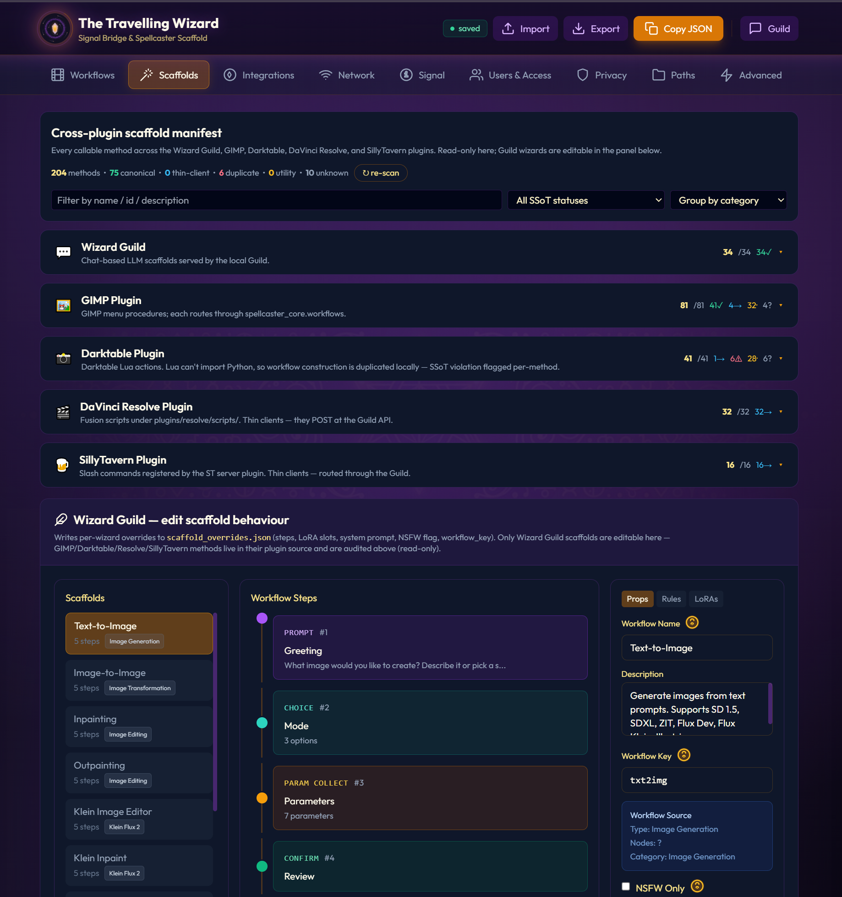
  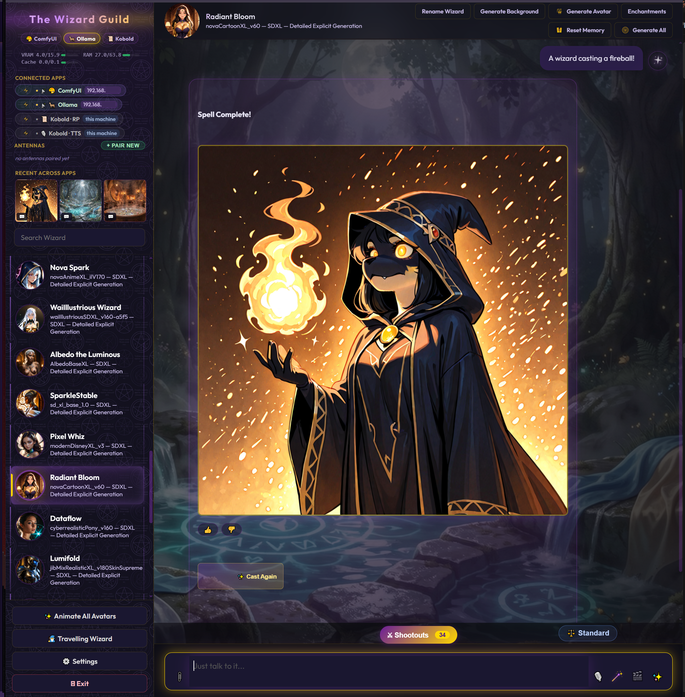
  
  <br/><br/>
  <strong>🧙 Wizard Guild</strong><br/>
  <sub>The chat UI. AI wizard characters walk you through every tool conversationally. "Restore this photo." "Make the sky orange." "Turn this into a video." No menus, no modes. <a href="DEEP_DIVE.md#the-wizard-guild-chat-interface">How it works →</a></sub>
</td>
<td width="33%" align="center" valign="top">
  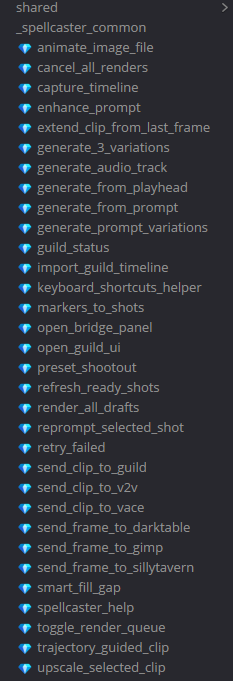
  <br/><br/>
  <strong>🎬 DaVinci Resolve plugin</strong><br/>
  <sub>The timeline. Drop the playhead, type a prompt, get an LTX-2 clip back in the Media Pool. Gap-fill between clips with reference-aware rendering. Markers map to render profiles. <a href="DEEP_DIVE.md#-resolve-bridge--timeline-aware-shot-generation">How it works →</a></sub>
</td>
</tr>
</table>

All three talk to the same ComfyUI backend. Every generated asset is visible from every interface. [The mechanics →](DEEP_DIVE.md#-cross-interface-backbone--every-surface-is-the-same-surface)

---

<details>
<summary><strong>💎 SillyTavern integration</strong></summary>

<p align="center">
  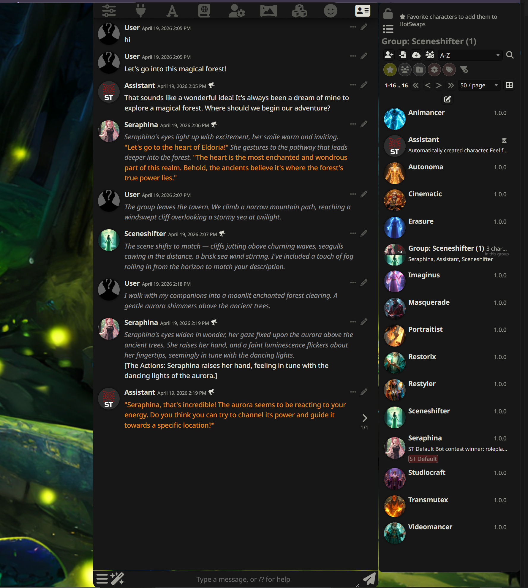
</p>

Spellcaster's [SillyTavern plugin](plugins/sillytavern/) turns the roleplay surface into a fourth interface. Slash commands (`/scene`, `/portrait`, `/animate`) render Klein-2 stills and LTX-2 clips in-chat. A round-trip-safe **Character Card Editor** in GIMP lets you paint card art, edit the V2 metadata with LLM-scaffolded best-practice auto-optimization, and save spec-compliant `chara` PNGs without damaging the embedded data. [SillyTavern upstream →](https://github.com/SillyTavern/SillyTavern) · [How it works →](DEEP_DIVE.md#-cross-interface-backbone--every-surface-is-the-same-surface)

</details>

<details>
<summary><strong>⚗️ Experimental plugins</strong> — Photoshop, Krita, Blender, OBS Studio</summary>

Four additional plugins live in the repo but are **not yet tested by the maintainer**. They share the same `plugin_base.SpellcasterPlugin` as the main four and route through the Wizard Guild, so presence, telemetry, and cross-interface asset sharing work out of the box. Expect rough edges — **please file issues / PRs** if you run them.

| Plugin | Location | Status |
|---|---|---|
| 🎨 **Photoshop (UXP panel)** | [`plugins/photoshop/`](plugins/photoshop/) | Smart Generate, img2img, Detail Hallucinate, Colorize B&W, Magic Eraser, AI Upscale, Remove Background, plus a ✨ **Presets** picker (product / portrait / social / background / detail / colorize) — all routed through the Guild's `/api/run_builder`. Selection-aware inpaint still requires the UXP `batchPlay` selection→bitmap dance and isn't wired yet. |
| 🎨 **Krita** | [`plugins/krita/`](plugins/krita/) | Full menu: txt2img, img2img, inpaint (uses the Krita selection as the mask), outpaint, IC-Light relight, 3D normal map, upscale, rembg, face restore, face swap from file, Detail Hallucinate, Colorize B&W, Magic Eraser, Style Transfer from file, LTX text-to-video, LTX image-to-video, WAN 2.2 image-to-video, plus a **Presets…** picker (anime, cinematic photo, concept art, textures, watercolour, oil-paint style, colorize, eraser, detail). Python-based; installs via pykrita. |
| 🧊 **Blender** | [`plugins/blender/`](plugins/blender/) | Sidebar panel in the 3D view with a **Run Preset** button at the top (PBR stone / wood / metal, sci-fi environment, fantasy landscape, HDRI skybox, character sheet, normal map, detail 4×). Operators: txt2img, img2img, outpaint, IC-Light, normal-map, Detail Hallucinate, Colorize, Magic Eraser, upscale, rembg, LTX T2V, LTX I2V, WAN I2V. Results land as Blender images (drop-in for material slots). |
| 📺 **OBS Studio** | [`plugins/obs/`](plugins/obs/) | Tools → Scripts → add `spellcaster_obs.py`. Text-first ops: generate scene backgrounds (Image source), transparent overlays (rembg on gen), short intro/BRB clips (LTX 2.3 text-to-video → Media source), Smart Generate (arch auto-pick), plus a **Presets** dropdown (cyberpunk / fantasy tavern / lo-fi / BRB / starting-soon / cyberpunk-flythrough / fantasy-reveal / abstract-particles) with a **Run Selected Preset** button. Canvas-input ops (img2img / inpaint / upscale-this-scene) intentionally skipped — OBS's Python API doesn't expose the preview pixel buffer cleanly. |

All four feed the same SpeedCoach telemetry pipeline as the GIMP / Darktable / Resolve / SillyTavern plugins — dispatch rows land in `dispatch_log.jsonl` alongside every other frontend — so if you run them, you're helping tune the suggestion model for everyone.

</details>

---

## For people who can't computer

If you can order food on your phone, you can use this. If you once successfully connected a printer on the first try, you're overqualified.

- **Installation?** Automated. The installer sniffs your GPU, figures out what AI models your hardware can run, downloads them, installs everything, creates shortcuts. You click "Next" a few times.
- **Settings?** Automated. Every tool has expert-tuned presets. Or run the **Calibration Wizard** — it shows you real images and asks "A or B?" Like an eye exam. [Details →](DEEP_DIVE.md#calibration-wizard)
- **Prompts?** Automated. Type "a cat" — a local AI rewrites it into the flavour your model was trained on. SDXL wants tags. Flux wants paragraphs. Klein wants bullets. It does this for you. [Details →](DEEP_DIVE.md#-prompt-enhancement--per-architecture-per-method-per-model)
- **Model selection?** Automated. The plugin detects what models are installed and picks the best one.
- **VRAM management?** Automated. Video resolution auto-scales to fit your GPU. The LLM politely unloads itself during image generation. TeaCache acceleration silently injected.
- **Remote ComfyUI?** Automated. Use **`spellcaster-remote-installer.exe`** — auto-discovers servers on your LAN, installs only the local plugins + Wizard Guild pointing at the remote.
- **Updates?** Automated. The plugin checks GitHub on launch and silently patches itself.
- **Recovery?** Automated. If an update corrupts the plugin, a 3-tier recovery system restores from backup, re-downloads from GitHub, or shows a visible error. GIMP never bricks.

**Open GIMP. Go to the Spellcaster menu. Pick a tool. Click Generate. That's it.**

Too intimidated by GIMP? The [Wizard Guild](DEEP_DIVE.md#the-wizard-guild-chat-interface) is a chat interface where you just tell an AI wizard what you want. In English.

---

## FAQ

<details>
<summary><strong>What GPU do I need?</strong></summary>

Any NVIDIA GPU with 4+ GB VRAM. AMD works too (ROCm/DirectML). The installer looks at your GPU and says "here's what you can run" — no guesswork. 4GB gets you the basics. 8GB is the sweet spot. 16GB unlocks the good stuff. 24GB and you're basically a wizard yourself.

</details>

<details>
<summary><strong>Do I need to understand ComfyUI?</strong></summary>

No. God no. That's the whole point. Every tool has expert-tuned presets. You never need to open ComfyUI, pick a sampler, write a negative prompt, or learn what "Euler ancestral CFG++ with Karras scheduling at 0.85 denoise" means. That sentence just gave you a headache. See? We saved you from that.

If you *want* to go deeper — every parameter is exposed, you can save custom presets, import raw ComfyUI workflows, and inject LoRAs. The power is there when you're ready for it.

</details>

<details>
<summary><strong>Does anything leave my computer?</strong></summary>

No. Nothing. Nada. Zero bytes. Your GPU does all the work, your images stay on your hard drive. The only network traffic is between GIMP and your own ComfyUI server, which can literally be `localhost`.

</details>

<details>
<summary><strong>Can I use my own ComfyUI workflows?</strong></summary>

Yes. `Filters > Spellcaster Tools > Workflow Library` runs any workflow JSON from GIMP.

</details>

<details>
<summary><strong>ComfyUI on another machine?</strong></summary>

Yes. The **`spellcaster-remote-installer.exe`** auto-discovers ComfyUI servers on your network (`--scan`), or pass the URL directly. Gaming PC in the closet, laptop on the couch — we have enabled laziness at an architectural level and we're proud of it. For multi-app coordination across multiple machines (Resolve on box A, GIMP on box B, SillyTavern on box C), see the optional [**Antenna service-mesh**](antenna/README.md) — most users never need it.

</details>

<details>
<summary><strong>Can I have more than one LLM running at once?</strong></summary>

Yes. ComfyUI's embedded LLM, Ollama, and a dedicated RP Kobold can all stay online together — SillyTavern keeps chatting with Kobold, the Guild uses ComfyUI for image prompts, Ollama handles install scaffolding. The pill picker decides who answers first; nobody gets stopped. [Details →](DEEP_DIVE.md#-llm-primary-picker--comfyui-reroute-ollama--kobold-auto-start)

</details>

<details>
<summary><strong>How does the LoRA Shootout work?</strong></summary>

Purpose-aware multi-sample renders. The LoRA registry is grouped into 20+ purpose buckets (`skin_detail`, `style_photoreal`, …), each with a subject-specific prompt (portrait / fullbody / macro / animal). You approve **many** LoRAs — not one winner — with keywords that the Guild auto-proposes when the keyword appears in a chat prompt. Auto-fallback tries up to 3 checkpoints of the same arch on failure. [Scaffold details →](DEEP_DIVE.md#-scaffold-system--state-machine-wizards-for-7b-models)

</details>

<details>
<summary><strong>Can I talk to the Guild instead of typing?</strong></summary>

Yes. Register a KoboldCpp in TTS/STT mode, then press-and-hold the 🎙️ button. Walkie-talkie — release to transcribe. [Voice details →](DEEP_DIVE.md#-voice--walkie-talkie-stt--tts-playback)

</details>

<details>
<summary><strong>Why "Spellcaster"?</strong></summary>

Because every tool is a spell, every workflow is an incantation, your GPU is a familiar, and the entire project radiates the energy of someone who played too much D&D and then learned Python. Also "ComfyUI-GIMP-Middleware-With-69-Tools-And-A-Chat-UI-Full-Of-Wizards" didn't fit in the GitHub repo name.

</details>

---

## Dig deeper

- [**Full technical reference →** `DEEP_DIVE.md`](DEEP_DIVE.md) — every tool enumerated, the 27-architecture registry, scaffold state machines, antenna service-mesh endpoints (optional, for advanced multi-machine setups), cross-interface backbone, prompt enhancement chain, privacy + boot safety details, every subsystem explained.
- [**ComfyUI dependencies** → `DEPENDENCIES.md`](DEPENDENCIES.md) — 24+ custom node packs Spellcaster uses, linked to upstream.

---

## How updates flow (the SSOT topology)

Spellcaster ships as a single canonical Python package — `spellcaster_core/` — that lives in five places at once. End-user installs auto-pull from the upstream surface; dev edits land at the canonical path and propagate outward.

**Canonical (the source of truth):**

> `spellcaster/comfyui-spellcaster/spellcaster_core/<file>`

Every dev edit starts there. Tests run there. CI gates fire there. Once green, the change propagates to:

| # | Mirror | Path | Consumer |
|---|--------|------|----------|
| 1 | GIMP plugin (vendored core) | `spellcaster/plugins/gimp/comfyui-connector/spellcaster_core/<file>` | The GIMP add-on |
| 2 | Public ComfyUI pack | `../ComfyUI-Spellcaster/spellcaster_core/<file>` | Standalone-pack users |
| 3 | Installed user copy | `%APPDATA%/.../ComfyUI/custom_nodes/comfyui-spellcaster/spellcaster_core/<file>` | Local end-users (auto-pulled by `auto_updater.py`) |

**What guarantees the mirrors stay in sync:**

- A pre-commit hook + CI hash-compare every mirror against the canonical copy and fail the build on any drift.
- **`scripts/check_arch_manifest_drift.py`** cross-checks `architectures.py:supported_methods` against `installer/manifest.json:features`. Documented exceptions live in `SUBSUMED_BY_PARENT` / `ADVANCED_NO_INSTALLER` maps inside the script.
- **`auto_updater.py`** is the client-side updater every end-user runs at first launch — it reads the manifest, downloads the latest pack, and drops it into surface 3.

**End-user perspective (zero work):** install once, then any time you launch GIMP / Darktable / DaVinci, Spellcaster checks for a new pack and silently swaps in the latest `spellcaster_core/`. No reboot. No reinstall.

**Dev perspective (one source of truth):** edit canonical → run tests → commit. CI handles the rest. Drift detection is automated; if you accidentally edit a mirror by hand, the next commit's drift check will fail the build with a list of files that diverged.

**Daily auto-research:** a scheduled cloud agent reviews recent SOTA developments (new model releases, custom_node updates, acceleration LoRAs, attention kernels, emerging architectures) every morning and produces a markdown report. Findings get triaged into the upgrade plan.

---

## Love it? Share it.

Spellcaster is 100% free, 100% open-source, and 0% funded. If it saves you a day of clicking, the best way to pay it forward is to **tell someone**:

- 🌟 **Star the repo** so more GIMP / Darktable / Resolve users find it
- 📣 **Post a screenshot** of your first 5-click result with `#Spellcaster` on your favourite network
- 🧙 **Show a friend** who spends too long on ComfyUI noodle graphs — 30 seconds to install, they'll thank you
- 🐛 **Open an issue** if it broke, a PR if you fixed it, or a [discussion](https://github.com/laboratoiresonore/spellcaster/discussions) if you just want to show off what you made
- ☕ **Tip the lab** on [Patreon](https://patreon.com/LeLaboratoireSonore) if Spellcaster earned you an afternoon of sanity — it funds the next GPU and the next 5 a.m. debugging session

Word of mouth is the entire marketing budget. Make us famous.

<p align="center">
  <a href="https://patreon.com/LeLaboratoireSonore">
    
  </a>
</p>

---

<details>
<summary><strong>Credits & acknowledgements</strong></summary>

*Proudly vibe-coded as a pure pineapple-pen innovation.* 🍍🖊️

Spellcaster doesn't reinvent the wheel — it duct-tapes together the best wheels the open-source AI community has ever built, then hides the duct tape behind a nice menu:

**Core engine:** [ComfyUI](https://github.com/comfyanonymous/ComfyUI) by comfyanonymous — the node-based powerhouse that actually does everything

**Models & architectures:** [Stability AI](https://stability.ai/) (SD 1.5, SDXL, SD3), [Black Forest Labs](https://blackforestlabs.ai/) (Flux), [Flux 2 Klein](https://civitai.com/), [Wan 2.2](https://github.com/Wan-Video/Wan2.2), [LTX Video](https://ltx.io/), [SeedVR2](https://seedvr2.net/)

**Workflow pipelines:** [Elusarca's Klein 6-in-1](https://civitai.com/models/2543188) (Klein refiner, auto-inpaint, color match — used with permission), [xb1n0ry's Comfy-Workflows](https://github.com/xb1n0ry/Comfy-Workflows) (Wan 2.2 NAG + SLG, Klein 4-image-grid, Wan 2.2 block-swap low-VRAM, Qwen Image Edit 2509)

**Face & identity:** [ReActor](https://github.com/Gourieff/comfyui-reactor-node), [IPAdapter](https://github.com/cubiq/ComfyUI_IPAdapter_plus), [PuLID](https://github.com/cubiq/PuLID_ComfyUI), [ACE++](https://github.com/ali-vilab/ACE_plus), [InsightFace](https://github.com/deepinsight/insightface), [CodeFormer](https://github.com/sczhou/CodeFormer), [GFPGAN](https://github.com/TencentARC/GFPGAN), [GPEN](https://github.com/yangxy/GPEN)

**Enhancement:** [Real-ESRGAN](https://github.com/xinntao/Real-ESRGAN), [SUPIR](https://github.com/Fanghua-Yu/SUPIR), [IC-Light](https://github.com/lllyasviel/IC-Light), [DDColor](https://github.com/piddnad/DDColor), [LaMa](https://github.com/advimman/lama), [NormalCrafter](https://github.com/AIWarper/ComfyUI-NormalCrafterWrapper)

**Segmentation:** [SAM 2/3](https://github.com/facebookresearch/sam2) (Meta), [BiRefNet/RMBG](https://github.com/1038lab/ComfyUI-RMBG), [DepthAnything V3](https://depth-anything-3.github.io/), [Florence 2](https://huggingface.co/microsoft/Florence-2-base)

**ControlNet:** [ControlNet](https://github.com/lllyasviel/ControlNet) by lllyasviel, [comfyui-controlnet-aux](https://github.com/Fannovel16/comfyui_controlnet_aux)

**Video:** [RIFE](https://github.com/hzwer/ECCV2022-RIFE), [GIMM-VFI](https://github.com/GSeanCDAT/GIMM-VFI), [VHS](https://github.com/Kosinkadink/ComfyUI-VideoHelperSuite), [AnimateDiff](https://github.com/guoyww/AnimateDiff)

**Acceleration:** [TeaCache](https://github.com/welltop-cn/ComfyUI-TeaCache), [WaveSpeed/FBCache](https://github.com/chengzeyi/Comfy-WaveSpeed), [LightX2V](https://github.com/ModelTC/LightX2V)

**LLM:** [Qwen3](https://huggingface.co/Qwen) (Alibaba), [ComfyUI-QwenVL-Mod](https://github.com/1038lab/ComfyUI-QwenVL)

**Klein Enhancer:** [Flux2Klein-Enhancer](https://github.com/capitan01R/ComfyUI-Flux2Klein-Enhancer) — RefLatentController, TextRefBalance, ColorAnchor

**Node packs:** [Impact Pack](https://github.com/ltdrdata/ComfyUI-Impact-Pack), [ComfyUI-essentials](https://github.com/cubiq/ComfyUI_essentials), [ComfyUI-GGUF](https://github.com/city96/ComfyUI-GGUF), [KJNodes](https://github.com/kijai/ComfyUI-KJNodes), and dozens more — full list in [DEPENDENCIES.md](DEPENDENCIES.md)

**Host apps:** [GIMP 3](https://www.gimp.org/), [Darktable](https://www.darktable.org/), [SillyTavern](https://github.com/SillyTavern/SillyTavern)

**Vibe coding assistant:** [Claude](https://claude.ai/) by Anthropic — wrote most of this while being yelled at

</details>

---

## Part of the Laboratoire Sonore ecosystem

[Le Laboratoire Sonore](https://github.com/laboratoiresonore) maintains three public projects:

- 🪄 [**Spellcaster**](https://github.com/laboratoiresonore/spellcaster) — this repo. AI image generation hidden behind one menu (GIMP / Darktable / DaVinci Resolve / chat UI).
- 🔧 [**ComfyUI-Spellcaster**](https://github.com/laboratoiresonore/ComfyUI-Spellcaster) — the four architecture-aware nodes that drive Spellcaster, installable on their own for ComfyUI users who don't want the full menu integration.
- 🎚️ [**BeatWeaver**](https://github.com/laboratoiresonore/beatweaver) — DJ overlay tool for non-musicians. Detects BPM + key in real time, lets you layer 32 hand-tuned synth presets in the right key on top of any track. Ships with a bundled offline-neural voice companion (Piper TTS) for hands-free cue announcements — no LLM server needed.

All fully local. Open-source when we can, always local. Talk to us on [r/Spellcaster_Studio](https://www.reddit.com/r/Spellcaster_Studio/).

---

<p align="center">
  <sub>
    Made with unhealthy amounts of coffee, mass delusion, and a GPU that sounds like a jet engine.<br/>
    If you've read this far, you're either installing it or writing a hate comment. Either way, we appreciate the engagement.<br/><br/>
    <strong>Love it? Share it.</strong> Star the repo. Fork it if you hate it. Either way, pass it on.
  </sub>
</p>
