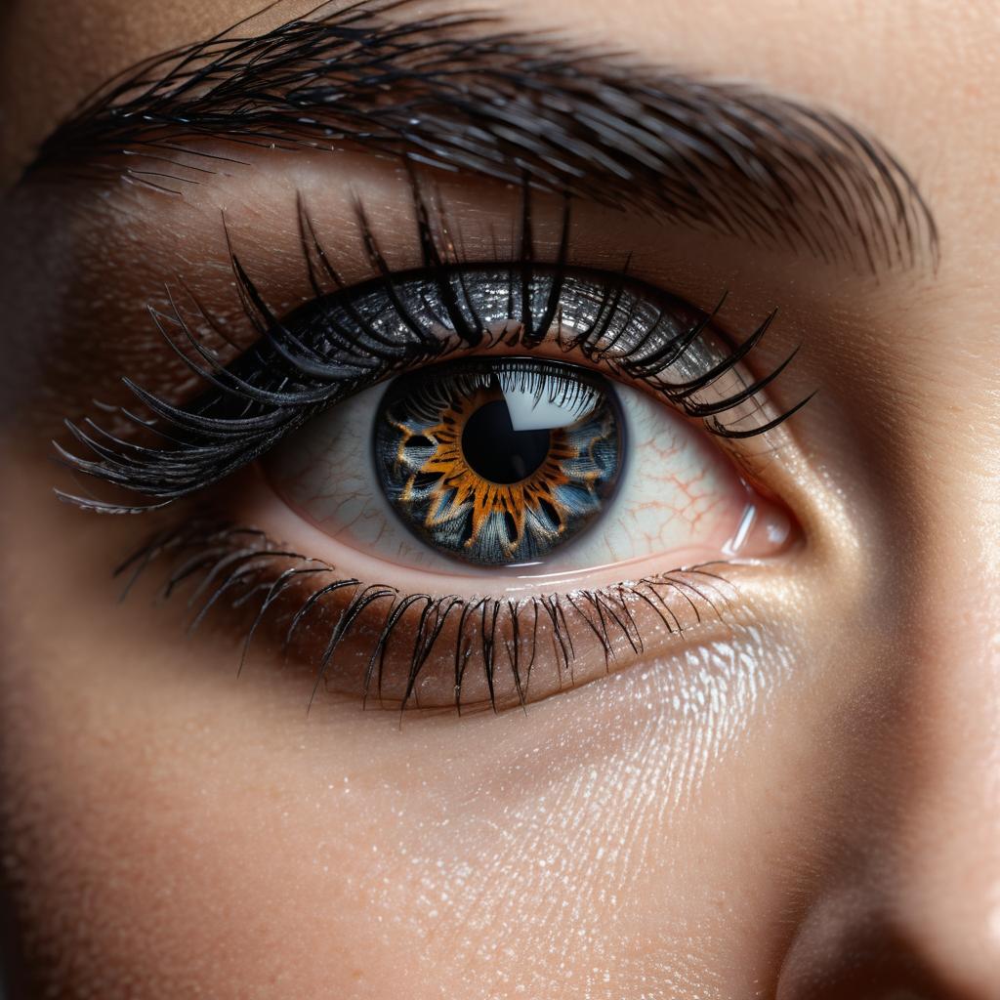
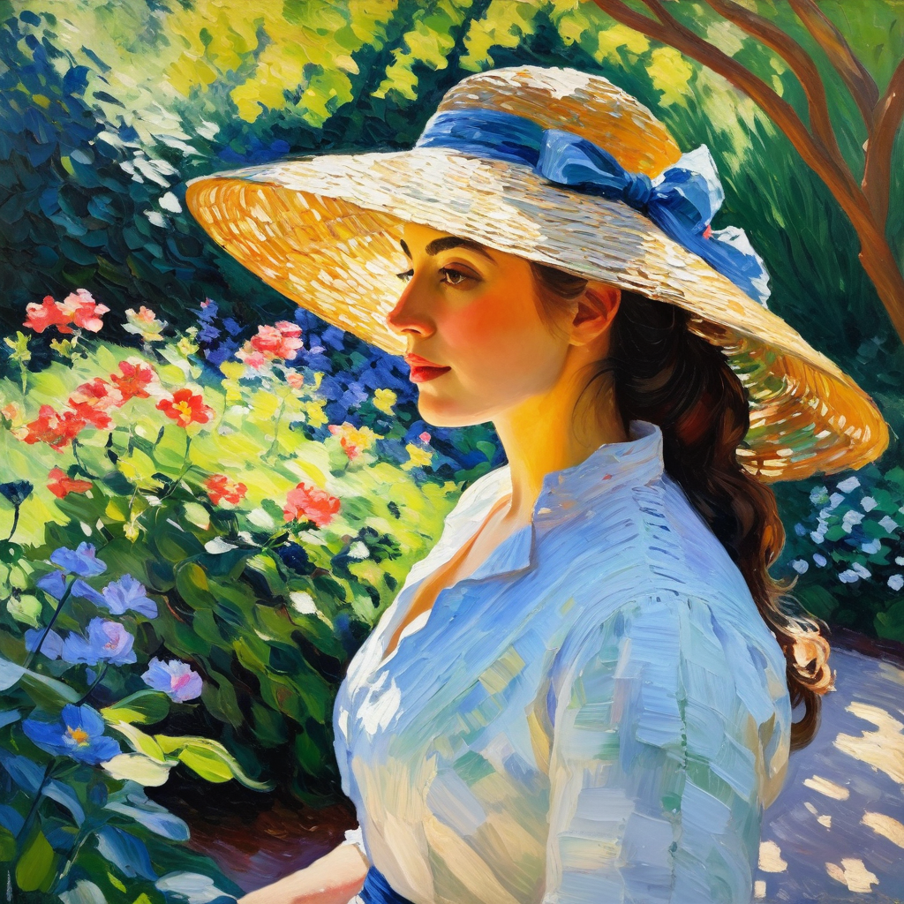
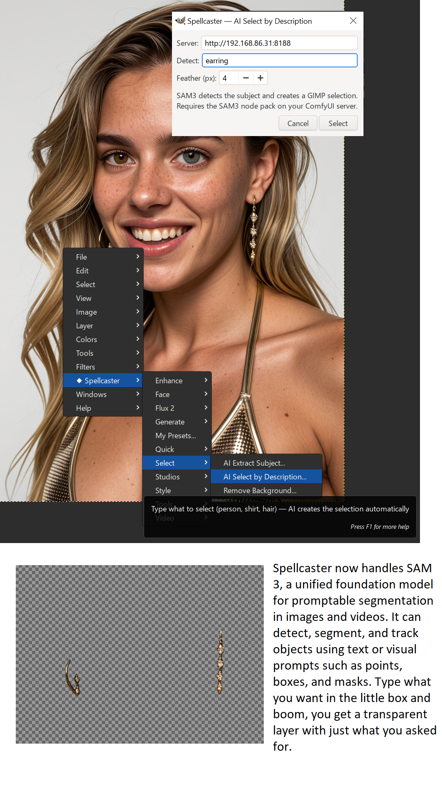
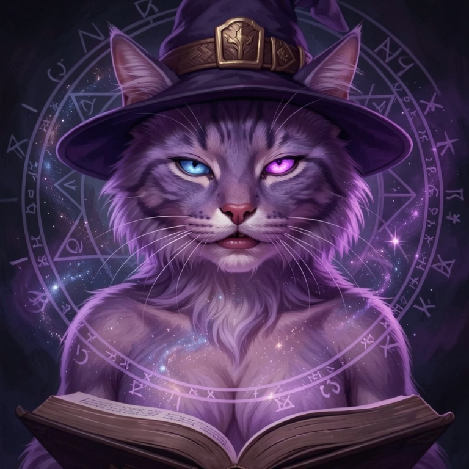
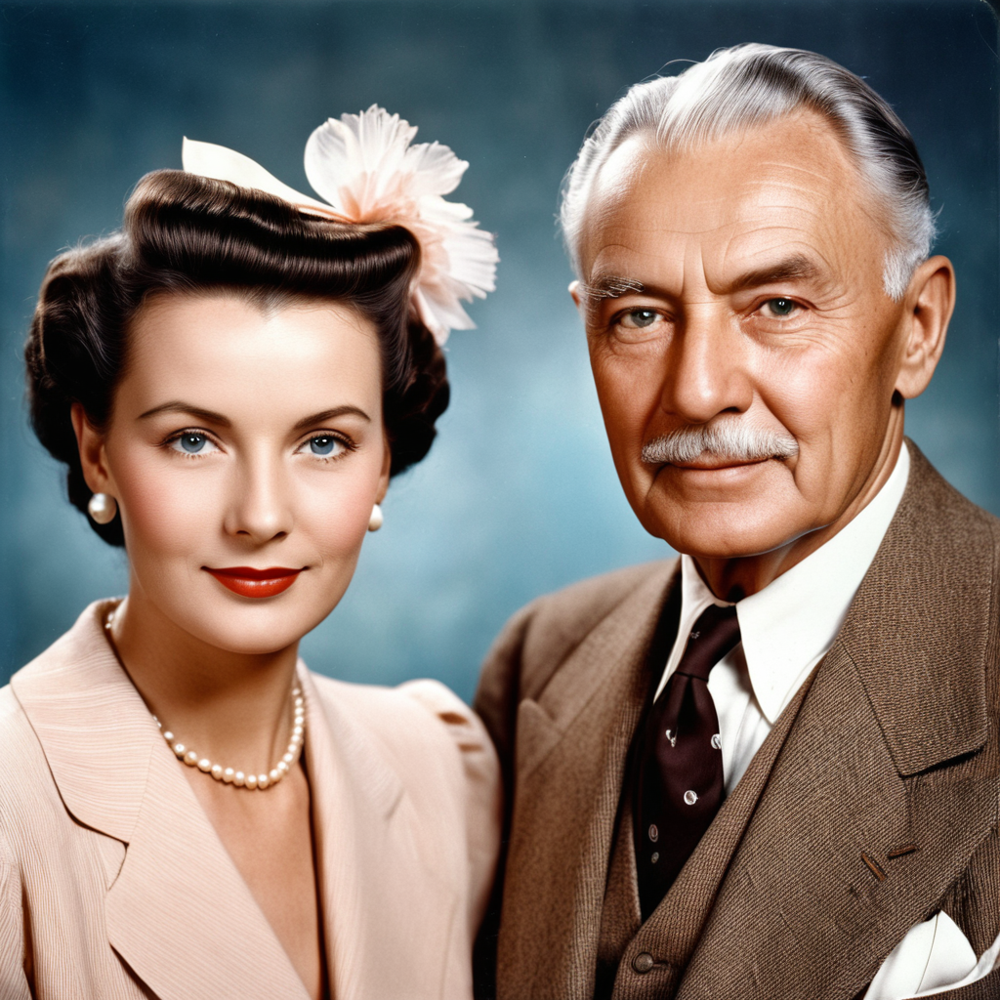

  

<h1 align="center">Spellcaster</h1>

  <strong>Dynamic middleware between ComfyUI and everything else, hellbent on removing every bit of difficulty out of AI image generation.</strong> 
  <em>69 AI tools (nice) &bull; GIMP &bull; Darktable &bull; Chat UI &bull; 100% Local &bull; Zero Config</em>

  
  &nbsp;
  
  &nbsp;
  

  <a href="#the-problem">The Problem</a> &bull;
  <a href="#the-solution">The Solution</a> &bull;
  <a href="#see-it-in-action">See It</a> &bull;
  <a href="#install">Install</a> &bull;
  <a href="#all-69-tools">All Tools</a> &bull;
  <a href="#faq">FAQ</a> &bull;
  <a href="https://www.reddit.com/r/Spellcaster_Studio/">Reddit</a>

<em>"Everyone with even a minor self respect would hate on this."</em> — u/chris020891, r/GIMP

---

## The Problem

Experimenting with AI image generation locally is a huge pain in the ass, even for people who are good with computers.

[ComfyUI](https://github.com/comfyanonymous/ComfyUI) is a phenomenal tool — it can do anything — but it takes weeks to wrap your mind around nodes, workflows, model architectures, samplers, schedulers, LoRAs, VAEs, ControlNets, and the dozens of custom node packs you need for each task. You end up spending more time wiring nodes than creating images.

Meanwhile, GIMP is already an ultra-capable image editor with an intuitive interface, a canvas, layers, masks, selections, and transparency. It's the free Photoshop. But it has zero AI capabilities.

<em>"No, I use GIMP because I don't want to make AI slop."</em> — u/Ill_Morning_4282, r/GIMP (130 upvotes)

Cool. This is for everyone else.

## The Solution

**Spellcaster is dynamic middleware that sits between ComfyUI and any interface you want to use.** It absorbs all the complexity — models, nodes, samplers, schedulers, LoRAs, VAEs, ControlNets — and exposes it as simple menu items and one-click tools. Its entire purpose is to make ComfyUI's power accessible to people who have no interest in learning ComfyUI.

- **GIMP / Darktable** — 69 AI tools appear in your menus. Generate, edit, upscale, swap faces, remove backgrounds, create videos — all from the same editor you already know.
- **The Wizard Guild** — a standalone chat UI where AI wizard characters walk you through every tool conversationally. No GIMP needed.
- **SillyTavern** — 13 character cards that generate live visuals during roleplay.

You never touch ComfyUI. Spellcaster talks to it behind the scenes. Think of it like an engine under the hood — you just press the gas. With your eyes closed. Going 140 in a school zone. Spellcaster is the responsible adult in this relationship.

Every tool starts with expert-tuned presets that just work. But as you get comfortable, you can fine-tune every parameter, save your own presets, build custom workflows, and inject LoRAs — the training wheels come off whenever you're ready.

<table>
<tr>
<td width="25%"> 1. Select what to fix</td>
<td width="25%"> 2. Pick a preset</td>
<td width="25%"> 3. Click Generate</td>
<td width="25%"> 4. Result on a new layer</td>
</tr>
</table>

---

## 69 Finely Tuned AI Tools, Each One Click Away

<table>
<tr>
<td align="center" width="25%"> <strong>SeedV2R Upscale</strong> — AI hallucinated detail</td>
<td align="center" width="25%"> <strong>AI Eraser</strong> — select & delete</td>
<td align="center" width="25%"> <strong>Remove Background</strong> — one click</td>
<td align="center" width="25%"> <strong>Colorize</strong> — B&W to color (instant)</td>
</tr>
<tr>
<td align="center" width="25%"> <strong>Relight</strong> — change lighting direction</td>
<td align="center" width="25%"> <strong>Style Transfer</strong> — copy any style</td>
<td align="center" width="25%"> <strong>AI Select</strong> — type what to select</td>
<td align="center" width="25%"> <strong>Video Generation</strong> — Wan 2.2 I2V</td>
</tr>
<tr>
<td align="center" width="25%"> <strong>Inpaint</strong> — replace any selected area</td>
<td align="center" width="25%"> <strong>AI Restoration</strong> — fix old photos</td>
<td align="center" width="25%"> <strong>Detail Hallucination</strong> — add texture</td>
<td align="center" width="25%"> <strong>Face Swap</strong> — paste any face</td>
</tr>
</table>

---

## For People Who Can't Computer

Listen. If you can order food on your phone, you can use this. If you once successfully connected a printer on the first try, you're overqualified. The entire thing is automated to a degree that borders on suspicious:

- **Installation?** Automated. The installer sniffs your GPU like a sommelier sniffs wine, figures out what AI models your hardware can swallow, downloads them, installs everything, creates shortcuts, and tucks you into bed. You click "Next" a few times. That's your contribution.
- **Settings?** Automated. Every tool has expert-tuned presets crafted by someone who spent way too long tweaking denoise values at 3 AM so you don't have to. You never configure a sampler, pick a scheduler, set a CFG scale, or write a negative prompt. You don't even know what those words mean. *Good.* Keep it that way.
- **Prompts?** Automated. Type "a cat" and a local AI rewrites it into a paragraph of optimized gibberish that the image model actually understands. It knows that SDXL wants tags, Flux wants poetry, and Klein wants bullet points. You just type "a cat."
- **Model selection?** Automated. The plugin detects what models are installed and picks the best one. You didn't even know you had models. You thought you just had a computer.
- **VRAM management?** Automated. Video resolution auto-scales to fit your GPU. The LLM politely unloads itself during image generation. TeaCache acceleration is silently injected into every workflow. If you don't know what any of that means — congratulations, that's the point.
- **Updates?** Automated. The plugin checks GitHub on launch and silently patches itself. You will never be asked to "pull the latest commit." You don't know what a commit is and we respect that.
- **Recovery?** Automated. If an update corrupts the plugin, a 3-tier recovery system restores from backup, re-downloads from GitHub, or shows a visible error. GIMP never bricks. Your relationship with technology remains intact.

**You open GIMP. You go to the Spellcaster menu. You pick a tool. You click Generate. That's it. The AI does the rest. You take the credit.**

Too intimidated by GIMP? The [Wizard Guild](#under-the-hood) is a chat interface where you literally just tell an AI wizard what you want. In English. Like ordering at a restaurant, except the waiter is a magical entity running on your GPU and the food is photorealistic art.

---

## Install

### What You Need

| You need | What it is | Where to get it |
|---|---|---|
| **ComfyUI** | The AI engine (runs in background) | [github.com/comfyanonymous/ComfyUI](https://github.com/comfyanonymous/ComfyUI) |
| **GIMP 3** | Free image editor (like Photoshop) | [gimp.org](https://www.gimp.org/downloads/) |
| **A GPU with 4+ GB VRAM** | Runs the AI models | You probably already have one |

> **Never heard of ComfyUI?** That's fine. You'll never need to open it. Spellcaster talks to it behind the scenes.
>
> **Don't have a GPU?** The installer's **Antenna mode** connects to a ComfyUI server on another computer on your network.

<em>"No one fucking uses GIMP to make AI slop"</em> — u/Capable_Basket1661, r/GIMP (50 upvotes)

Tell that to the 69 tools in the menu, bestie.

### Download & Run

  
  &nbsp;
  
  &nbsp;
  

1. **Download** the installer for your system
2. **Run it.** It walks you through everything — detects your GPU, downloads models, installs plugins
3. **Open GIMP.** Go to `Filters > Spellcaster` — all 69 AI tools are there
4. **Pick any tool and click Generate.** Every preset is already optimized

> **From source:** `git clone https://github.com/laboratoiresonore/spellcaster && cd spellcaster && python installer/install.py`

---

<em>"Ew, AI slop... and you didn't even code it yourself? lmao how ridiculous can you get"</em> — u/FentonTheIIV, r/GIMP

Correct! 22,000 lines of Python, vibe-coded at 3 AM while arguing with an AI that kept setting Klein's CFG to 3.5. We are not ashamed. We <em>are</em> tired.

## All 69 Tools <!-- nice -->

<h3>Generate (7)</h3>

| Tool | What It Does |
|---|---|
| **Text to Image** | Type what you want. 25 scene presets across 6 model families. |
| **Image to Image** | Transform any photo — change styles, add detail, reimagine. |
| **Inpaint Selection** | Paint over any area to regenerate it. 44 expert presets. |
| **Outpaint / Extend** | Extend your image beyond its borders in any direction. |
| **Batch Variations** | Generate 2-8 versions with one click. |
| **Edit by Instruction** | Type "make the sky orange" in plain English. Powered by Kontext. |
| **Generate Anything** | Create a transparent object (sword, hat, dragon) on its own layer. |

<h3>Flux 2 Klein (9)</h3>

| Tool | What It Does |
|---|---|
| **AI Editor** | Best-quality img2img with Flux 2 Klein (4-20 steps). |
| **Editor + Reference** | Edit guided by a reference image for structure/style. |
| **Outpaint** | Highest-quality canvas extension. |
| **Inpaint** | Context-aware selection fill. 29 task presets. |
| **Layer Blender** | AI-powered layer harmonization. |
| **Re-poser** | Change poses and camera angles. 26 poses + 11 cameras. |
| **Headswap** | Hybrid: ReActor swap + Klein refinement. |
| **Detail Enhancer** | Targeted detail: face, eyes, hands, skin, hair, feet, custom. |
| **Generate Object** | Transparent object with scene-matched lighting. |

<h3>Enhance (9)</h3>

| Tool | What It Does |
|---|---|
| **Upscale** | 9 models: WaveSpeed SeedVR2 AI (2K/4K), UltraSharp, RealESRGAN, Remacri, NMKD, Anime. |
| **Photo Restoration** | One-click: upscale + face fix + sharpen. |
| **Detail Hallucination** | Add texture that wasn't there — upscale + low-denoise img2img. |
| **SUPIR AI Restoration** | State-of-the-art repair for damaged/compressed photos. |
| **SeedV2R Upscale** | Controllable hallucination: none/light/high. |
| **Colorize B&W** | 3 engines: DDColor instant (artistic/natural) or ControlNet+diffusion. |
| **Object Removal** | LaMa inpainting — paint over anything, it disappears. |
| **3D Normal Map** | NormalCrafter surface normals for relighting and 3D. |
| **AI Eraser** | Select + `Ctrl+Alt+X` = gone. AI fills the gap. |

<h3>Face (7)</h3>

| Tool | What It Does |
|---|---|
| **Face Swap (ReActor)** | Paste a face from one photo onto another. |
| **Face Swap (Saved Model)** | Swap using a saved face model library. |
| **Face Swap (mtb)** | Alternative engine with multi-face indexing. |
| **Face Identity Transfer** | Generate images that look like a specific person. FaceID. |
| **Face Identity (Flux)** | Flux-native identity via PuLID. |
| **Face Restore** | 7 models: GPEN-2048, CodeFormer, GFPGAN, RestoreFormer++. |
| **Flux 2 Headswap** | ReActor + Klein refinement for seamless blending. |

<h3>Style (4) &bull; Select (3) &bull; Video (7)</h3>

**Style:**

| Tool | What It Does |
|---|---|
| **Style Transfer** | Copy any reference image's visual style via IPAdapter. |
| **Color Grading** | Cinematic LUT application with strength control. |
| **IC-Light Relighting** | Change lighting direction. 10 presets. |
| **AI Color Match** | Transfer color palette from a reference. 3 methods. |

**Select:**

| Tool | What It Does |
|---|---|
| **AI Select (SAM3)** | Type "hair" or "shirt" to select it. |
| **AI Extract Subject** | One-click subject extraction with transparent background. |
| **Remove Background** | 3 engines: rembg, BiRefNet (best hair), BiRefNet Portrait. |

**Video:**

| Tool | What It Does |
|---|---|
| **LTX 2.3 Text to Video** | Generate video from text. VRAM-aware resolution. |
| **LTX 2.3 Image to Video** | Animate any photo. Preserves aspect ratio. |
| **Wan 2.2 Image to Video** | 2-5 second clips. 26 motion presets, dual-pass. |
| **Wan 2.2 First+Last Frame** | Video transition between two images. |
| **Video Upscale** | AI video upscaling with SeedVR2. |
| **Video Face Swap** | ReActor across every video frame + upscale. |
| **SeedVR2 Video Upscale** | Dedicated SeedVR2 video upscaler. |

<h3>Studios (7) &bull; Quick (7) &bull; Tools (8)</h3>

**Studios** — full character production pipeline:

| Tool | Pipeline step |
|---|---|
| **Casting Polaroids** | Create reusable face model from any photo. |
| **Body Double** | Full-body transparent cutout with face swap. |
| **Wardrobe Department** | AI outfit replacement. 40 presets. |
| **Set Design** | Generate background + composite characters. |
| **Director's Chair** (Solo/Duo/Trio) | Animated video with face re-injection. |

**Quick** — zero-dialog, instant (`Ctrl+Alt`):

| Action | Shortcut |
|---|---|
| Enhance | `Ctrl+Alt+E` |
| Inpaint | `Ctrl+Alt+P` |
| Upscale | `Ctrl+Alt+U` |
| Face Restore | `Ctrl+Alt+F` |
| Remove BG | `Ctrl+Alt+B` |
| AI Eraser | `Ctrl+Alt+X` |
| Re-run Last | `Ctrl+Alt+R` |

**Tools** — Layer Blend, Upscaler Blend, GIF Stitcher, Watermark Embed/Read, Upload to Server, Settings, Workflow Library.

---

<em>"No. Go away, sloperator!"</em> — u/chris020891, r/GIMP

We can't leave. We live here now. We have 69 tools and a chat UI full of wizards. This is our home.

---

## Under the Hood

<strong>What makes it fast</strong>

- **TeaCache auto-acceleration** — every image generation is automatically 1.4x faster. Zero config, zero quality loss. The optimizer injects it into all workflows.
- **Architecture-aware everything** — CFG, denoise, prompts, and ControlNet models are auto-configured per architecture (SDXL, Flux, Klein, Illustrious, Pony, SD1.5, WAN, LTX).
- **AI Prompt Enhancement** — a small LLM runs inside ComfyUI, rewrites your simple prompts into architecture-optimized descriptions. SDXL gets tags, Flux gets natural language, Klein gets concise descriptions. Multi-character prompts use BREAK separation with attention weights.
- **VRAM management** — LLM auto-unloads during image generation. LTX resolution auto-scales to fit your GPU. Video frame counts auto-cap on low VRAM.

<strong>The Wizard Guild (chat interface)</strong>

Don't want to learn GIMP? The Wizard Guild is a standalone web UI where AI wizard characters handle everything conversationally.

Each wizard specializes in different tools. A local LLM runs natively inside ComfyUI — no separate server needed. Click action buttons to generate directly, or chat for guidance.

Launch: `start_guild.bat` (Windows) or `python tavern/guild_launcher.py`

<strong>SillyTavern integration — 13 AI wizard characters</strong>

Drop these characters into any SillyTavern group chat. They work silently in the background — generating scene backgrounds, character portraits, and dramatic illustrations as your story unfolds.

<table>
<tr>
<td align="center" width="25%"> <strong>Imaginus</strong> Text-to-image generation. Creates images from descriptions.</td>
<td align="center" width="25%"> <strong>Transmutex</strong> Image transformation. Changes styles, moods, details.</td>
<td align="center" width="25%"> <strong>Masquerade</strong> Face swap & identity. ReActor, FaceID, PuLID, Headswap.</td>
<td align="center" width="25%"> <strong>Restorix</strong> Upscale & restore. SUPIR, SeedV2R, CodeFormer, GPEN.</td>
</tr>
<tr>
<td align="center" width="25%"> <strong>Erasure</strong> Inpaint & remove. LaMa, AI Eraser, background gen.</td>
<td align="center" width="25%"> <strong>Videomancer</strong> Video generation. Wan 2.2 I2V, LTX 2.3 T2V.</td>
<td align="center" width="25%"> <strong>Cinematic</strong> Director's Chair. Multi-step video with face re-injection.</td>
<td align="center" width="25%"> <strong>Studiocraft</strong> Production manager. Full Studios pipeline orchestration.</td>
</tr>
<tr>
<td align="center" width="25%"> <strong>Sceneshifter</strong> Living scenes. Auto-generates backgrounds as story moves.</td>
<td align="center" width="25%"> <strong>Portraitist</strong> Expression portraits. Generates mood-matched character art.</td>
<td align="center" width="25%"> <strong>Autonoma</strong> Autonomous generation. AI decides when scenes need illustration.</td>
<td align="center" width="25%"> <strong>Restyler</strong> Avatar restyle. Transform all avatars to any art style.</td>
</tr>
<tr>
<td align="center" width="25%"> <strong>Animancer</strong> Animation. Brings still images to life as video.</td>
<td align="center" width="25%"></td>
<td align="center" width="25%"></td>
<td align="center" width="25%"></td>
</tr>
</table>

**How to use:** Launch the Wizard Guild — it auto-downloads SillyTavern, installs the plugin, and imports all 13 characters. Add any character to a group chat alongside your RP characters. Sceneshifter and Autonoma work silently without interrupting conversation.

<strong>For developers</strong>

- **8 model architectures**: SD 1.5, SDXL, Pony, ZIT, Flux Dev, Flux Schnell, Flux 2 Klein (4B/9B), LTX, Wan
- **NodeFactory DSL** — every tool is defined declaratively
- **Crash-safe boot shim** — 3-tier recovery. GIMP never bricks.
- **PDB procedures** — every tool callable from Script-Fu or Python-Fu
- **Workflow Library** — import any ComfyUI workflow JSON and run it from GIMP
- **`spellcaster_core/`** — single source of truth, shared across all repos

---

<em>"the smugness radiates 'I'm better than everyone' it kills the interest"</em> — u/kanatakkun, r/GIMP

Fair point honestly. We were kind of a dick about it. But the tool still works. And the smugness is load-bearing — remove it and the whole architecture collapses.

## FAQ

<strong>What GPU do I need?</strong>

Any NVIDIA GPU with 4+ GB VRAM. AMD works too (ROCm/DirectML). The installer looks at your GPU and says "here's what you can run" — no guesswork. 4GB gets you the basics. 8GB is the sweet spot. 16GB unlocks the good stuff. 24GB and you're basically a wizard yourself, at which point you should be the one writing this README.

<strong>Do I need to understand ComfyUI?</strong>

No. God no. The whole point of this project is that you don't. Every tool has expert-tuned presets. You never need to open ComfyUI, pick a sampler, write a negative prompt, or learn what "Euler ancestral CFG++ with Karras scheduling at 0.85 denoise" means. That sentence just gave you a headache. See? We saved you from that.

(But if you *want* to go deeper — every parameter is exposed, you can save custom presets, import raw ComfyUI workflows, and inject LoRAs. The power is there when you're ready for it.)

<strong>Does anything leave my computer?</strong>

No. Nothing. Nada. Zero bytes. Your GPU does all the work, your images stay on your hard drive, and absolutely no one — not us, not OpenAI, not the ghost of Steve Jobs — ever sees what you generate. The only network traffic is between GIMP and your own ComfyUI server, which can literally be `localhost`. Generate whatever you want. We're not watching. We don't *want* to watch.

<strong>Can I use my own ComfyUI workflows?</strong>

Yes. `Filters > Spellcaster Tools > Workflow Library` runs any workflow JSON from GIMP.

<strong>ComfyUI on another machine?</strong>

Yes. The Antenna Installer auto-detects ComfyUI servers on your network. Or set the URL in Settings.

---

<em>"Man this is the kind of phrasing you can use in your incel-fueled, ragebaiting and redpilled nutjobed clanckers spaces"</em> — u/MrSumNemo, r/GIMP

We had to look up "clanckers" and we're still not sure what it means. But it's going on a t-shirt.

<strong>Wall of Love from r/GIMP</strong>

We posted Spellcaster to r/GIMP. They were... *thrilled.*

> *"No, I use GIMP because I don't want to make AI slop."*
> — u/Ill_Morning_4282 (130 upvotes, community hero)

> *"No one fucking uses GIMP to make AI slop"*
> — u/Capable_Basket1661 (50 upvotes, keeper of the sacred flame)

> *"Ew, AI slop... and you didn't even code it yourself? lmao how ridiculous can you get"*
> — u/FentonTheIIV (correct! 22,000 lines of Python, vibe-coded at 3 AM while arguing with an AI that kept setting Klein's CFG to 3.5. We are not ashamed. We are tired.)

> *"No. Go away, sloperator!"*
> — u/chris020891 (coined a new word though, we respect that)

> *"the smugness radiates 'I'm better than everyone' it kills the interest"*
> — u/kanatakkun (fair point honestly, we were kind of a dick about it)

> *"Man this is the kind of phrasing you can use in your incel-fueled, ragebaiting and redpilled nutjobed clanckers spaces"*
> — u/MrSumNemo (we had to look up "clanckers" and we're still not sure what it means)

> *"Nice persecution complex, some of us don't need to steal others' artwork in order to pretend to be creative."*
> — u/Ill_Morning_4282 (back for round two, still swinging)

> *"Everyone with even a minor self respect would hate on this."*
> — u/chris020891 (our self-respect was already in critical condition, but thanks for checking)

Meanwhile, u/stilgarpl said *"Background removal has been the worst and most tedious task for me for years... I can finally focus on actual creative work"* and got buried by downvotes. u/darkhalfkz said *"thank you"* and survived. Barely.

We love you, r/GIMP. Never change. The tool is still free. The source is still open. The LICENSE still lets you print it and shove it wherever you want. We'll be here when you're ready. ❤️

<strong>Credits & Acknowledgements</strong>

*Proudly vibe-coded as a pure pineapple-pen innovation.* 🍍🖊️ *I have a pen. I have ComfyUI. Ugh — Spellcaster.*

Spellcaster doesn't reinvent the wheel — it duct-tapes together the best wheels the open-source AI community has ever built, then hides the duct tape behind a nice menu:

**Core engine:** [ComfyUI](https://github.com/comfyanonymous/ComfyUI) by comfyanonymous — the node-based powerhouse that actually does everything

**AI models & architectures:** [Stability AI](https://stability.ai/) (SD 1.5, SDXL, SD3), [Black Forest Labs](https://blackforestlabs.ai/) (Flux), [Flux 2 Klein](https://civitai.com/), [Wan 2.2](https://github.com/Wan-Video/Wan2.2), [LTX Video](https://ltx.io/), [SeedVR2](https://seedvr2.net/)

**Workflow pipelines:** [Elusarca's Klein 6-in-1](https://civitai.com/models/2543188) (Klein refiner, auto-inpaint, color match — used with permission)

**Face & identity:** [ReActor](https://github.com/Gourieff/comfyui-reactor-node), [IPAdapter](https://github.com/cubiq/ComfyUI_IPAdapter_plus), [PuLID](https://github.com/cubiq/PuLID_ComfyUI), [ACE++](https://github.com/ali-vilab/ACE_plus), [InsightFace](https://github.com/deepinsight/insightface), [CodeFormer](https://github.com/sczhou/CodeFormer), [GFPGAN](https://github.com/TencentARC/GFPGAN), [GPEN](https://github.com/yangxy/GPEN)

**Enhancement:** [Real-ESRGAN](https://github.com/xinntao/Real-ESRGAN), [SUPIR](https://github.com/Fanghua-Yu/SUPIR), [IC-Light](https://github.com/lllyasviel/IC-Light), [DDColor](https://github.com/piddnad/DDColor), [LaMa](https://github.com/advimman/lama), [NormalCrafter](https://github.com/AIWarper/ComfyUI-NormalCrafterWrapper)

**Segmentation:** [SAM 2/3](https://github.com/facebookresearch/sam2) (Meta), [BiRefNet/RMBG](https://github.com/1038lab/ComfyUI-RMBG), [DepthAnything V3](https://depth-anything-3.github.io/), [Florence 2](https://huggingface.co/microsoft/Florence-2-base)

**ControlNet:** [ControlNet](https://github.com/lllyasviel/ControlNet) by lllyasviel, [comfyui-controlnet-aux](https://github.com/Fannovel16/comfyui_controlnet_aux)

**Video:** [RIFE](https://github.com/hzwer/ECCV2022-RIFE), [GIMM-VFI](https://github.com/JihyongOh/GIMM-VFI), [VHS](https://github.com/Kosinkadink/ComfyUI-VideoHelperSuite), [AnimateDiff](https://github.com/guoyww/AnimateDiff)

**Acceleration:** [TeaCache](https://github.com/welltop-cn/ComfyUI-TeaCache), [WaveSpeed/FBCache](https://github.com/chengzeyi/Comfy-WaveSpeed), [LightX2V](https://github.com/modelscope/lightx2v)

**LLM:** [Qwen3](https://huggingface.co/Qwen) (Alibaba), [ComfyUI-QwenVL-Mod](https://github.com/1038lab/ComfyUI-QwenVL)

**Klein Enhancer:** [Flux2Klein-Enhancer](https://github.com/Flux2Klein) — RefLatentController, TextRefBalance, ColorAnchor

**Node packs:** [Impact Pack](https://github.com/ltdrdata/ComfyUI-Impact-Pack), [ComfyUI-essentials](https://github.com/cubiq/ComfyUI_essentials), [ComfyUI-GGUF](https://github.com/city96/ComfyUI-GGUF), [KJNodes](https://github.com/kijai/ComfyUI-KJNodes), and dozens more

**Host apps:** [GIMP 3](https://www.gimp.org/), [Darktable](https://www.darktable.org/), [SillyTavern](https://github.com/SillyTavern/SillyTavern)

**Vibe coding assistant:** [Claude](https://claude.ai/) by Anthropic — wrote most of this while being yelled at

