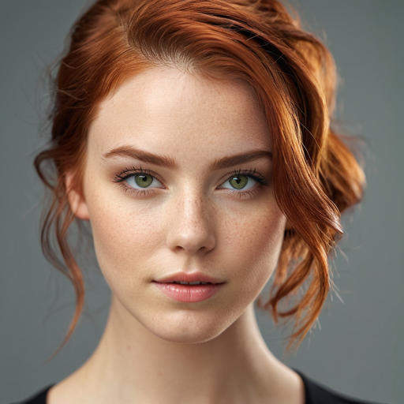
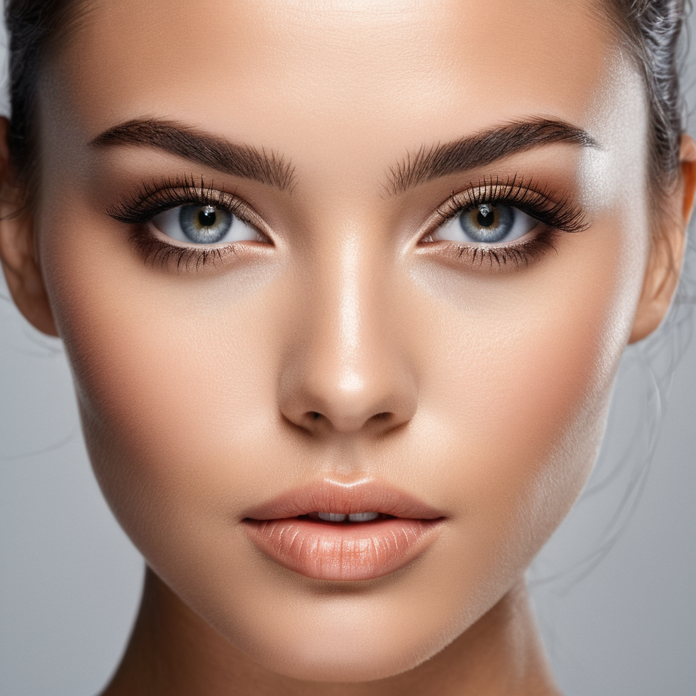
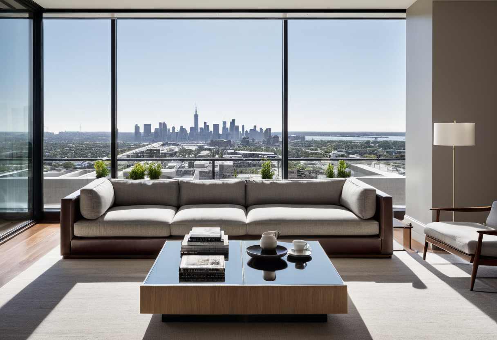
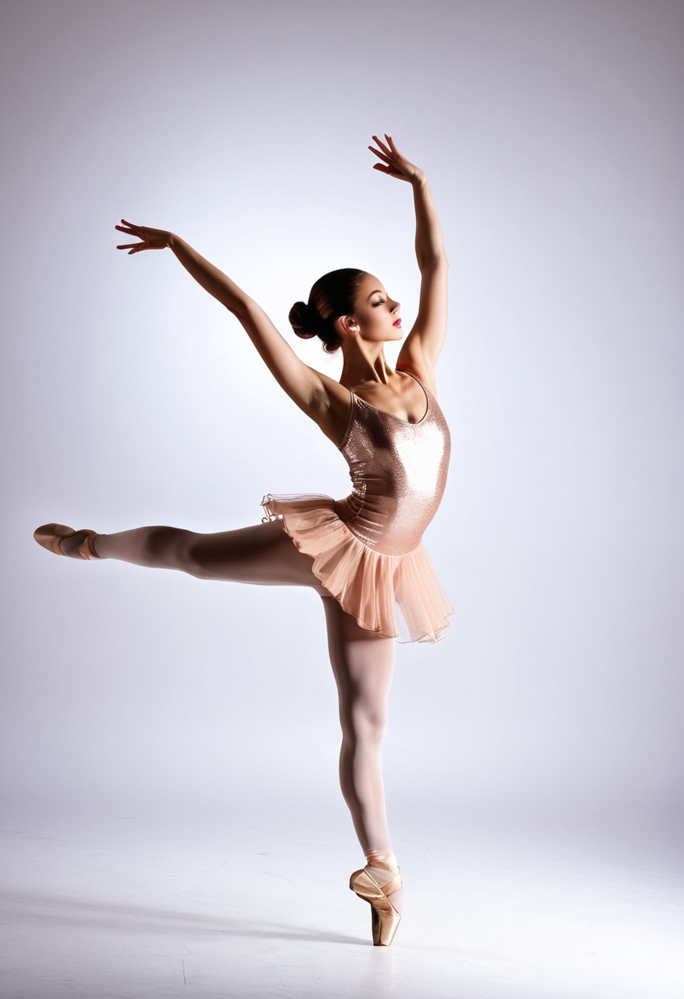
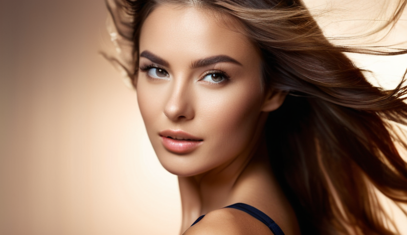
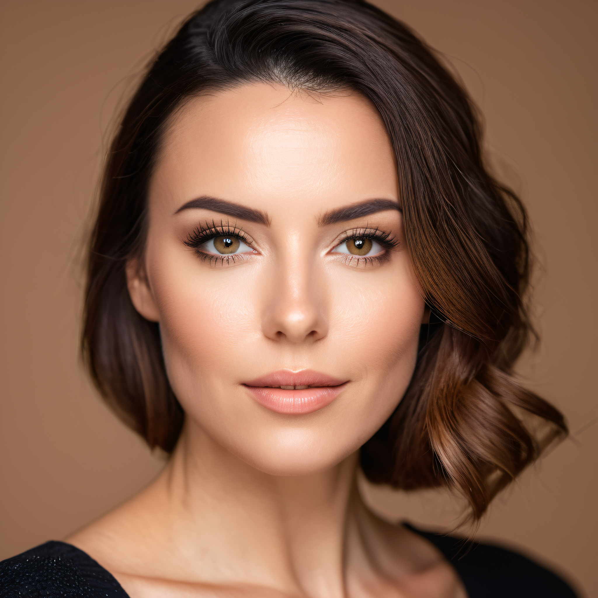

  

<h1 align="center">Spellcaster</h1>

  <strong>Dynamic middleware between ComfyUI and everything else, hellbent on removing every bit of difficulty out of AI image generation.</strong> 
  <em>69 AI tools &bull; GIMP &bull; Darktable &bull; Chat UI &bull; 100% Local &bull; Zero Config</em>

  
  &nbsp;
  
  &nbsp;
  

  <a href="#the-problem">The Problem</a> &bull;
  <a href="#the-solution">The Solution</a> &bull;
  <a href="#see-it-in-action">See It</a> &bull;
  <a href="#install">Install</a> &bull;
  <a href="#all-69-tools">All Tools</a> &bull;
  <a href="#faq">FAQ</a> &bull;
  <a href="https://www.reddit.com/r/Spellcaster_Studio/">Reddit</a>

---

## The Problem

Experimenting with AI image generation locally is a huge pain in the ass, even for people who are good with computers.

[ComfyUI](https://github.com/comfyanonymous/ComfyUI) is a phenomenal tool — it can do anything — but it takes weeks to wrap your mind around nodes, workflows, model architectures, samplers, schedulers, LoRAs, VAEs, ControlNets, and the dozens of custom node packs you need for each task. You end up spending more time wiring nodes than creating images.

Meanwhile, GIMP is already an ultra-capable image editor with an intuitive interface, a canvas, layers, masks, selections, and transparency. It's the free Photoshop. But it has zero AI capabilities.

## The Solution

**Spellcaster is dynamic middleware that sits between ComfyUI and any interface you want to use.** It absorbs all the complexity — models, nodes, samplers, schedulers, LoRAs, VAEs, ControlNets — and exposes it as simple menu items and one-click tools. Its entire purpose is to make ComfyUI's power accessible to people who have no interest in learning ComfyUI.

- **GIMP / Darktable** — 69 AI tools appear in your menus. Generate, edit, upscale, swap faces, remove backgrounds, create videos — all from the same editor you already know.
- **The Wizard Guild** — a standalone chat UI where AI wizard characters walk you through every tool conversationally. No GIMP needed.
- **SillyTavern** — 13 character cards that generate live visuals during roleplay.

You never touch ComfyUI. Spellcaster talks to it behind the scenes. Think of it like an engine under the hood — you just press the gas.

<table>
<tr>
<td width="50%">

Generate images from text, right inside GIMP

</td>
<td width="50%">

Edit with Flux 2 Klein — 4-step AI editing

</td>
</tr>
</table>

---

## See It in Action

<table>
<tr>
<td align="center" width="25%"> <strong>Inpaint</strong> — fix faces, hands, anything</td>
<td align="center" width="25%"> <strong>Remove Background</strong> — one click</td>
<td align="center" width="25%"> <strong>AI Eraser</strong> — select & delete</td>
<td align="center" width="25%"> <strong>Upscale</strong> — 4x with detail</td>
</tr>
<tr>
<td align="center" width="25%"> <strong>Relight</strong> — change lighting direction</td>
<td align="center" width="25%"> <strong>Style Transfer</strong> — copy any style</td>
<td align="center" width="25%"> <strong>Colorize</strong> — B&W to color (instant)</td>
<td align="center" width="25%"> <strong>AI Select</strong> — type what to select</td>
</tr>
<tr>
<td align="center" width="25%"> <strong>Face Swap</strong> — paste any face</td>
<td align="center" width="25%"> <strong>AI Restoration</strong> — fix old photos</td>
<td align="center" width="25%"> <strong>Detail Hallucination</strong> — add texture</td>
<td align="center" width="25%"> <strong>Face Identity</strong> — generate as someone</td>
</tr>
</table>

<strong>More screenshots — video, ControlNet, Klein, animations</strong>

<table>
<tr>
<td align="center" width="33%"> ControlNet Depth</td>
<td align="center" width="33%"> ControlNet OpenPose</td>
<td align="center" width="33%"> ControlNet Canny</td>
</tr>
<tr>
<td align="center" width="33%"> Wan 2.2 Image-to-Video</td>
<td align="center" width="33%"> SeedV2R Upscale</td>
<td align="center" width="33%"> Photo Restoration Pipeline</td>
</tr>
</table>

---

## For People Who Can't Computer

Seriously — you don't need to know anything. The entire thing is automated:

- **Installation?** Automated. The installer detects your GPU, downloads the right AI models, installs everything, creates shortcuts. You click "Next" a few times.
- **Settings?** Automated. Every tool has expert-tuned presets. You never configure a sampler, pick a scheduler, set a CFG scale, or write a negative prompt. The AI handles all of that.
- **Prompts?** Automated. Type "a cat" and the built-in LLM rewrites it into an optimized prompt for whatever AI model you're using. You don't need to know what SDXL tags are or how Flux prompting works.
- **Model selection?** Automated. The plugin detects what models are installed and picks the best one for each task.
- **VRAM management?** Automated. Video resolution scales to fit your GPU. The LLM unloads during image generation. TeaCache acceleration is injected into every workflow. You never see an out-of-memory error.
- **Updates?** Automated. The plugin checks GitHub on launch and silently patches itself.
- **Recovery?** Automated. If an update corrupts the plugin, a 3-tier recovery system restores from backup, re-downloads from GitHub, or shows a visible error. GIMP never bricks.

**You open GIMP. You go to the Spellcaster menu. You pick a tool. You click Generate. That's it.**

If you don't want to use GIMP at all, the [Wizard Guild](#under-the-hood) is a chat interface where you just tell an AI wizard what you want in plain English.

---

## Install

### What You Need

| You need | What it is | Where to get it |
|---|---|---|
| **ComfyUI** | The AI engine (runs in background) | [github.com/comfyanonymous/ComfyUI](https://github.com/comfyanonymous/ComfyUI) |
| **GIMP 3** | Free image editor (like Photoshop) | [gimp.org](https://www.gimp.org/downloads/) |
| **A GPU with 4+ GB VRAM** | Runs the AI models | You probably already have one |

> **Never heard of ComfyUI?** That's fine. You'll never need to open it. Spellcaster talks to it behind the scenes.
>
> **Don't have a GPU?** The installer's **Antenna mode** connects to a ComfyUI server on another computer on your network.

### Download & Run

  
  &nbsp;
  
  &nbsp;
  

1. **Download** the installer for your system
2. **Run it.** It walks you through everything — detects your GPU, downloads models, installs plugins
3. **Open GIMP.** Go to `Filters > Spellcaster` — all 69 AI tools are there
4. **Pick any tool and click Generate.** Every preset is already optimized

> **From source:** `git clone https://github.com/laboratoiresonore/spellcaster && cd spellcaster && python installer/install.py`

---

## All 69 Tools

<h3>Generate (7)</h3>

| Tool | What It Does |
|---|---|
| **Text to Image** | Type what you want. 25 scene presets across 6 model families. |
| **Image to Image** | Transform any photo — change styles, add detail, reimagine. |
| **Inpaint Selection** | Paint over any area to regenerate it. 44 expert presets. |
| **Outpaint / Extend** | Extend your image beyond its borders in any direction. |
| **Batch Variations** | Generate 2-8 versions with one click. |
| **Edit by Instruction** | Type "make the sky orange" in plain English. Powered by Kontext. |
| **Generate Anything** | Create a transparent object (sword, hat, dragon) on its own layer. |

<h3>Flux 2 Klein (9)</h3>

| Tool | What It Does |
|---|---|
| **AI Editor** | Best-quality img2img with Flux 2 Klein (4-20 steps). |
| **Editor + Reference** | Edit guided by a reference image for structure/style. |
| **Outpaint** | Highest-quality canvas extension. |
| **Inpaint** | Context-aware selection fill. 29 task presets. |
| **Layer Blender** | AI-powered layer harmonization. |
| **Re-poser** | Change poses and camera angles. 26 poses + 11 cameras. |
| **Headswap** | Hybrid: ReActor swap + Klein refinement. |
| **Detail Enhancer** | Targeted detail: face, eyes, hands, skin, hair, feet, custom. |
| **Generate Object** | Transparent object with scene-matched lighting. |

<h3>Enhance (9)</h3>

| Tool | What It Does |
|---|---|
| **Upscale** | 9 models: WaveSpeed SeedVR2 AI (2K/4K), UltraSharp, RealESRGAN, Remacri, NMKD, Anime. |
| **Photo Restoration** | One-click: upscale + face fix + sharpen. |
| **Detail Hallucination** | Add texture that wasn't there — upscale + low-denoise img2img. |
| **SUPIR AI Restoration** | State-of-the-art repair for damaged/compressed photos. |
| **SeedV2R Upscale** | Controllable hallucination: none/light/high. |
| **Colorize B&W** | 3 engines: DDColor instant (artistic/natural) or ControlNet+diffusion. |
| **Object Removal** | LaMa inpainting — paint over anything, it disappears. |
| **3D Normal Map** | NormalCrafter surface normals for relighting and 3D. |
| **AI Eraser** | Select + `Ctrl+Alt+X` = gone. AI fills the gap. |

<h3>Face (7)</h3>

| Tool | What It Does |
|---|---|
| **Face Swap (ReActor)** | Paste a face from one photo onto another. |
| **Face Swap (Saved Model)** | Swap using a saved face model library. |
| **Face Swap (mtb)** | Alternative engine with multi-face indexing. |
| **Face Identity Transfer** | Generate images that look like a specific person. FaceID. |
| **Face Identity (Flux)** | Flux-native identity via PuLID. |
| **Face Restore** | 7 models: GPEN-2048, CodeFormer, GFPGAN, RestoreFormer++. |
| **Flux 2 Headswap** | ReActor + Klein refinement for seamless blending. |

<h3>Style (4) &bull; Select (3) &bull; Video (7)</h3>

**Style:**

| Tool | What It Does |
|---|---|
| **Style Transfer** | Copy any reference image's visual style via IPAdapter. |
| **Color Grading** | Cinematic LUT application with strength control. |
| **IC-Light Relighting** | Change lighting direction. 10 presets. |
| **AI Color Match** | Transfer color palette from a reference. 3 methods. |

**Select:**

| Tool | What It Does |
|---|---|
| **AI Select (SAM3)** | Type "hair" or "shirt" to select it. |
| **AI Extract Subject** | One-click subject extraction with transparent background. |
| **Remove Background** | 3 engines: rembg, BiRefNet (best hair), BiRefNet Portrait. |

**Video:**

| Tool | What It Does |
|---|---|
| **LTX 2.3 Text to Video** | Generate video from text. VRAM-aware resolution. |
| **LTX 2.3 Image to Video** | Animate any photo. Preserves aspect ratio. |
| **Wan 2.2 Image to Video** | 2-5 second clips. 26 motion presets, dual-pass. |
| **Wan 2.2 First+Last Frame** | Video transition between two images. |
| **Video Upscale** | AI video upscaling with SeedVR2. |
| **Video Face Swap** | ReActor across every video frame + upscale. |
| **SeedVR2 Video Upscale** | Dedicated SeedVR2 video upscaler. |

<h3>Studios (7) &bull; Quick (7) &bull; Tools (8)</h3>

**Studios** — full character production pipeline:

| Tool | Pipeline step |
|---|---|
| **Casting Polaroids** | Create reusable face model from any photo. |
| **Body Double** | Full-body transparent cutout with face swap. |
| **Wardrobe Department** | AI outfit replacement. 40 presets. |
| **Set Design** | Generate background + composite characters. |
| **Director's Chair** (Solo/Duo/Trio) | Animated video with face re-injection. |

**Quick** — zero-dialog, instant (`Ctrl+Alt`):

| Action | Shortcut |
|---|---|
| Enhance | `Ctrl+Alt+E` |
| Inpaint | `Ctrl+Alt+P` |
| Upscale | `Ctrl+Alt+U` |
| Face Restore | `Ctrl+Alt+F` |
| Remove BG | `Ctrl+Alt+B` |
| AI Eraser | `Ctrl+Alt+X` |
| Re-run Last | `Ctrl+Alt+R` |

**Tools** — Layer Blend, Upscaler Blend, GIF Stitcher, Watermark Embed/Read, Upload to Server, Settings, Workflow Library.

---

## Under the Hood

<strong>What makes it fast</strong>

- **TeaCache auto-acceleration** — every image generation is automatically 1.4x faster. Zero config, zero quality loss. The optimizer injects it into all workflows.
- **Architecture-aware everything** — CFG, denoise, prompts, and ControlNet models are auto-configured per architecture (SDXL, Flux, Klein, Illustrious, Pony, SD1.5, WAN, LTX).
- **AI Prompt Enhancement** — a small LLM runs inside ComfyUI, rewrites your simple prompts into architecture-optimized descriptions. SDXL gets tags, Flux gets natural language, Klein gets concise descriptions. Multi-character prompts use BREAK separation with attention weights.
- **VRAM management** — LLM auto-unloads during image generation. LTX resolution auto-scales to fit your GPU. Video frame counts auto-cap on low VRAM.

<strong>The Wizard Guild (chat interface)</strong>

Don't want to learn GIMP? The Wizard Guild is a standalone web UI where AI wizard characters handle everything conversationally.

Each wizard specializes in different tools. A local LLM runs natively inside ComfyUI — no separate server needed. Click action buttons to generate directly, or chat for guidance.

Launch: `start_guild.bat` (Windows) or `python tavern/guild_launcher.py`

<strong>SillyTavern integration</strong>

13 character cards for SillyTavern that generate live visuals during roleplay. Backgrounds change with the story. Portraits shift with emotions. Dramatic moments get illustrated automatically.

Launch the Wizard Guild — it sets up SillyTavern automatically.

<strong>For developers</strong>

- **8 model architectures**: SD 1.5, SDXL, Pony, ZIT, Flux Dev, Flux Schnell, Flux 2 Klein (4B/9B), LTX, Wan
- **NodeFactory DSL** — every tool is defined declaratively
- **Crash-safe boot shim** — 3-tier recovery. GIMP never bricks.
- **PDB procedures** — every tool callable from Script-Fu or Python-Fu
- **Workflow Library** — import any ComfyUI workflow JSON and run it from GIMP
- **`spellcaster_core/`** — single source of truth, shared across all repos

---

## FAQ

<strong>What GPU do I need?</strong>

Any NVIDIA GPU with 4+ GB VRAM. AMD works too (ROCm/DirectML). The installer auto-detects your GPU and only shows features your hardware can run. 8+ GB handles most tools. 16+ GB runs everything.

<strong>Do I need to understand ComfyUI?</strong>

No. Every tool has expert-tuned presets. You never need to open ComfyUI, pick a sampler, or write a negative prompt.

<strong>Does anything leave my computer?</strong>

No. Everything runs 100% locally. No cloud, no accounts, no telemetry.

<strong>Can I use my own ComfyUI workflows?</strong>

Yes. `Filters > Spellcaster Tools > Workflow Library` runs any workflow JSON from GIMP.

<strong>ComfyUI on another machine?</strong>

Yes. The Antenna Installer auto-detects ComfyUI servers on your network. Or set the URL in Settings.

---

## Credits

- **Klein Refiner, Auto-Inpaint & Color Match** pipelines adapted from [Elusarca's Flux2 Klein 9B Ultimate 6-in-1 Workflow](https://civitai.com/models/2543188/flux2-klein-9b-ultimate-6-in-1-workflow-face-swap-inpaint-auto-mask-nag-refine-upscale-8gb-vram) (CivitAI), used with permission.
