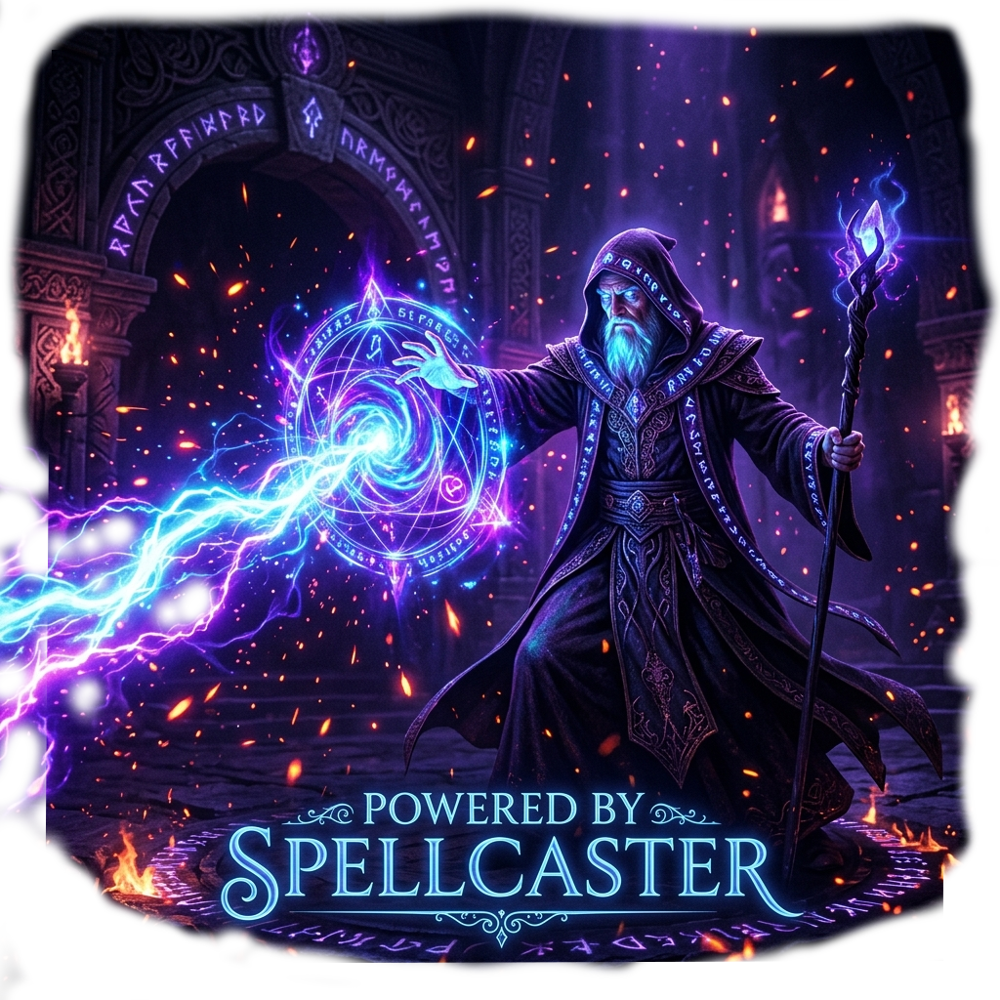
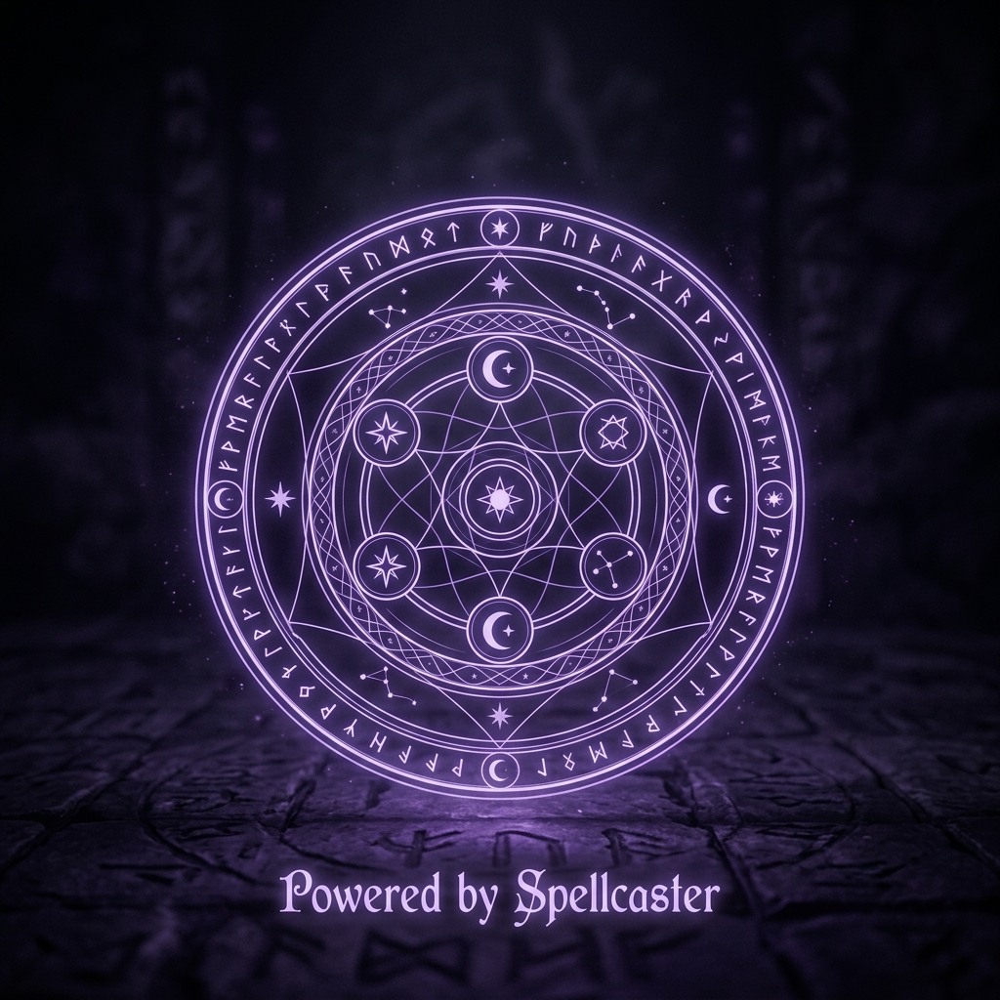

<p align="center">
  
</p>

<p align="center">
  <strong>ComfyUI connectors for GIMP 3 and Darktable</strong><br/>
  AI image generation, inpainting, face swap, and video — directly from your canvas.
</p>

<p align="center">
  <a href="https://github.com/laboratoiresonore/spellcaster/releases"></a>
  <a href="LICENSE"></a>
  
  
</p>

---

<p align="center">
  
  &nbsp;&nbsp;
  
</p>

---

## Features

**Spellcaster** bridges professional photo editing and AI image processing — running complex ComfyUI workflows from inside your existing tools, without switching applications.

| | Feature | Plugins | Notes |
|---|---|---|---|
| 🎨 | **Image-to-Image** | GIMP 3, Darktable | SD 1.5 · SDXL · Illustrious · Klein Flux 2 |
| ✍️ | **Text-to-Image** | GIMP 3 | All checkpoint families |
| 🩹 | **Inpainting & Refinement** | GIMP 3 | 38 preset masks — hands, eyes, skin, style effects |
| 🎭 | **Face Swap** | GIMP 3, Darktable | ReActor · MTB · FaceID · PuLID Flux identity preservation |
| 🎬 | **Image-to-Video** | GIMP 3, Darktable | Wan 2.2 · RTX super-resolution · RIFE interpolation |

---

## Installation

You need a running **ComfyUI** backend (v0.2.0 or newer). The installer handles custom nodes, models, and plugin files automatically.

<p align="center">
  <a href="https://github.com/laboratoiresonore/spellcaster/releases/latest/download/spellcaster-installer.exe">
    
  </a>
  &nbsp;
  <a href="https://github.com/laboratoiresonore/spellcaster/releases/latest/download/spellcaster-installer-macos.zip">
    
  </a>
  &nbsp;
  <a href="https://github.com/laboratoiresonore/spellcaster/releases/latest/download/spellcaster-installer-linux">
    
  </a>
</p>

### 🌟 Simple — Standalone Installer

*For artists who don't want to touch a terminal.*

1. Click your platform's button above, or visit the [**Releases page**](https://github.com/laboratoiresonore/spellcaster/releases):
   - **Windows:** `spellcaster-installer.exe`
   - **macOS:** `spellcaster-installer-macos.zip` → unzip → run `Spellcaster Installer.app`
   - **Linux:** `spellcaster-installer` → `chmod +x spellcaster-installer && ./spellcaster-installer`
2. Run it — a wizard walks you through everything.
3. Point it at your ComfyUI folder. It downloads models, clones nodes, and installs the plugins.

> The installer works without `git` installed — it falls back to ZIP downloads automatically.

---

### 💻 Advanced — Git + Python

*For developers who want `git pull` updates and a standard Python environment.*

```bash
git clone https://github.com/laboratoiresonore/spellcaster
cd spellcaster
python install.py
```

The wizard auto-detects your GIMP 3 and Darktable plugin directories and walks you through feature selection.

**CLI flags for scripted or headless installs:**

```bash
# Non-interactive with defaults
python install.py --yes

# Remote ComfyUI on another machine
python install.py --server-url http://192.168.1.50:8188

# Install specific features only
python install.py --features img2img,inpaint,face_swap_reactor

# Explicit paths (no prompts)
python install.py --comfyui ~/ComfyUI --gimp ~/.config/GIMP/3.0/plug-ins

# Preview without making changes
python install.py --dry-run
```

---

### 🌐 ComfyUI Server Setup

Spellcaster works whether ComfyUI runs locally or on a dedicated machine:

| Setup | URL to use |
|---|---|
| Same machine | `http://127.0.0.1:8188` *(default)* |
| Another PC on your network | `http://192.168.x.x:8188` |
| Custom port | `http://127.0.0.1:8288` |

The installer asks you which setup applies and patches the plugins automatically. You can also change the URL at any time from the plugin dialog inside GIMP or Darktable.

---

## What Gets Installed

<details>
<summary><strong>Custom nodes</strong> (installed into ComfyUI/custom_nodes/)</summary>

| Node | Required by |
|---|---|
| ComfyUI-GGUF | Wan I2V |
| ComfyUI-VideoHelperSuite | Wan I2V |
| ComfyUI-Frame-Interpolation (RIFE) | Wan I2V |
| comfyui-reactor-node | Face Swap (ReActor) |
| comfyui-mtb | Face Swap (MTB) |
| ComfyUI_IPAdapter_plus | FaceID |
| PuLID_ComfyUI | PuLID Flux |
| ComfyUI_GetImageSize / KJNodes | img2img, inpaint, face swap |
| ComfyUI-RTXVideoSuperResolution | Wan I2V (optional, NVIDIA RTX) |

</details>

<details>
<summary><strong>Models</strong> (installed into ComfyUI/models/)</summary>

The installer shows size estimates and lets you choose which to download. Most large models (checkpoints, Wan, Klein) require manual download from CivitAI or HuggingFace — the installer tells you exactly where to place them.

Models with direct download links are fetched automatically:
- CodeFormer / GFPGAN face restore models
- CLIP-L, T5-XXL, Flux VAE (for PuLID Flux)
- PuLID Flux v0.9.1
- UMT5-XXL GGUF, Wan 2.1 VAE (for Wan I2V)
- SDXL offset LoRA

</details>

---

## Contributing

Pull requests and bug reports are welcome.

- **New model presets** — edit `manifest.json`
- **Workflow bugs** — open an issue with your ComfyUI version and node list
- **Platform fixes** — PRs for macOS/Linux path detection are especially appreciated

```bash
# Build the standalone installer yourself
python build_installer.py                    # auto-detect OS
python build_installer.py --platform macos --onedir   # macOS .app bundle
```

---

<p align="center">
  
  <br/><br/>
  <sub>Made with ✦ by <a href="https://github.com/laboratoiresonore">laboratoiresonore</a></sub>
</p>
